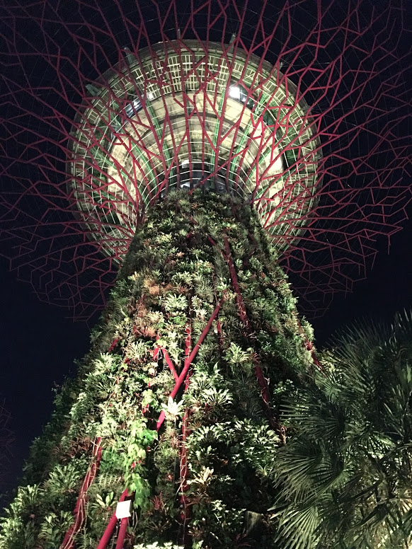
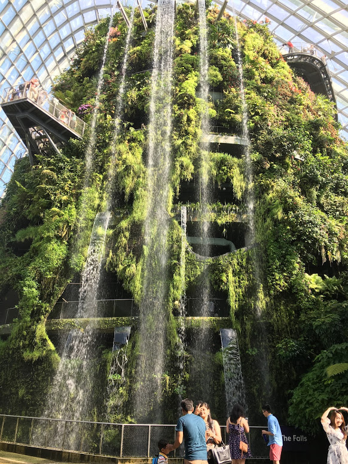
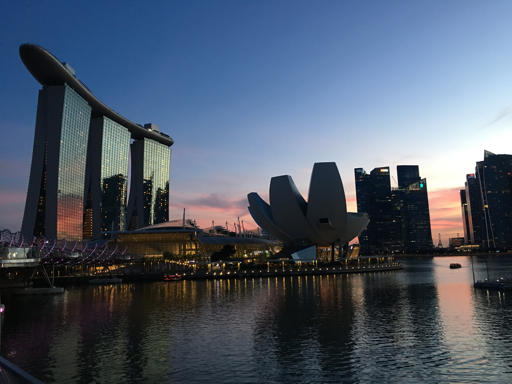
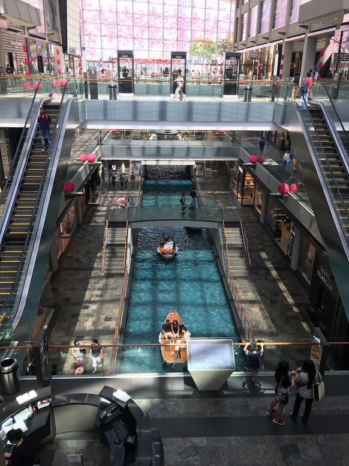
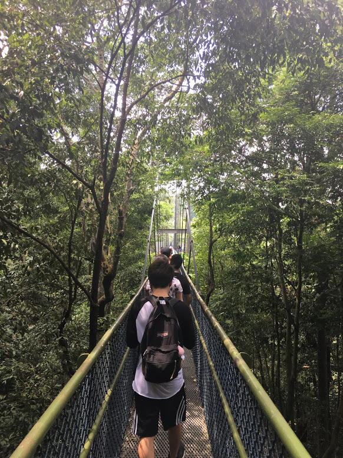
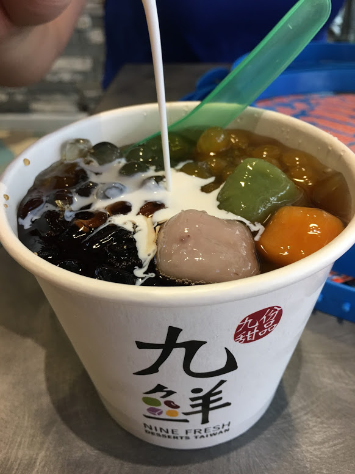
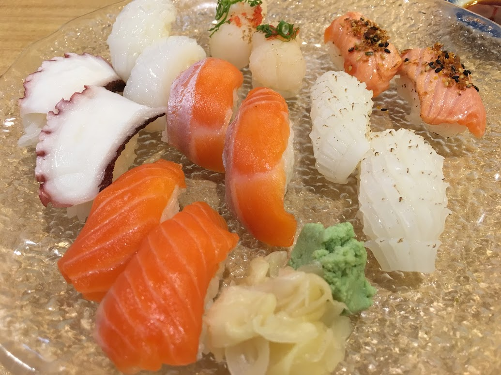
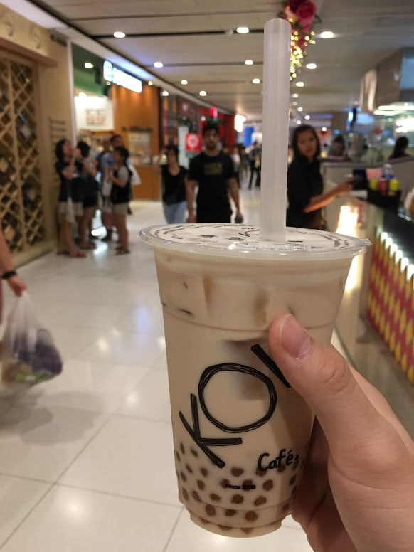
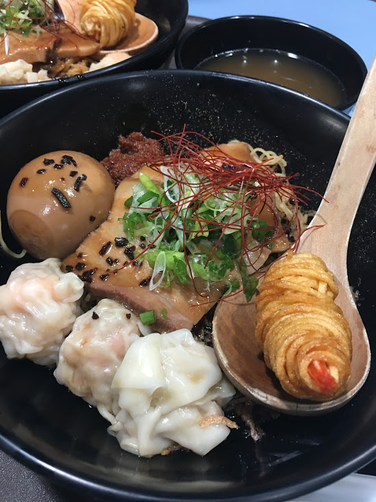

Earlier this year I went on exchange for four months at the National University of Singapore. Here are my top recommendations:

## Sightseeing
### Gardens By The Bay
* Music/light show under the super grove trees 7:45pm and 8:45pm daily
* http://www.gardensbythebay.com.sg/en/whats-on/calendar-of-events/garden-rhapsody-light-show.html

### Cloud Forest + Flower Dome
* Bundle admission is cheaper
* Student discount

### Sunset at Marina Bay Sands
* Nice view watching it outside by the Helix Bridge

### Shopping at The Shoppes Marina Bay
* Building has really nice architecture, but a little pricey

## Nature
### MacRitchie Reservoir Treetop Walk
* Warning - doing anything outside in Singapore is not really recommended since it is so hot

## Food
### Gudetama Cafe

### NineFresh
* Several locations
* Taiwanese dessert shop

### Genki Sushi
* Conveyer belt sushi
* Several locations

### Sushi Goshin in Vivocity Mall
* Each sushi is $0.80!!!
* Apart from the sushi, the mall is really nice with lots of great snacks on the basement level

### Koi Cafe
* Several locations
* Golden Bubble milk tea is 👌

### A Noodle Story
* This place is a hawker stall
* Go early or else they'll run out of ramen

