In April, I visited Japan with two of my friends. It was hands down one of the best trips I've taken.

I thought it might be fun to rate all of the activities out of 🔟 since I love rating things.

## Day 1: Tokyo
We started by checking into our hostel, and they gave us a map wih food recommendations.

### Ramen 9️⃣
This was a hole in the wall restaurant near our hostel in Ryogoku. This ramen in particular had a lot of yummy seaweed.

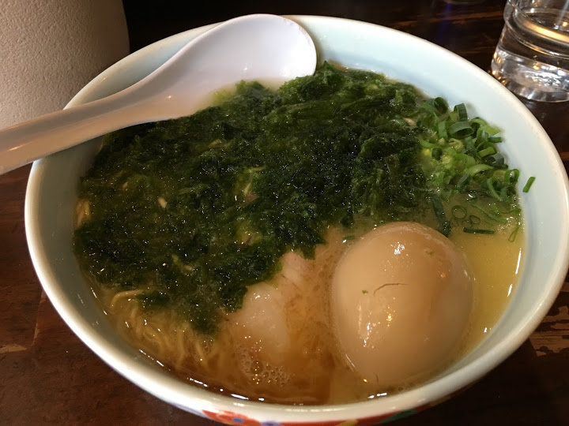

### Shibuya Crossing 7️⃣
This place reminded me of Times Square. We spent hours browsing stationaries and households items at Muji and Tokyo Hands.

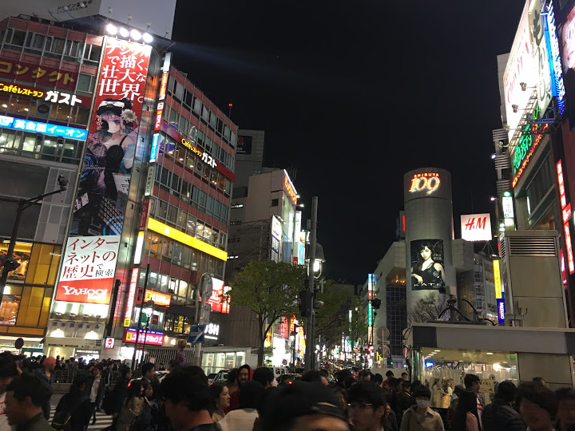

## Day 2: Tokyo
### Tsukiji Fish Market 8️⃣
We woke up REALLY early at around 5am to go to Daiwa Sushi. Apparently you could wake up even earlier to watch the fish auction, but we weren't about that morning life 😴

The neighbouring restaurant Sushi Dai had a line of 3+ hours!! Luckily this one only had a 45 minute wait.

The meal of about 10 pieces of nigiri came out to around $30.

Unfortunately all of the sushi came with wasabi already on them so it was too spicy for me.

This O'toro was bless 👌

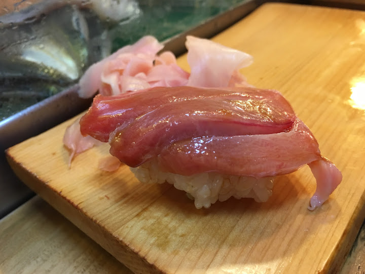

### Cherry Blossoms 8️⃣
We were fortunate to visit Japan near the end of cherry blossom season and Google Maps gave park recommendations where the blossoms were still in late bloom.

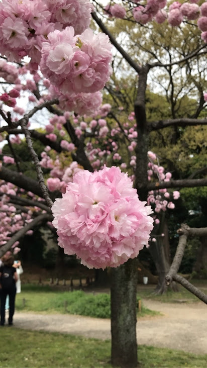

### Japanese Tea Ceremony 5️⃣
I tried to sit on my knees the whole time but it was so hard!

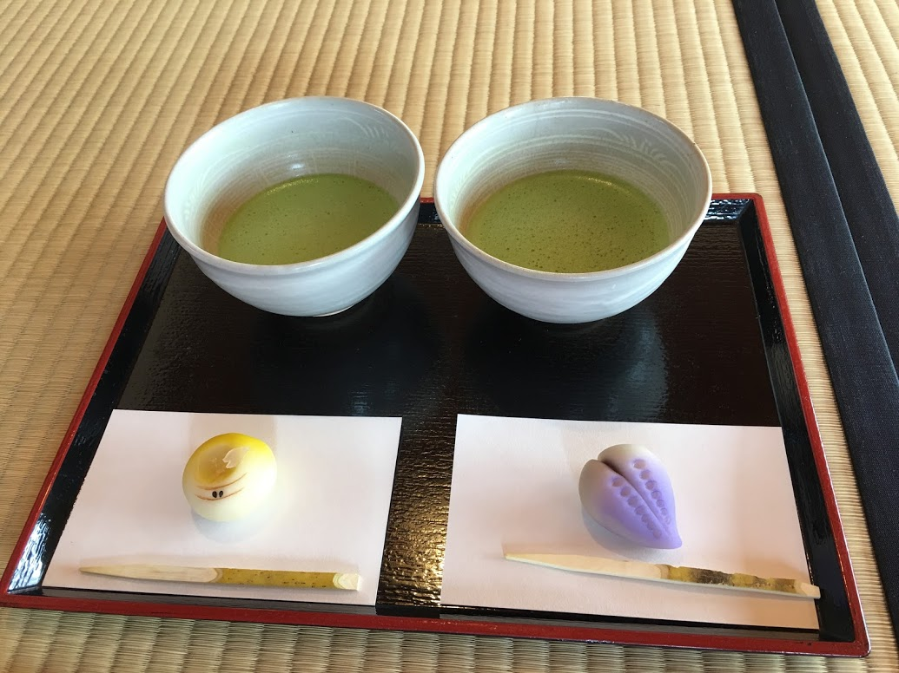

### Ribeye for Lunch 8️⃣
It was pretty common to find a restaurant that focused on beef, such as this one in Ginza, which sold steak in 300g portions 🐮

### Ice Cream Sandwich 🔟
There were soooo many delicious looking snacks in Sensoji but we were too full from lunch 😞

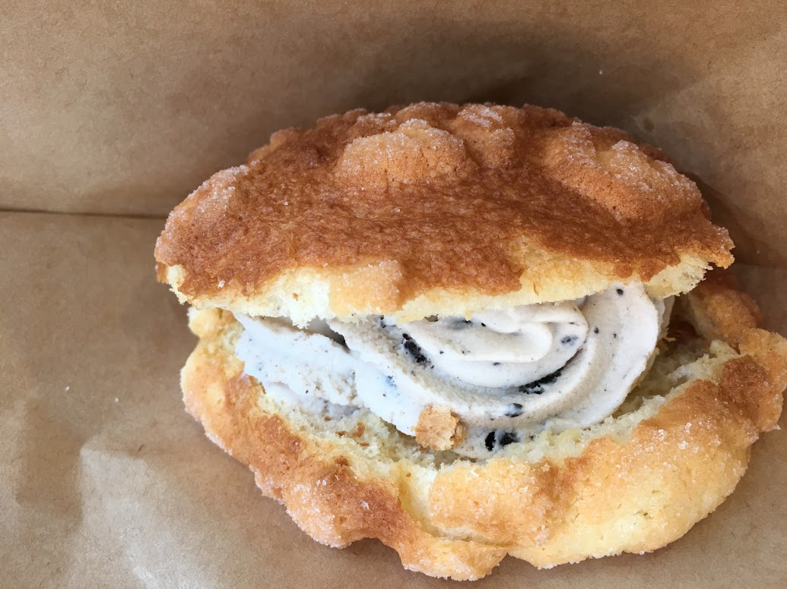

### Pokemon Store 8️⃣
There are two Pokemon Stores in Tokyo and they both have a huge selection of Pokemon plushies.

This one was at the Tokyo Skytree which had a lot of other cute stores.

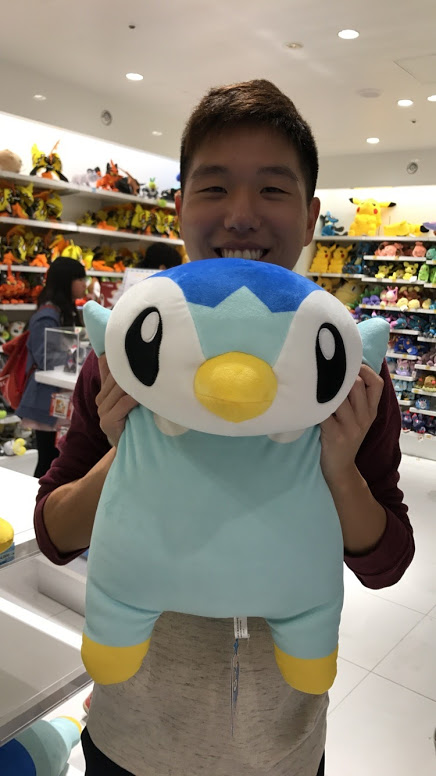

### Pokemon Go 🔟
We played so much Pokemon Go this trip. Even though it was one year after the release of the game, it was very common to see people playing Pokemon Go especially in parks.

We also caught the Japan regional exclusive pokemon Farfetch'd!!

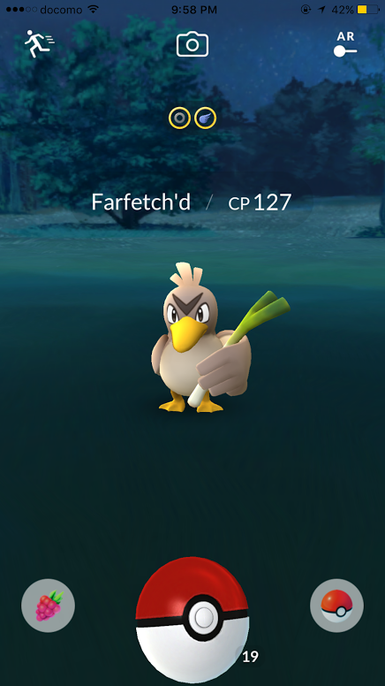

## Day 3: Tokyo
We were supposed to go to the Studio Ghibli Museum this day, but it turns out we needed to reserve 2 months in advance! 😭

### Soba 8️⃣
Instead, we started the morning with a delicious soba near our hostel.

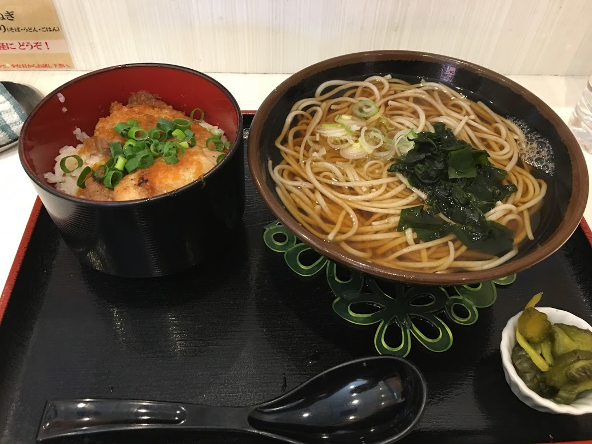

### Akihabara 7️⃣
We spent the afternoon in Akihbara at an arcade and a maid cafe.

It was $5 to get a picture with the maids so instead, we opted for a picture of ourselves for free! Some of the customers and general culture at the maid cafe was a little creepy.

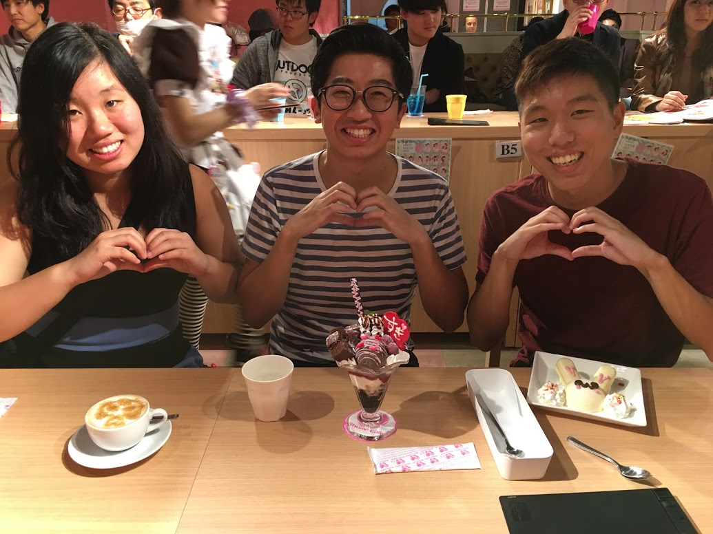

### Take-out Sushi for Dinner 7️⃣
Most sushi in Japan was cheaper than Canada and tasted so good 😋

I regret not eating take-out sushi more often as filler meals.

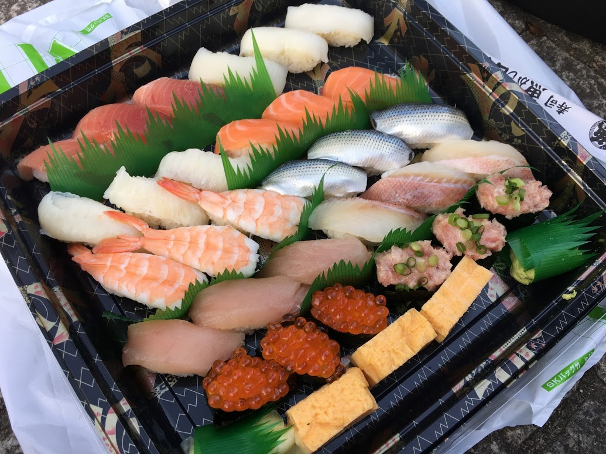

## Day 4: DisneySea 8️⃣
We spent a full day at DisneySea and tried to get the most value out of our ticket. We read a guide the night before which gave us an idea of which rides would have long lines and how to plan efficiently. 

They had some pretty sweet rides, though I had been to Disney resorts in the past so some of the rides were the same.

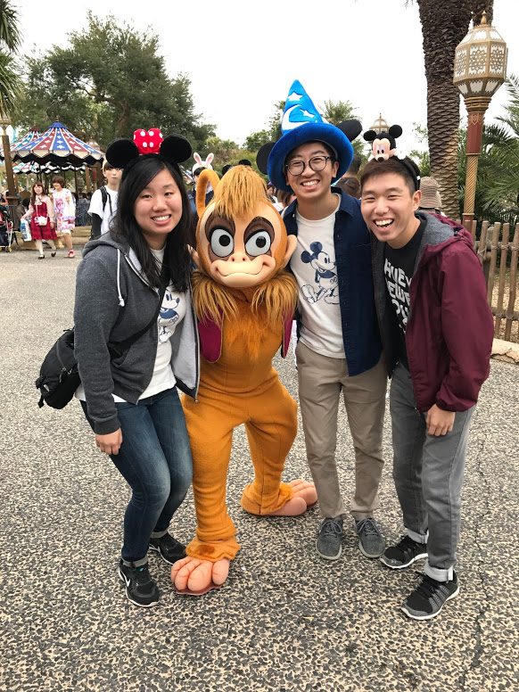

## Day 5: Takaragawa Onsen ♨️ 🔟
We took a train to Takaragawa Onsen and stayed there for one night. This Onsen in particular was convenient to travel via train and offered mixed gender baths where everyone could enter with their towels.

Overall, this onsen was unreal. The hot springs were such a unique experience and the in-room dinner service was amazing.

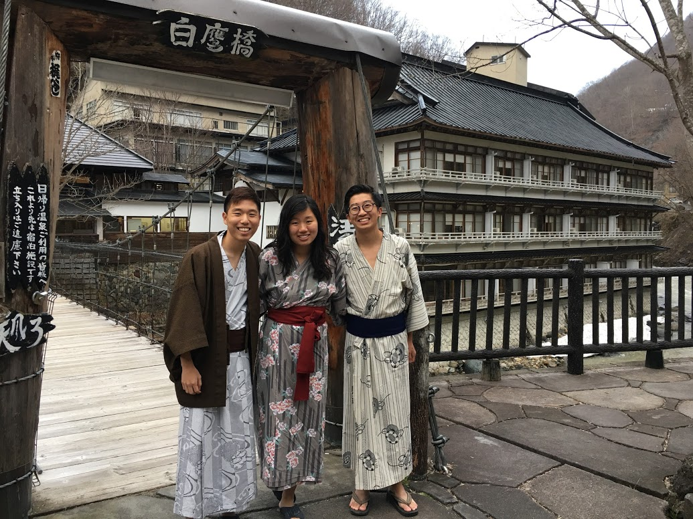

## Day 6: Kyoto
We took a train straight from the onsen to Kyoto. Kyoto had much less of a city vibe compared to Tokyo and we checked out a lot more nature and temples.

### Bamboo Forest 7️⃣

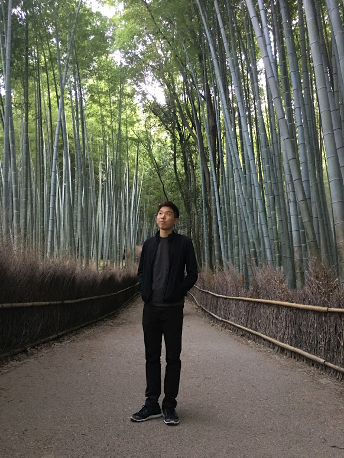

### Another Beef Restaurant 7️⃣
This giant beef sushi was one of their many beef dishes.

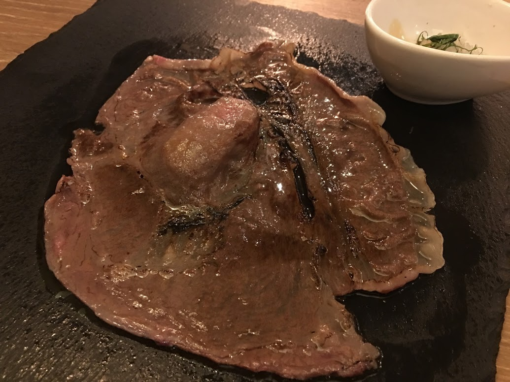

## Day 7: Kyoto

### Torri Gates 9️⃣
This place was really cool! I still cannot believe how many torri gates they had, we couldn't even finish climbing to the top.

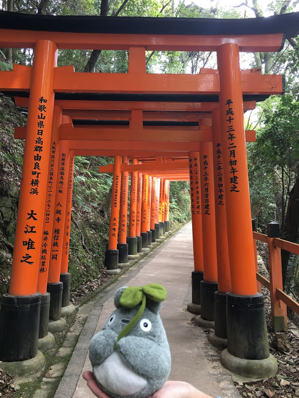

### Delicious Strawberries 7️⃣

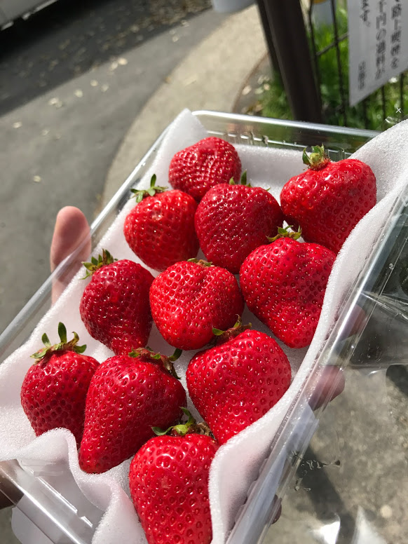

## Day 8: Tokyo
My friends left a day earlier than me, so I spent the last day in Tokyo and pretty much played a lot of Pokemon Go and ate some delicious food.

### Beef Bowl 8️⃣

### Ichiran Ramen 8️⃣
This place had stalls for eating alone! The waiters are all behind a wall and hand you your ramen through a slit.

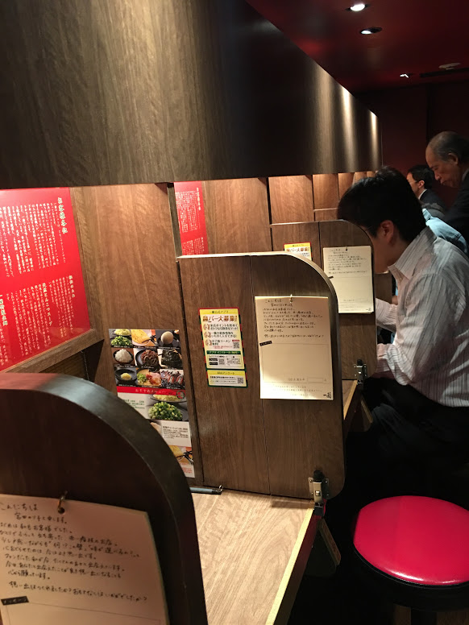

### Fatty Tuna 9️⃣
My last meal was a take-out container of fatty tuna for $15 🍣

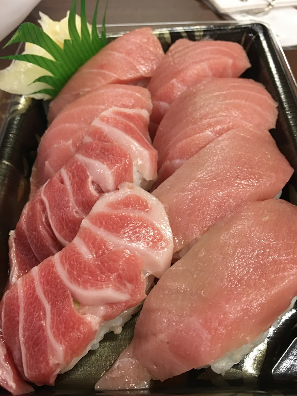

Overall the trip was fantastic and I can't wait to go back to Japan someday!
