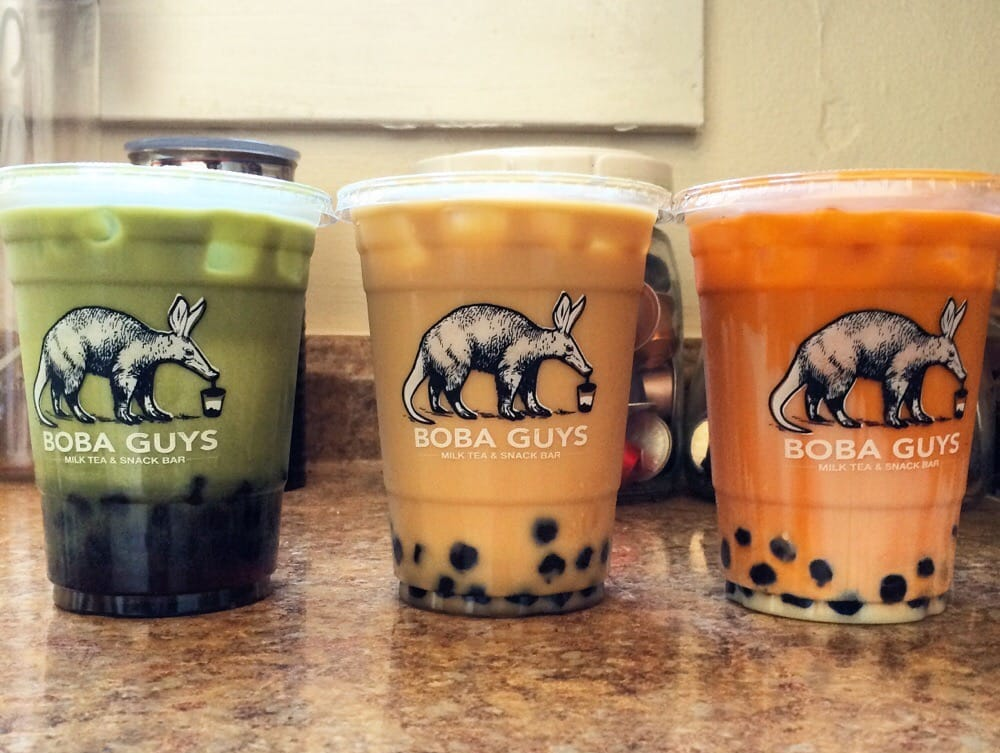
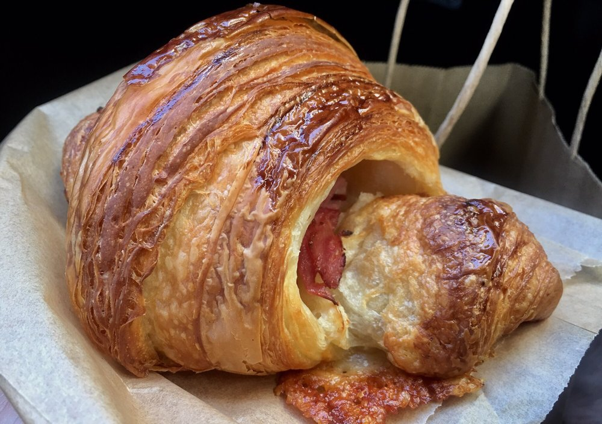
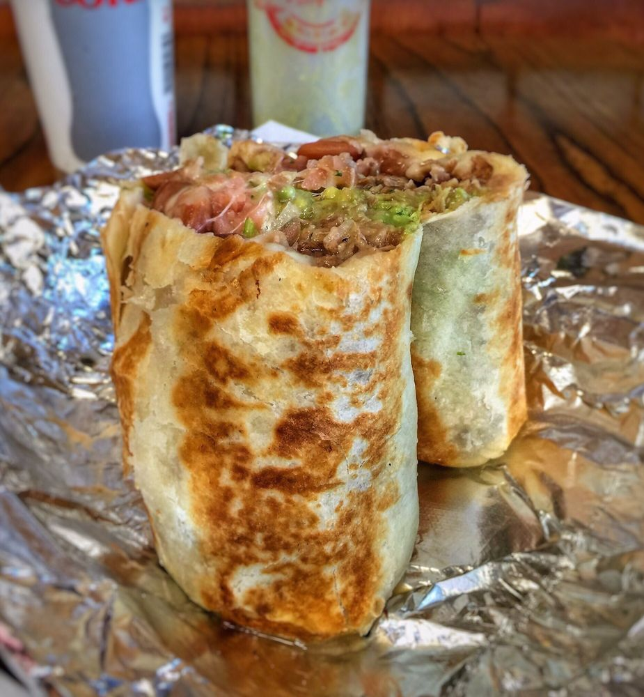
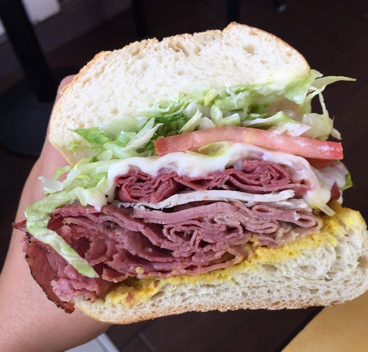
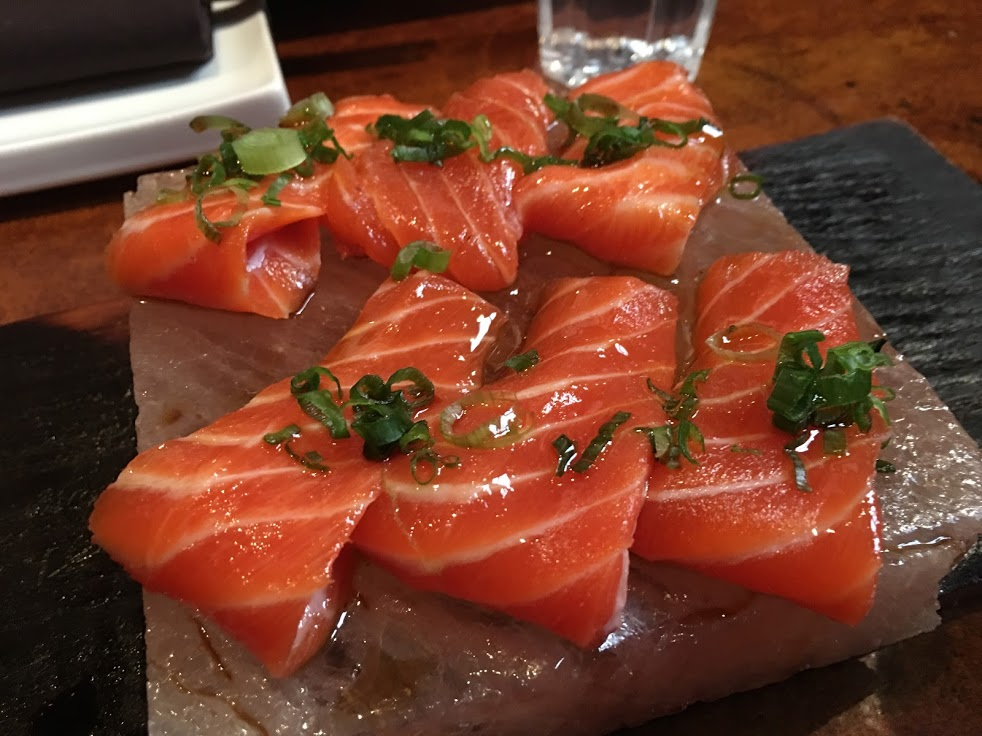
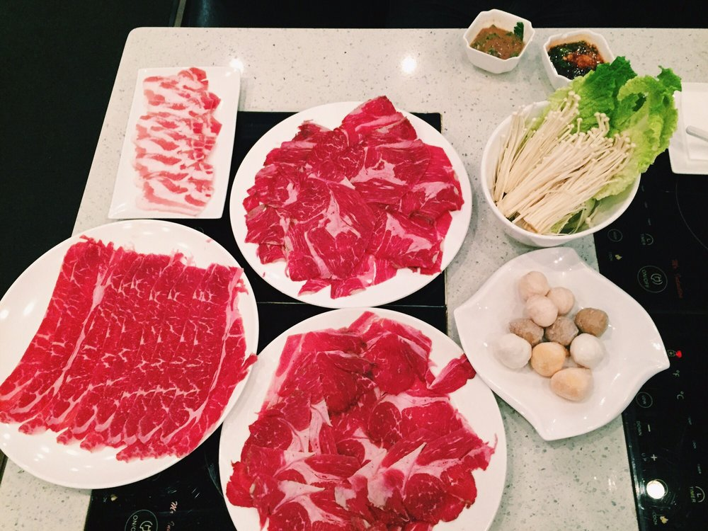
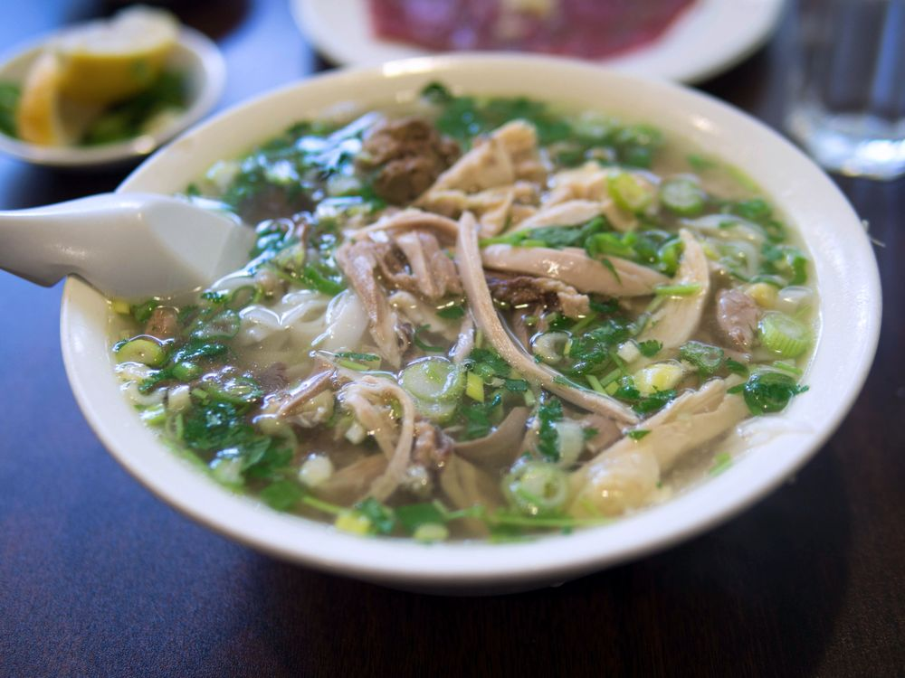
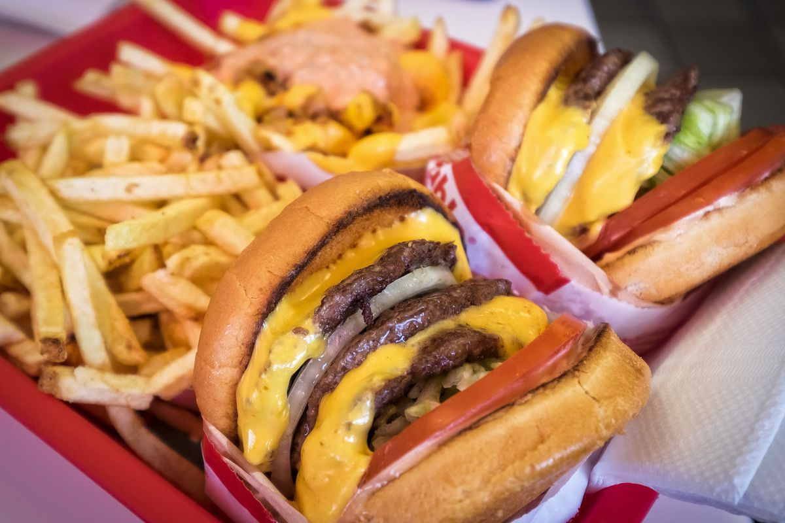

I have lived in San Francisco during 4 internships and eaten so much delicious food.

SF is such a foodie city so I wanted to share my absolute favourite restaurants that I would visit if I went back in SF for a week.

### Notes
1. Most of these places are in the $5-15 range with a few exceptions, namely AYCE and Sushi.

2. A lot of these suggestions are popular spots so I would recommend visiting them on weekdays when they are less busy!

3. Pics are taken off of Yelp.

## Bubble Tea 🥤
### Boba Guys [(yelp)](https://www.yelp.ca/biz/boba-guys-san-francisco-6)
The tapiaco is so soft, so chewy and so sweet. My go-to is a Jasmine Milk Tea with No Ice, 75% sugar and extra boba. My absolute favourite drink.

### TPumps [(yelp)](https://www.yelp.ca/biz/tpumps-san-francisco)
TPumps is my second pick for bubble tea and I love their fruity milk teas. They let you mix three fruity flavours and they blend so well together for a really sweet drink. Also their jumbo size is absolutely gigantic.

## Pastries 🥐
### Tartine [(yelp)](https://www.yelp.ca/biz/tartine-bakery-and-cafe-san-francisco)
Every pastry from Tartine is so buttery and flaky, it's just the best feeling biting into them. My favourites are: Croissant, Pain au Jambon, Pain au Chocolat and Morning Bun.

[Huge Line Warning] Must go during weekdays to avoid 1+ hour wait.

### Ariscault Bakery [(yelp)](https://www.yelp.ca/biz/arsicault-bakery-san-francisco)
This place is a little out of they way in Presidio, so I have only been there once, but they have the best chocolate croissant I've had in my life. It was so buttery and flaky.

## Pizza 🍕
### Arizmendi Bakery [(yelp)](https://www.yelp.ca/biz/arizmendi-bakery-san-francisco)
Although they are called a Bakery, Arizmendi Bakery is my favourite pizza place. They only serve one type of pizza, always vegetarian, and they change pizzas daily. The best thing about this pizza is the crust. They use a crisp, oily sourdough crust that tastes amazing.

## Mission Burrito 🌯
### El Farolito, Papolate and La Taqueria
A Mission Burrito is a burrito you can buy in the Mission. El Farolito, Papolate and La Taqueria all offer a super burrito for around $8-10. I always get the carne asada (steak). It is great value and very filling.

## Sandwiches 🥪
### Irving Subs and Subs Inc
I think these sandwiches make for a perfect lunch. I opt for the pastrami toasted on dutch crunch bread for those extra crunchy bites.

## Sushi 🍣
### Elephant Sushi [(yelp)](https://www.yelp.ca/biz/elephant-sushi-san-francisco)
SF sushi can range from $ to $$$. I'd say Elephant Sushi is the best value in terms of quality. I love their Ya Man Roll and Himalayan Trout though it probably won't fill you up if you're hungry.

[Reservation Recommended] Show up early or make reservations!

## All You Can Eat 🥩
### iPot (Hotpot) [(yelp)](https://www.yelp.ca/biz/ipot-san-francisco)
This place is perfect for when I am really hungry. I opt for the pork bone broth and get tons of beef, lamb, hand-made noodles and enoki mushrooms to fill myself up.

[Huge Line Warning] I would recommend showing up before 6pm for dinner. 

### Kogi Gogi Kbbq [(yelp)](https://www.yelp.ca/biz/kogi-gogi-bbq-san-francisco-2)
If you're craving kbbq there are a few places in SF that will tend to your needs. Kogi Gogi has a large variety of delicious meats. My favourites are the galbi and bulgogi.

## Pho 🍜
### Turtle Tower [(yelp)](https://www.yelp.ca/biz/turtle-tower-san-francisco-6)
I’ve tried a couple of pho places in SF and this is the only one I would travel out of my way for.
They use a delicious chicken broth that melts in my mouth.

## In-n-out 🍔
Double Double. So simple, so cheap, so good.

[Line Warning] There are many in-n-out locations locations in the Bay Area so I would recommend a location in a less touristy area for cheaper prices and shorter lines.

