In September I took a trip to the Nordic countries with Cherrie.

We stopped by Norway to see the fjords and it was well worth it. Norway is a beautiful place. (Though my iphone photography may not do it justice 😛 )

Apparently it rains over 200 days a year in Bergen, but it was warm and sunny the whole time we were there 😄

## Day 1

We flew in from Iceland and had a nice view of the islands during our descent.

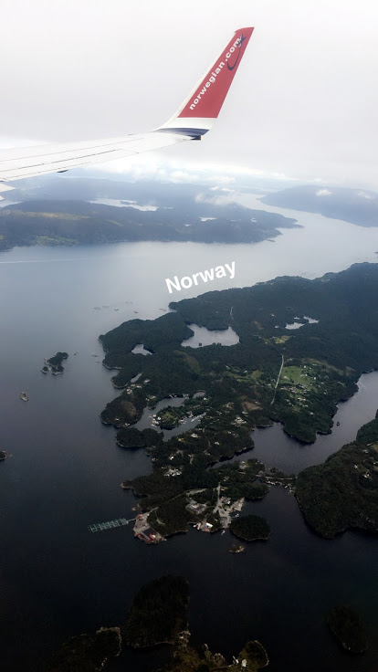

The first thing we saw when we got out of the airport was this `Bergen?` sign. I was very confused, but apparently it is an artpiece meant to draw attention. I guess it worked.

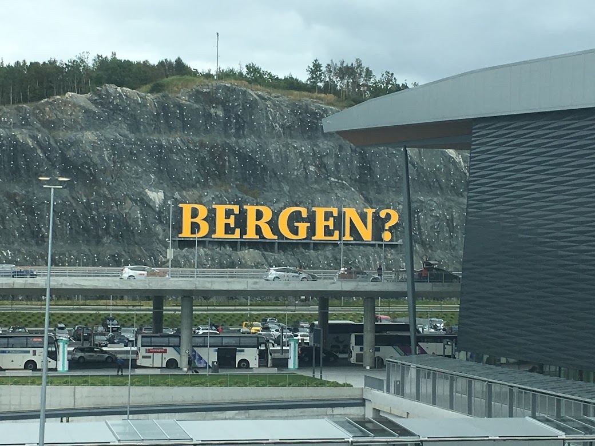

We checked into the airbnb and the view was spectacular.

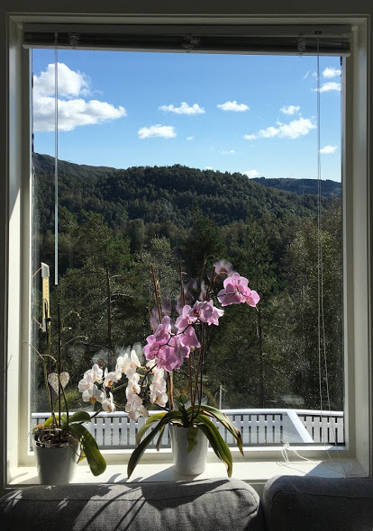

On top of that our host was very friendly and he had a really cute kid! At first, I was a little wary of sharing the apartment with our host, but I'm glad we did. He spoke English well and recommended a lot of places to visit. The first thing he suggested was going to the nearby grocery store and buying a brand of norweigian salmon sashimi called Salma Laks. How did he know I love salmon sashimi!

We went and brought back groceries for two meals and snacks. We bought two different cuts of salmon sashimi and it was so cheap!! I wanted to buy even more! It was soo good and so fresh. To this day I am still craving more Salma Laks.

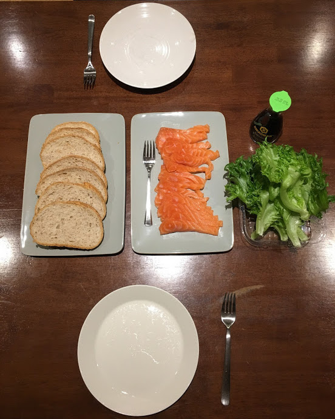

## Day 2

After cooking lunch at home we started on a hike up Mount Ulriken (recommended by our Airbnb host). Apparently he climbs to the top and back in 40 minutes as exercise. It took us over 2 hours just to go up 😞

It was so steep the whole way up!

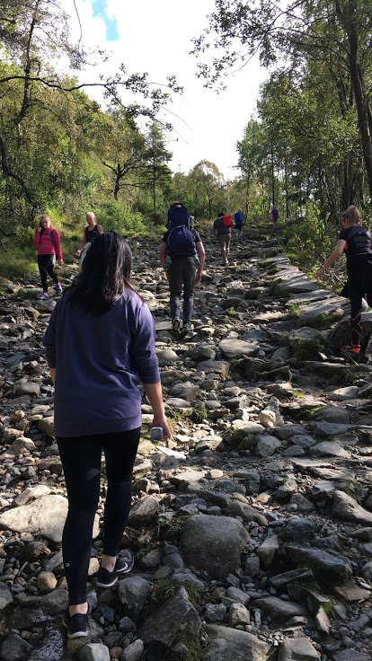

At the peak we could see all of Bergen, especially on such a rare day of clear skies. We thought climbing down the steep mountain was a little dangerous so we took the gondala down.

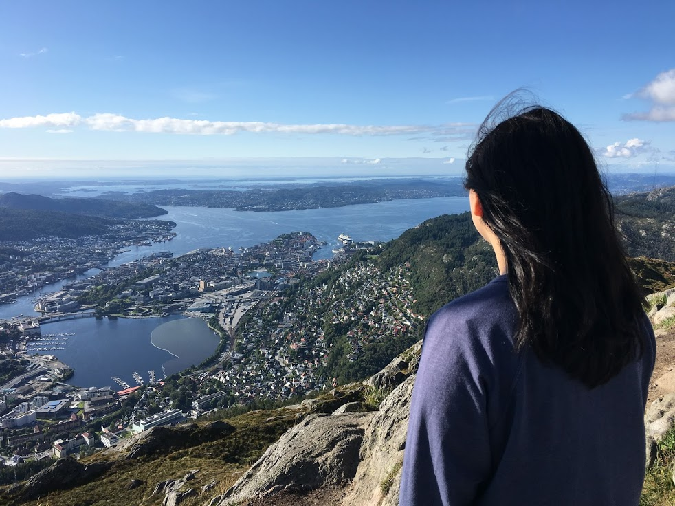

Afterwards we drove to downtown Bergen which had these colourful buildings (Can you spot the fake one?).

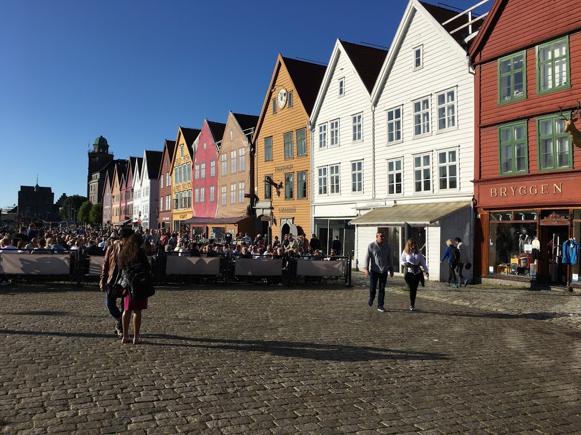

These ribs were amazing.

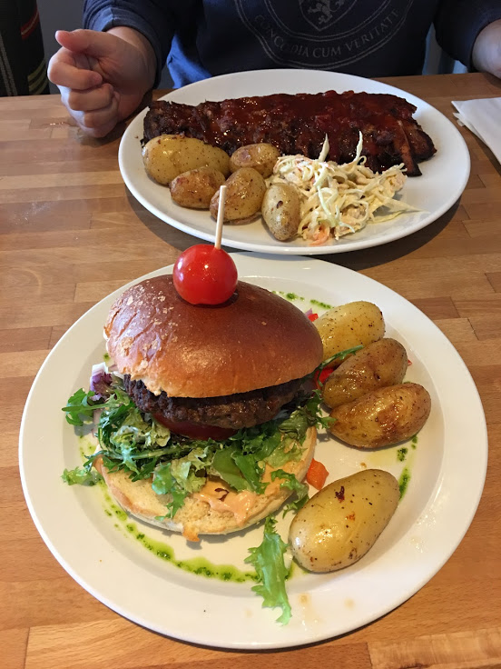

And finally the highlight of the trip. We caught the Europe-exclusive Mr. Mime!!! I was so happy when it showed up on my radar and ran around a residential area for 5 minutes to catch it. Trip = Success 😄

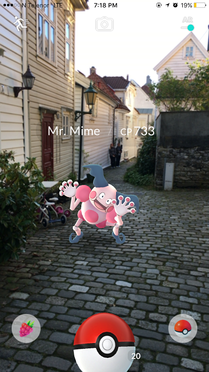

## Day 3

This was the busiest day as we had 8 hours of driving planned to see the fjords!

There is a popular tour bus company called "Norway in a Nutshell" which sells day tours for $250/person. However, we thought this was a waste since we had our own car. Instead we came across a blog post called "How to do Norway in a Nutshell on Your Own" [(link)](https://www.earthtrekkers.com/how-to-norway-in-a-nutshell-on-your-own/) and we followed it to get the full Norway fjord experience by driving ourselves.

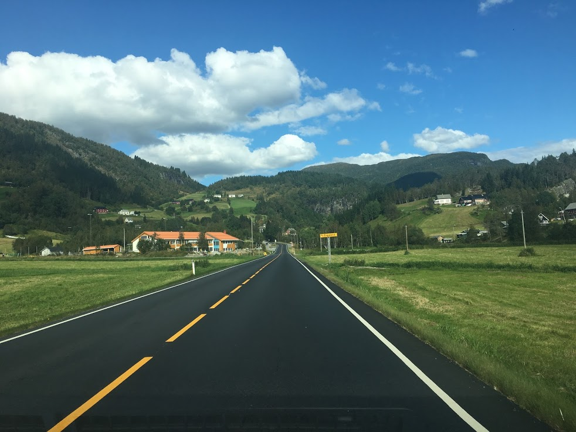

Our first stop was at Stalheim Hotel. We did not stay at this hotel, but they open their back patio to tourists for free and they have a stunning view of the mountains.

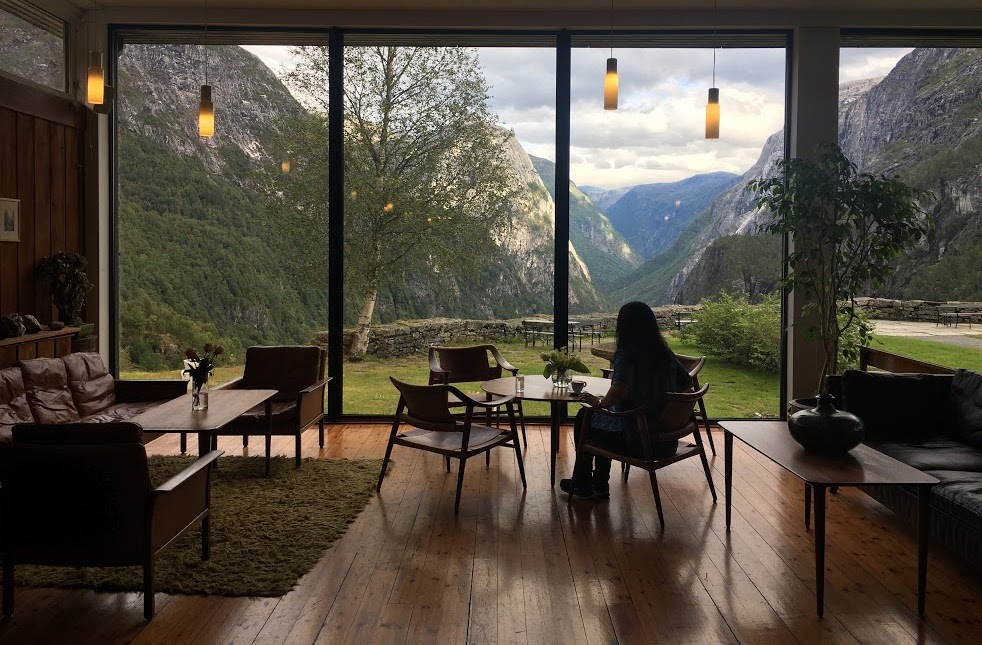

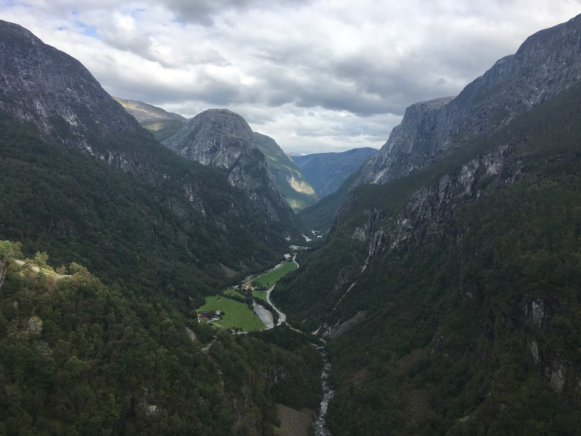

Our next stop was at Flåm to see the Nærøyfjord. We thought about taking a 1 hour cruise on the fjord, but we had already seen a lot of the fjords just by driving around.

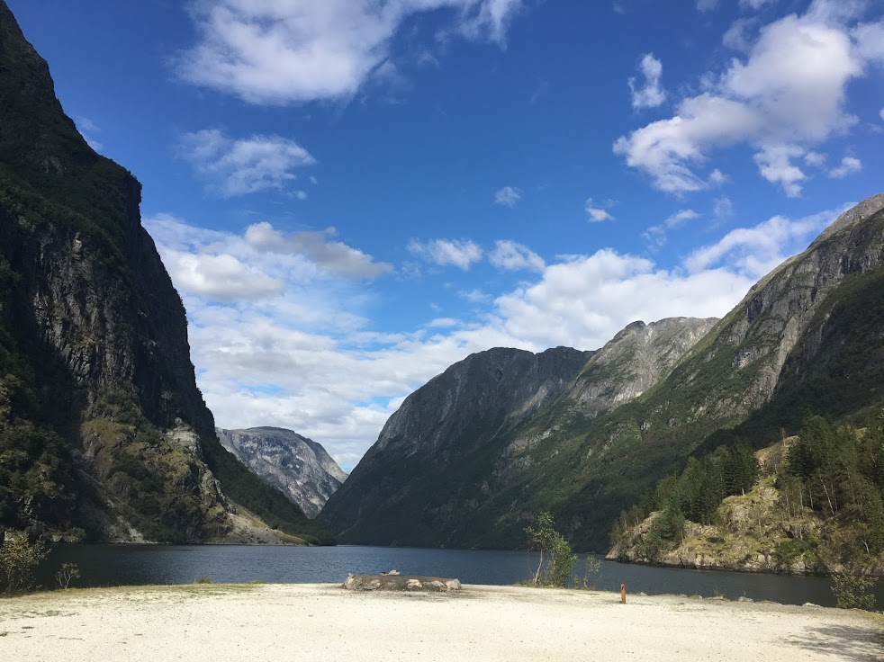

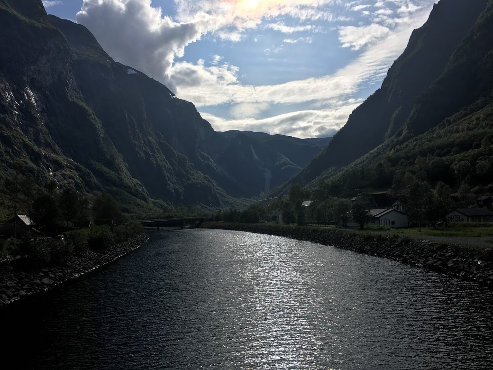

Our last stop was at Stegastein which i **would not** recommend if you are driving. The view was nice, but the road up was a narrow zig-zagging two way street. A very stressful 30 minute drive up. Nice views though! 

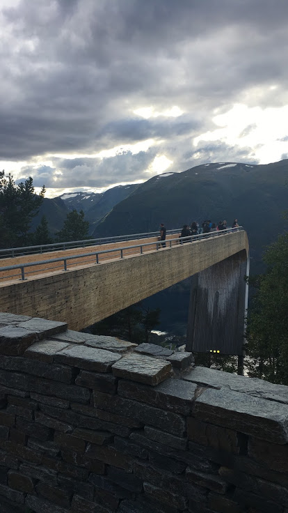

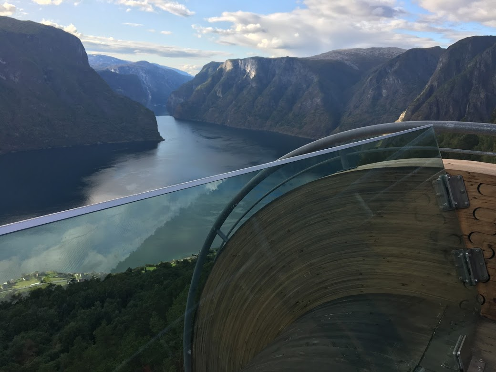

We ended the trip with some delicious tacos the next day and flew off to Copenhagen!

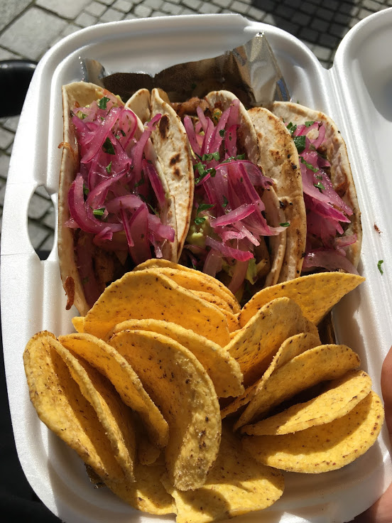

