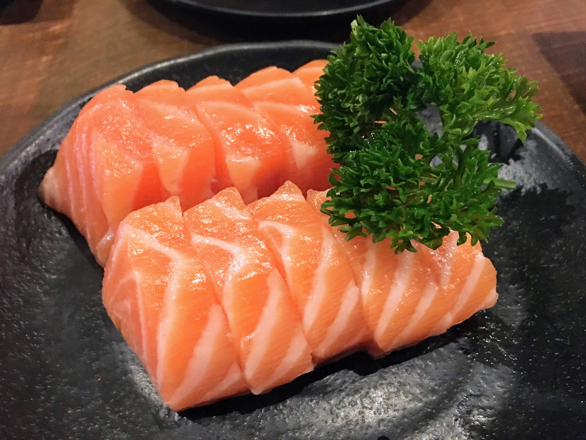
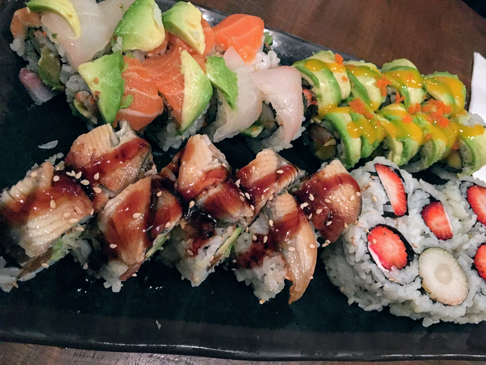
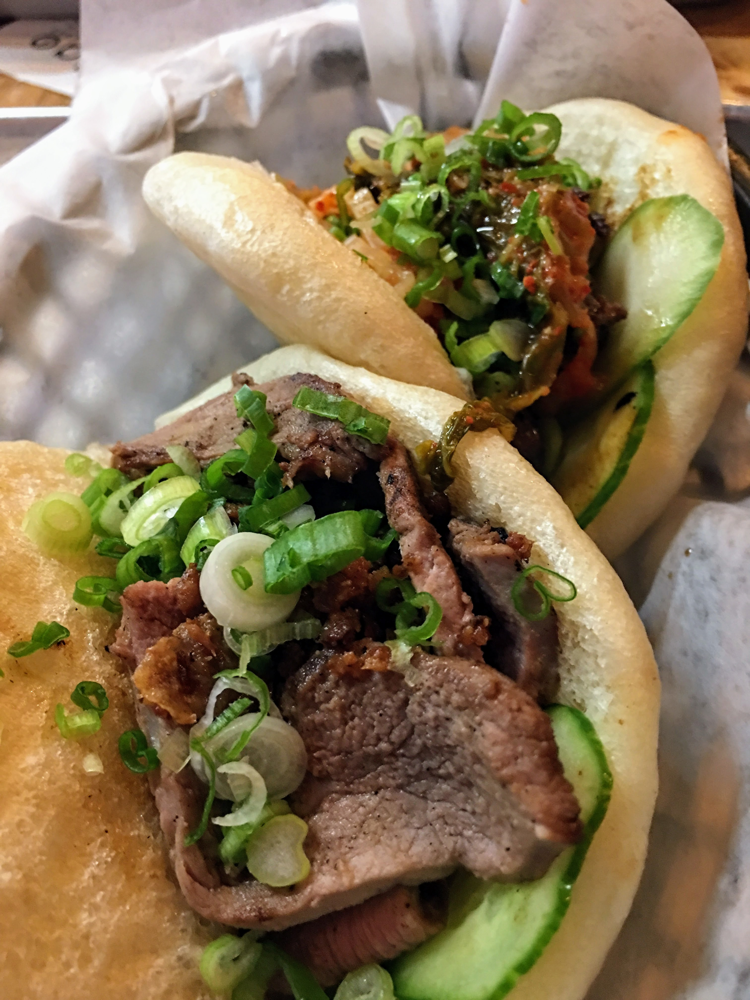
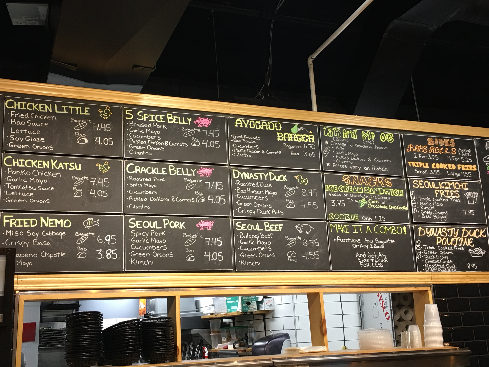
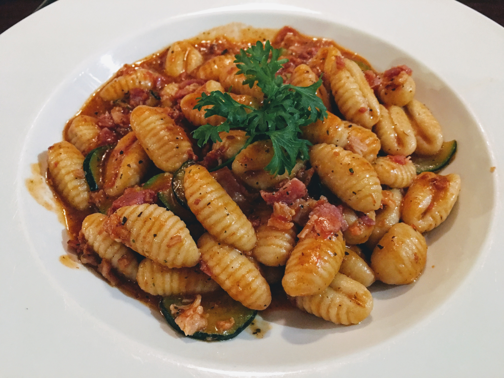
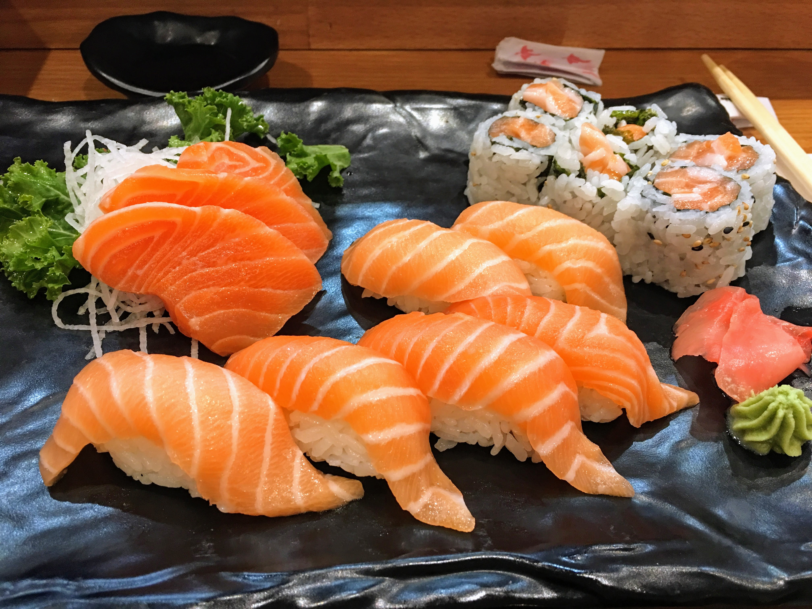
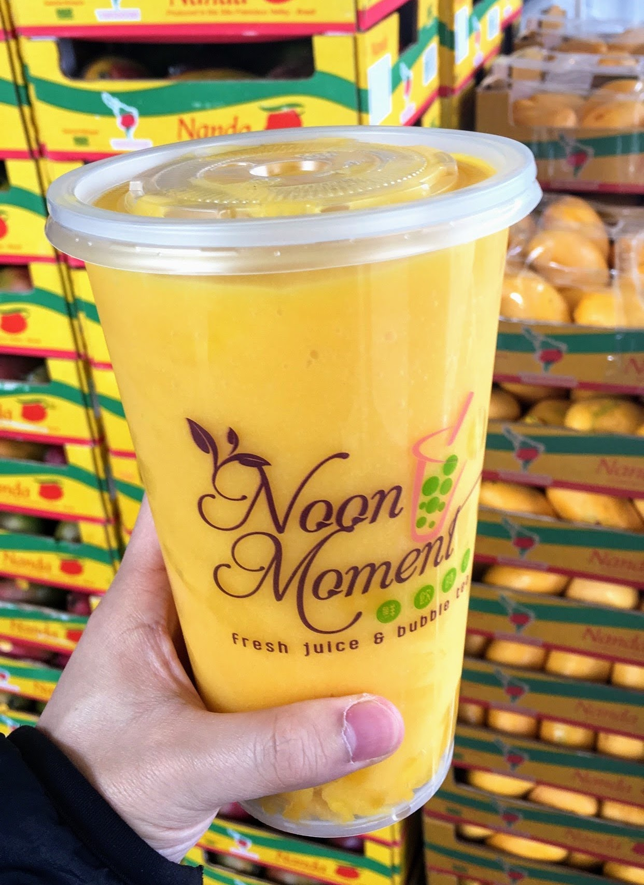
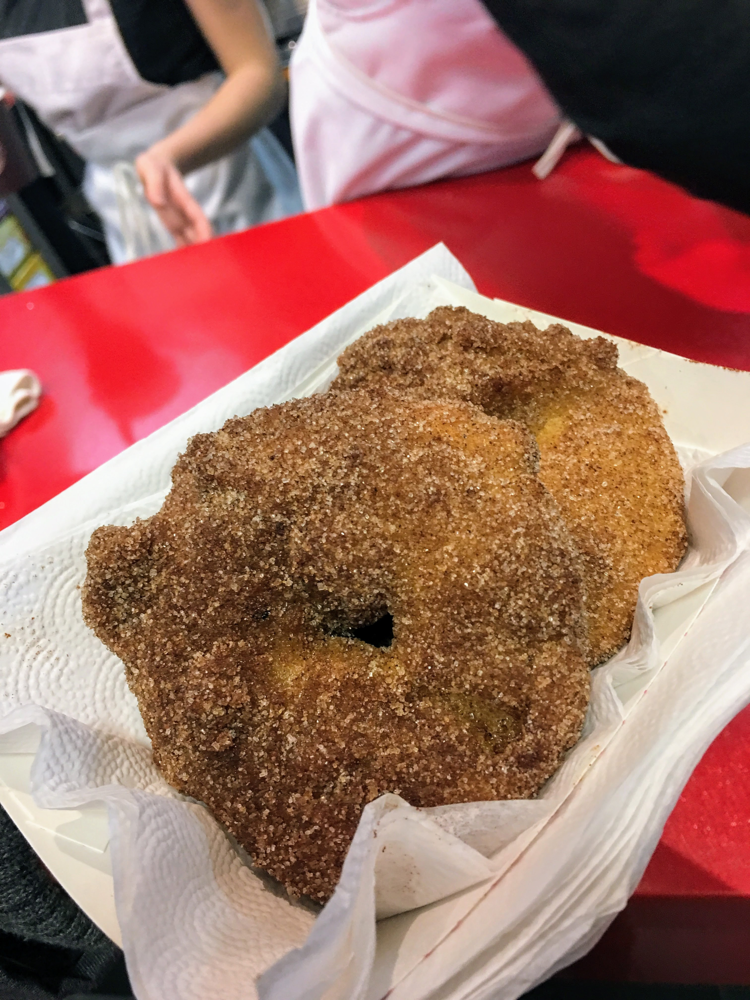

I am going into my last semester at Waterloo, and these are my favourite restaurants in Waterloo.

## Kinkaku Izakaya
Starting off with Kinkaku, which might be my favourite restaurant ever. It's an all you can eat sushi place and all of their food is super fresh. Every dish that comes out of their kitchen is really high quality. My favourites are: salmon sushi/sashimi/carpaccio, strip loin steak, beef teriyaki, black dragon roll, big hand roll, creme brulee and ice cream. I would recommend going right when they open for lunch or dinner to avoid wait in line.

### Bao Sandwich Bar
As the name suggests this place makes baos and vietnamese sandwiches. They offer around 12 types of baos which include pork, chicken, beef, fish and duck, and they are all really good.

## Ennios Pasta House
Usually I find that Italian restaurants don't have very big portions, but Ennios gives you a lot of pasta. I like the gnocchi a lot.

## Ken Sushi House
I love this place becuase it is so close to campus. They have lunch specials that are pretty good value. And if you go for dinner, the sushi/sashimi/roll boats are pretty good value too ⛵

## Noon Moment
This is a bubble tea store, and I haven't tried most of their drinks because I always order the Mango diamond slush, which is their specialty. They use real mangoes and its so good.

## St. Jacob’s Farmers Market
This farmers market is open year round on Thursdays and Saturdays from 7am-3pm. On top of selling produce, they have 20+ food stalls scattered around the Market. Two of my favourite snacks here are the apple fritters from The Fritter Co ([link](https://stjacobs.com/business-directory/eat/everything/everything/the-fritter-co-.htm)) and the freshly made pretzels from Grandpa's Soft Pretzels ([link](https://stjacobs.com/business-directory/eat/everything/everything/grandpa-s-soft-pretzels.htm)).

