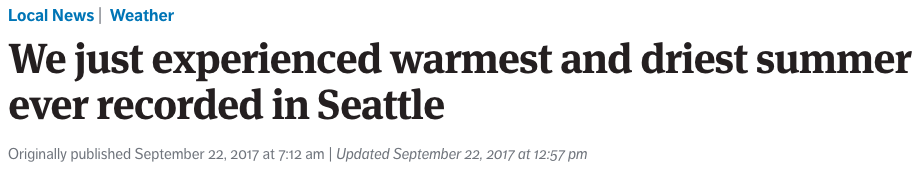
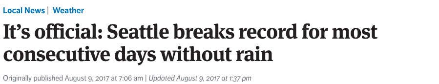
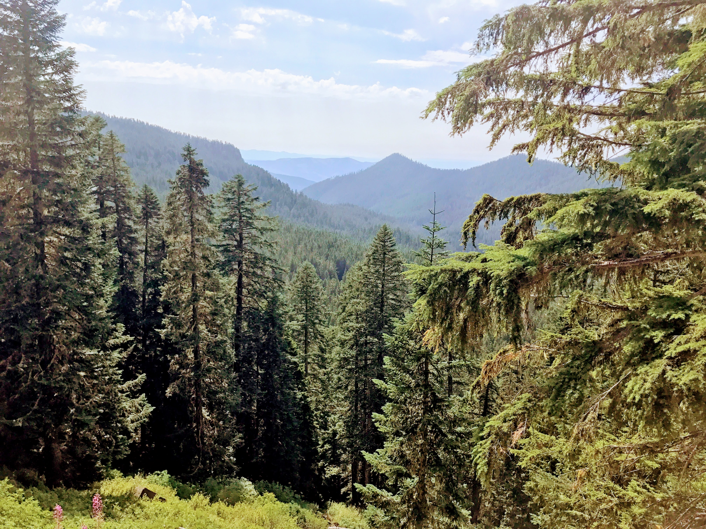
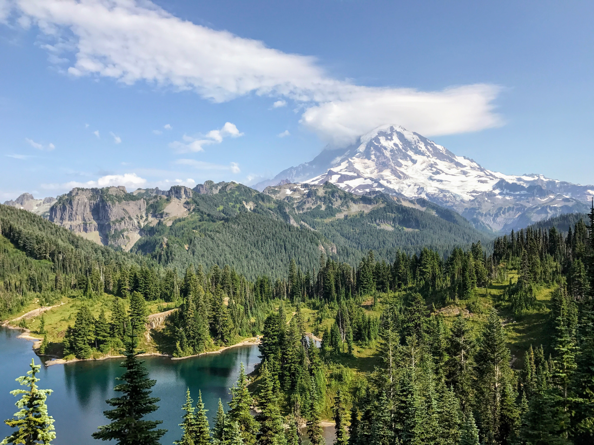
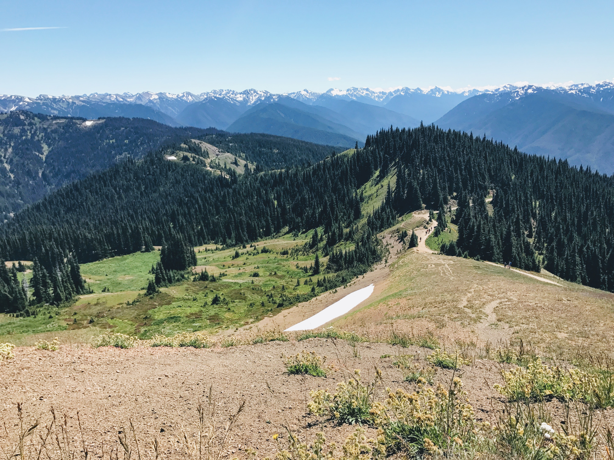
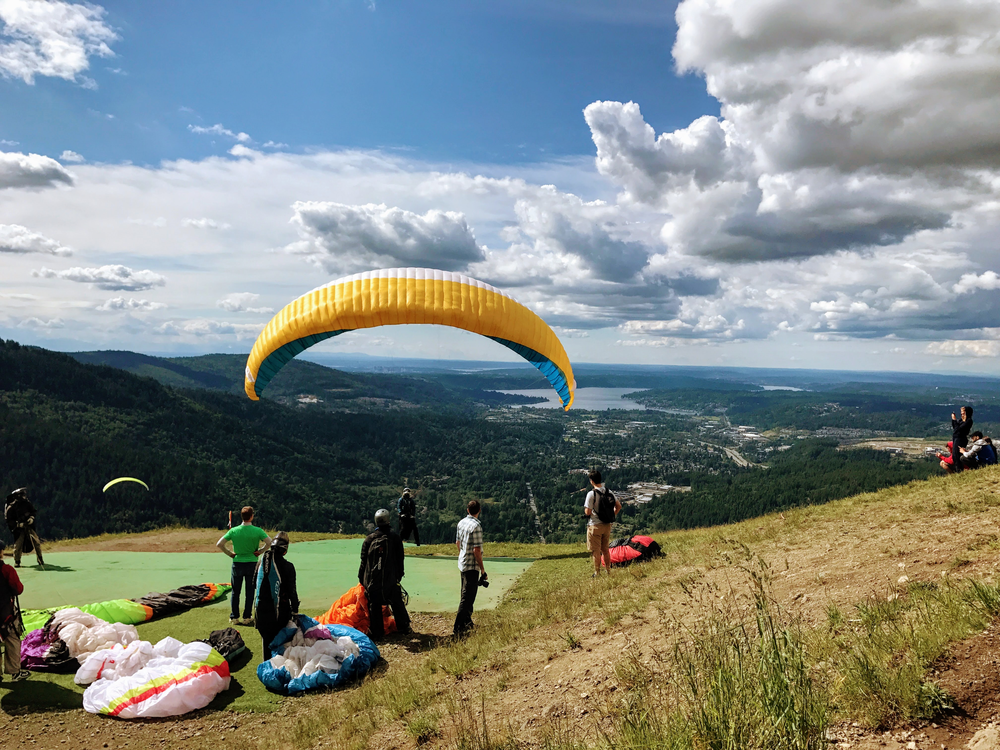
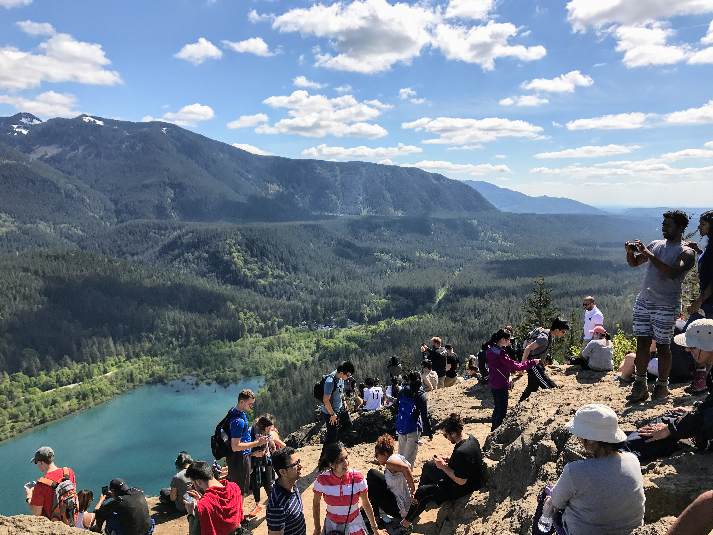
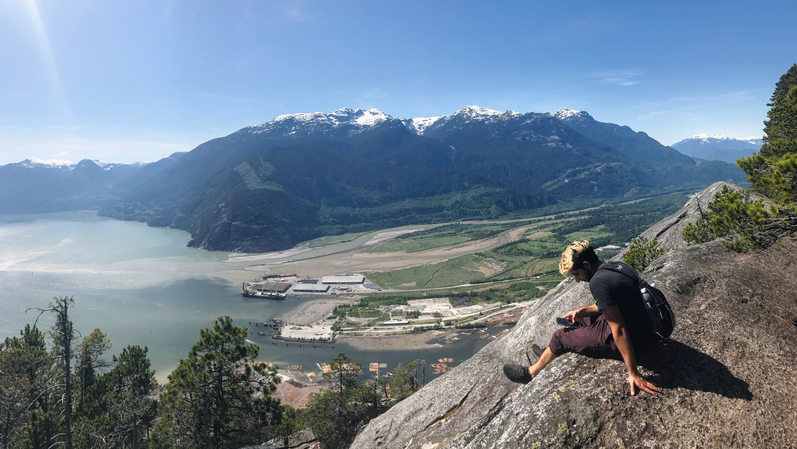

I lived in Seattle this past summer and was blessed with warm and dry weather. Historically it rains 150 days a year in Seattle, but it is a lot less frequent over the summer and this summer especially set the record for most consecutive days without rain ☀️

I had to take advantage by going outdoors as much as possible and exploring all of the nature around Seattle. Most of these hikes were around 3h roundtrip, but they were also out of the city, so we did as much driving as we did hiking on those days. Difficulty ratings are out of 🔟

## Tolmie Peak in Mount Rainier
* Drive from Seattle: 2h
* Hiking Roundtrip: 3h
* Difficulty: 4️⃣

This was my favourite hike because it was so scenic the whole way up. Mount Rainier has something about it that is so majestic. I could always see it looming behind me the whole way up. At the top we found a few birds that were really attracted to granola, though that probably wasn't good for them 😬

## Hurricane Ridge in Olympic National Park
* Drive from Seattle: 3h
* Hiking Roundtrip: 3h
* Difficulty: 5️⃣

The mountains in Hurrican Ridge looked straight out of a Coors Light commercial. We went on a sunny day and there were no trees to cast shade 😞 We also ran into deer! Olympic National Park is pretty far from Seattle, so I would recommend camping overnight if you visit.

## Poo Poo Point 💩
* Drive from Seattle: 30min
* Hiking Roundtrip: 3h
* Difficulty: 6️⃣

Poo Poo Point might be the closest hike to Seattle being just a 30 min drive away. We actually took the bus that day and walked 40min to get from the bus stop to the trailhead. The hike was a gradual incline the whole way up. At the top there were a lot of paragliders. It was so fun to watch them take off. A few of them even gained height during the flight and circled around us like hawks.

## Rattlesnake Ledge 🐍
* Drive from Seattle: 40min
* Hiking Roundtrip: 3h
* Difficulty: 6️⃣

I actually went on this hike twice, once with friends and once on a team offsite. It's an incline the whole way up but it is a fairly short hike and the viewpoint at the peak is amazing.

## Chief Trail in Squamish, BC
* Drive from Seattle: 3.5h
* Hiking Roundtrip: 5h
* Difficulty: 🔟

Ok this hike is actually in north of Vancouver in Squamish, but still only a 3.5h drive from Seattle, granted you have to cross the border and you might hit traffic. This is the most difficult hike I have ever done. The hike is short in distance, but it is straight uphill. Near the end it is so steep that they have chains and ladders to help you climb up and down.

Overall Seattle has some great hikes with breathtaking views. I'm looking forward to going back next year 😄
