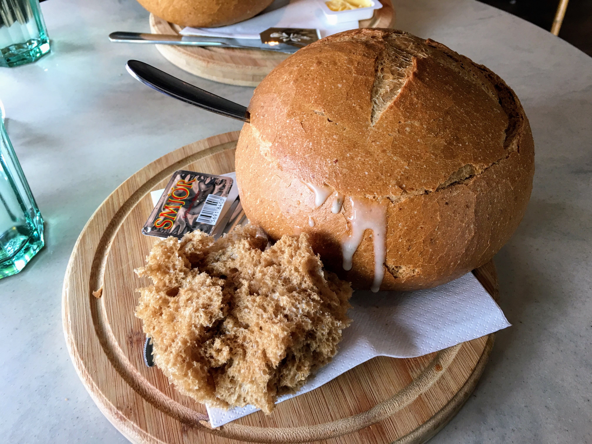
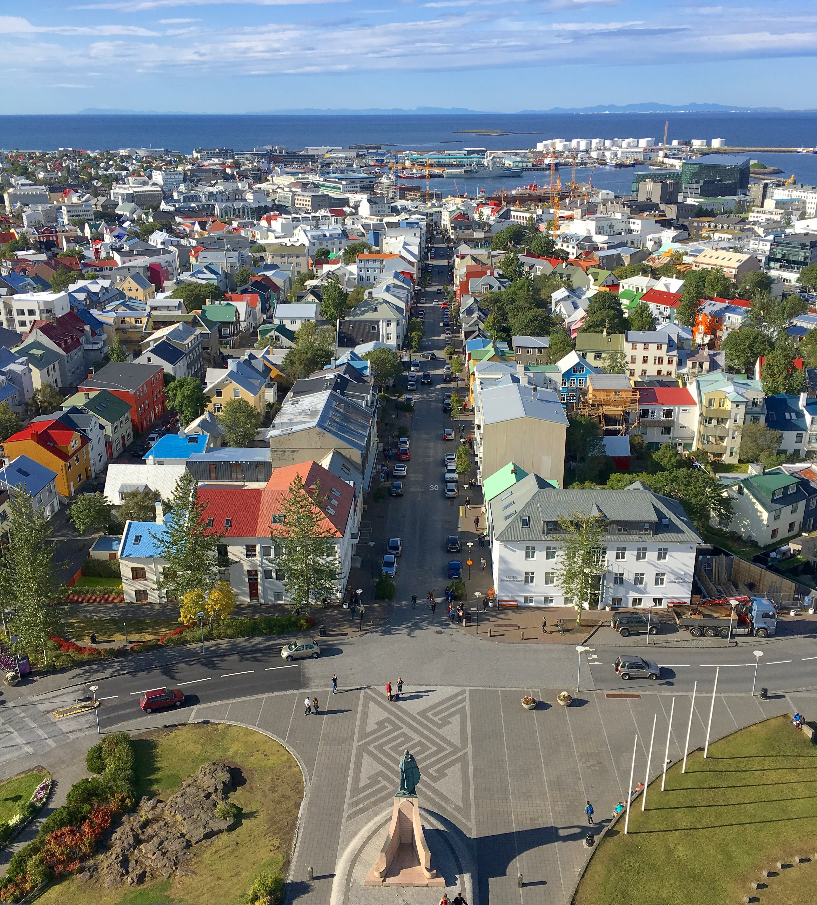
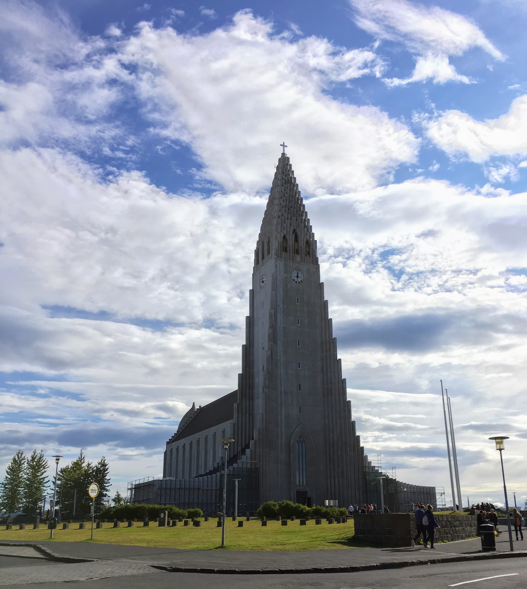
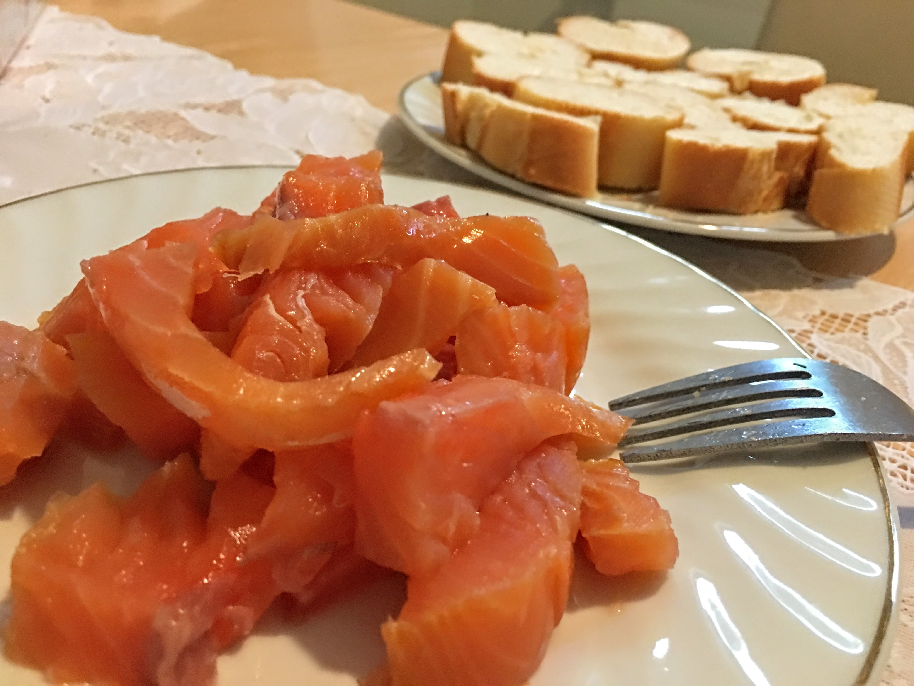
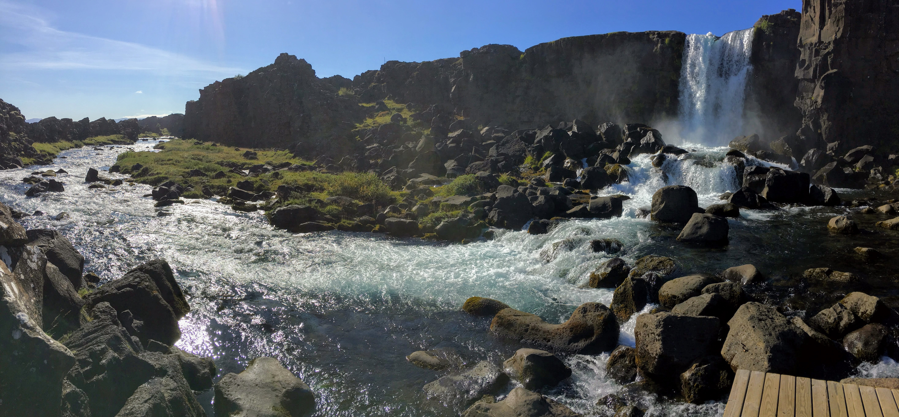
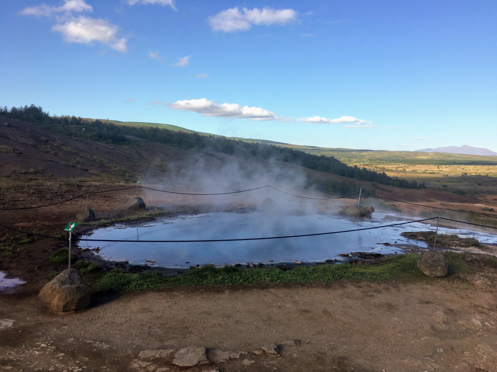
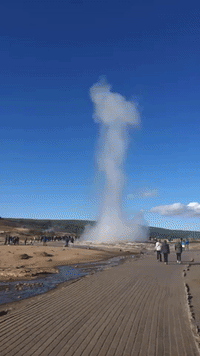
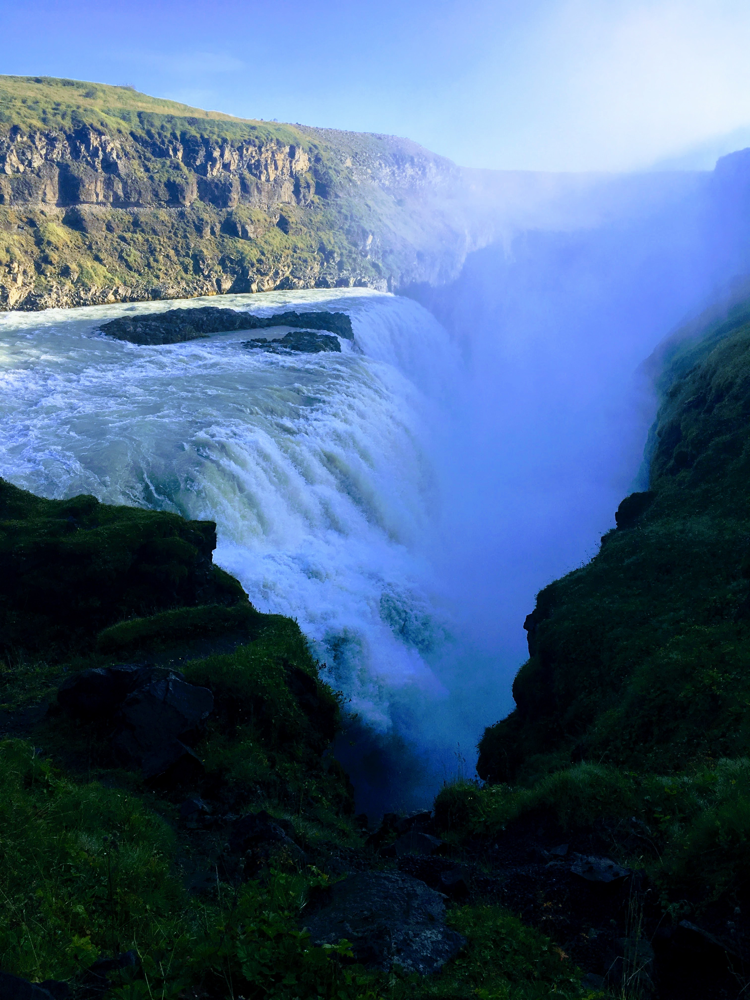
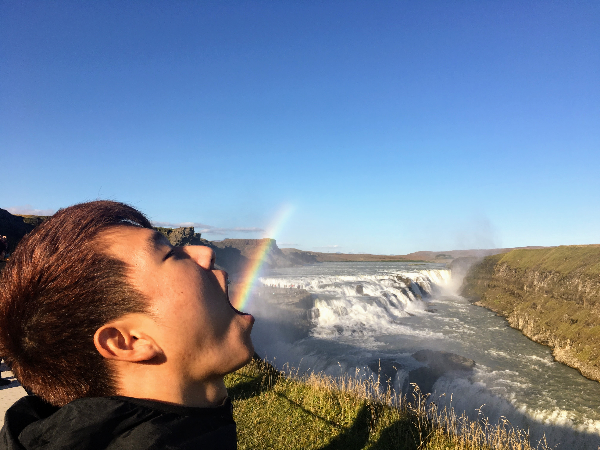
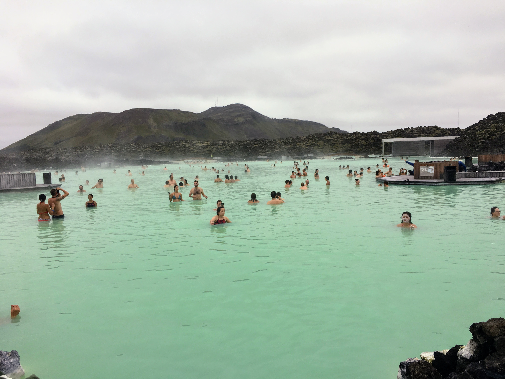

In September I took a trip to the Nordic countries with Cherrie and our first stop was Iceland.	

## Day 1

We stayed at an Airbnb near Reykjavik during the trip. One of our biggest concerns about Iceland was expensive it was to dine out. We tried our best to go to budget restaurants and buy groceries.

For our first meal, we went to the number one budget restaurant on TripAdvisor and had this amazing Soup in bread.

We walked around Reykjavik and checked out the iconic Hallgrimskirkja church. Before heading back to the Airbnb we went to a grocery store called Bonus and stocked up on dinner and snacks for the next day.

Later that night we tried to see the Northern lights by driving to a really dark area. We watched the sky for about 15 minutes, but didn't see anything. Our Airbnb host did warn us that you can't see the Northern Lights in September and I guess she was right.

## Day 2

The next day we drove to the Golden Circle, which is a route with three major scenic spots along the way [(more info on the Golden Circle)](https://guidetoiceland.is/best-of-iceland/top-9-detours-on-the-golden-circle#Thingvellir).

**Thingvellir National Park**

**The Geysir Geothermal Area**

**Gullfoss Waterfall**

## Day 3

On the last day we went to Blue Lagoon, which is a pretty neat geothermal spa. They have a large area that is not overcrowded and they have free unlimited face cream. It's best to reserve tickets online as it was sold out on the day we visited. Didn't get any great pics because I didn't wanna drop my phone in the water 💧

Overall I'd say three days was enough to see Reykjavik the Golden Circle and Blue Lagoon. If I go back I will be sure to drive around more of the island as the whole place is quite beautiful.

