To give Matt a bit of a break, **Sean** presented this month's news round-up

## News Round-up

### MicroPython v1.22.2 Patch release for rp2 DMA, UART and BLE; esp32 BLE; renesas-ra I2C
A few minor changes, [from the release notes](https://github.com/micropython/micropython/releases/tag/v1.22.2):

> *   py/compile: fix potential Py-stack overflow in try-finally with return
> *   extmod/asyncio: support gather of tasks that finish early
> *   extmod/modssl\_mbedtls: fix cipher iteration in SSLContext.get\_ciphers
> *   extmod/btstack: reset pending\_value\_handle before calling write-done cb
> *   extmod/btstack: reset pending\_value\_handle before calling read-done cb
> *   esp32/mpnimbleport: release the GIL while doing NimBLE port deinit
> *   esp32: increase NimBLE task stack size and overflow detection headroom
> *   mimxrt/modmachine: fix deepsleep wakeup pin ifdef
> *   renesas-ra/ra: fix SysTick clock source
> *   renesas-ra/boards/ARDUINO\_PORTENTA\_C33: fix the RTC clock source
> *   renesas-ra/ra/ra\_i2c: fix 1 byte and 2 bytes read issue
> *   rp2/rp2\_dma: fix fetching 'write' buffers for writing not reading
> *   rp2/machine\_uart: fix event wait in uart.flush() and uart.read()
> *   rp2: change machine.I2S and rp2.DMA to use shared DMA IRQ handlers

### Arduino Alvik

Arduino have announced [a cute pocket-sized little robot, called Alvik](https://www.arduino.cc/education/arduino-alvik/)

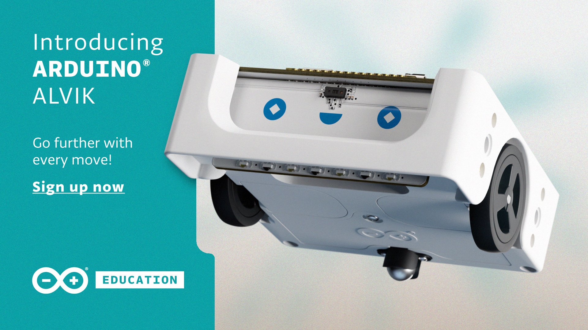

* Comes loaded with MicroPython out of the box
* Built-in [Arduino Nano ESP32, using an ESP32-S3](https://www.espressif.com/en/news/Alvik_ESP32-S3)
* Comes with numerous sensors:
    * line-following
    * Time-of-Flight (distance)
    * 6-axis accelerometer and gyroscope
    * proximity
    * colour

### Using a Raspberry Pi Pico to Enhance a Vintage Radio Shack Microcomputer Kit

Can a vintage microcontroller from 1985 run MicroPython? Of course not! Especially not one with a 4-bit architecture and 512 _bits_ of RAM. But, [this All About Circuits project using the Radio Shack Science Fair Microcomputer Trainer coupled to a Raspberry Pi Pico](https://www.allaboutcircuits.com/projects/using-a-raspberry-pi-pico-to-enhance-a-vintage-radio-shack-microcomputer-kit/) serves as a great introduction to how simple computers work.

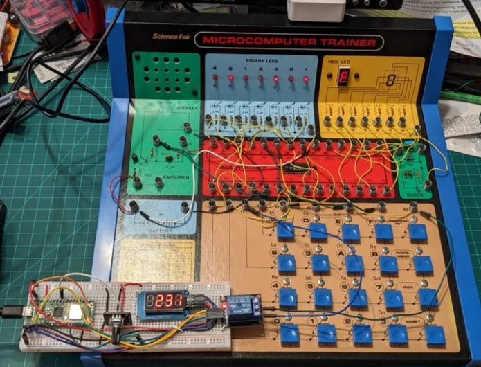

* Interesting intoduction to the Texas Instruments TMS1100, a very simple system-on-chip microcontroller (and claimed to be the first such chip)

### MPRemote Visual Studio Code Extension

> The goal of the MPRemote extension for Visual Studio Code is to give easy point and click access to many of the functions of the MicroPython project's MPRemote command-line tool. Rather than typing commands in a separate window, you simply navigate to them using the VS Code user interface.

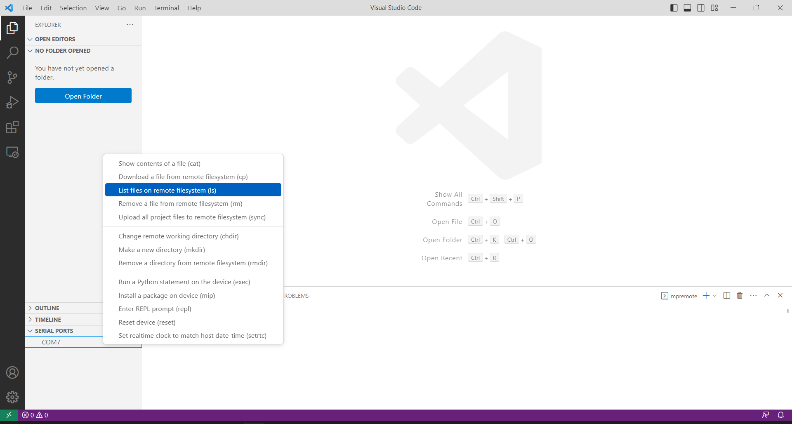

* Thanks to Dave, [DavesCodeMusings on GitHub](https://github.com/DavesCodeMusings)
* Have a look at [the GitHub repo](https://github.com/DavesCodeMusings/mpremote-vscode) or [detailed wiki page](https://github.com/DavesCodeMusings/mpremote-vscode/wiki) for more info

### Driving a LEGO car with an Xbox controller

Laurens Valk [has showed off driving a remote control car](https://fosstodon.org/@laurensvalk/111951571623325379) using LEGO Pybricks system attached to an Xbox controller

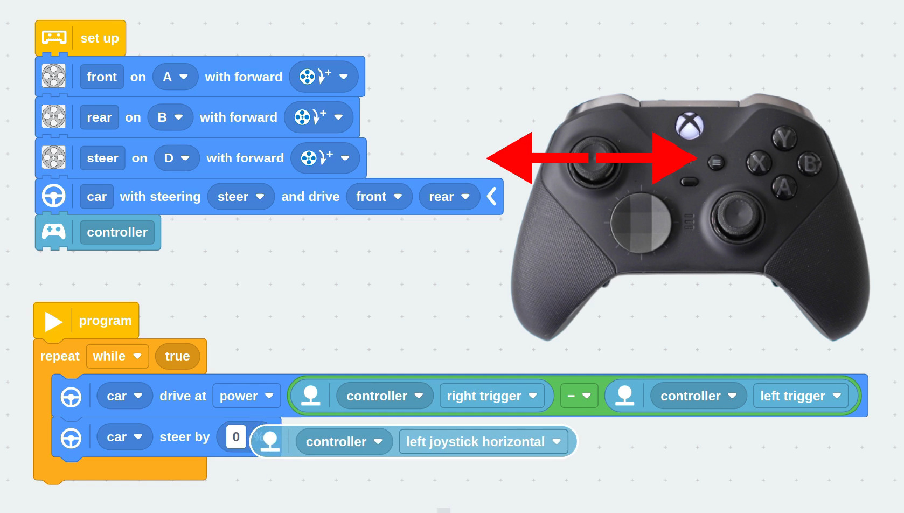

* We're going to try and get this running in the session today! We'll take photos if we get it working…
* Check out [this video](https://www.youtube.com/watch?v=fxInp9cutNg)
* [Pybricks](https://pybricks.com/) is MicroPython and block coding for LEGO hubs

### Crickets in (a northern hemisphere) February

Stewart C. Russell (scruss) has a new project guide on [using some Raspberry Pi Picos to make sounds like crickets](https://scruss.com/blog/2024/02/19/crickets-in-february/) do, including adapting the chirp rate depending on the temperature

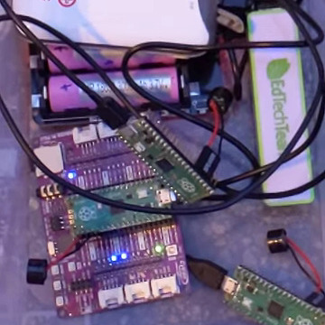

* Makes more sense when you know he lives in Canada! (it's cold there in February...)
* Good as an introductory lesson on doing a simple algorithm in MicroPython and interfacing that to some hardware

### Make Your Pet Hexapod

Who _doesn't_ want a 3D printed walking mechanical insect??

* [YouTube video series](https://www.youtube.com/makeyourpet) on making a robotic insect with a Pimoroni Servo2040, from Make Your Pet
* [Lots of information available](https://github.com/MakeYourPet/hexapod), although doesn't seem like it's a full end-to-end guide – more of a starting point to customise your own creation

### Notifications to water your pot plants

WizNet have [published a quick project demo](https://maker.wiznet.io/viktor/projects/how-to-monitor-your-plant-with-w5100s-evb-pico/?page=3&serob=mv&serterm=all) using one of their Ethernet boards to get Telegram messages when your pot plants need to be watered

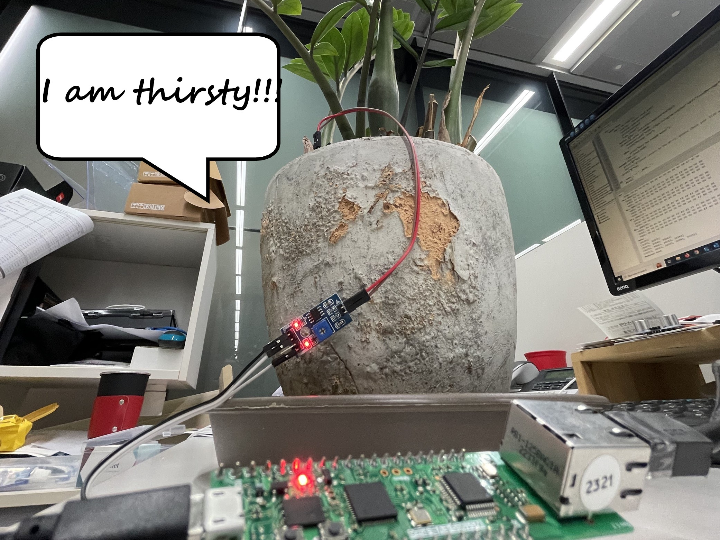

* Uses the W5100S-EVB-Pico
* And an undisclosed moisture sensor

### Build-A-Thon Nigeria

Nigerian government organised [an educational event](https://www.pulse.ng/news/local/build-a-thon-federal-government-concludes-student-centric-tech-program/1qk2j1s) in conjunction with the Raspberry Pi Foundation

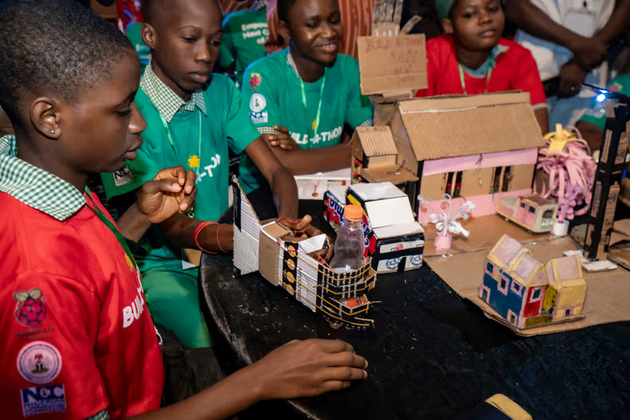

* 4-days program
* Over 500 senior secondary school students
* Introduction to embedded systems and maker culture using Raspberry Pi Pico and MicroPython

### Bus Pirate 5!

Hackaday [have written up a very detailed hand-on review](https://hackaday.com/2024/02/12/hands-on-bus-pirate-5/) of [the new Bus Pirate 5](https://buspirate.com/bus-pirate-5-rev-10-now-available/)

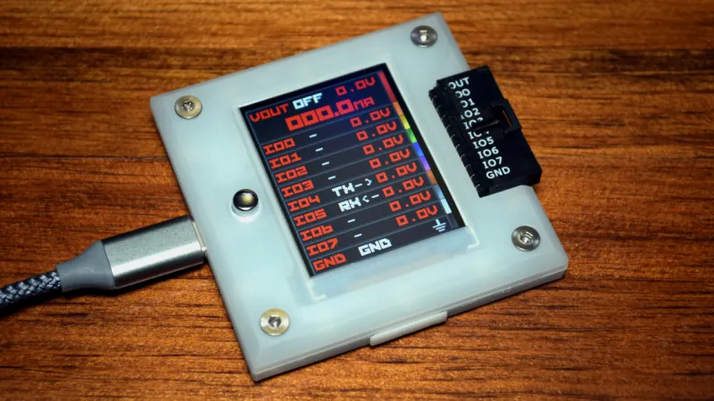

* Latest version of the Bus Pirate, a very handy protocol analyser and multi-tool
* Serial text-based interface, no special software needed (just a serial terminal)
* Has a display to show I/O configuration
* 1.2 V to 5.5 V I/O tolerance
* Programmable power supply, with current limiting
* Open source firmware, still in its infancy, but is [under active development](https://github.com/DangerousPrototypes/BusPirate5-firmware)
* I want one! Seems like it's US$38, [from their website](https://buspirate.com/get/)

### Electrosmith Daisy Seed

The [Daisy](https://electro-smith.com/products/daisy-seed) is an embedded system geared towards making music

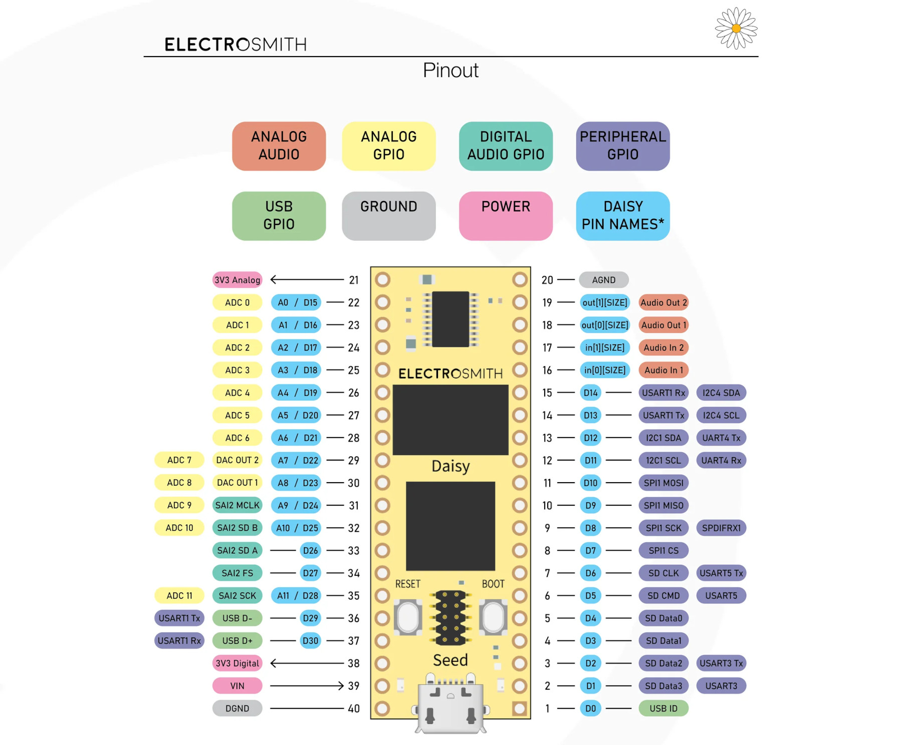

* Stereo audio I/O – 96kHz / 24-bit audio hardware
* ARM Cortex-M7 MCU, running at 480MHz
* 64MB of SDRAM for up to 10 minute long audio buffers, 8MB external flash
* No specific MicroPython support, but the MCU is supported so shouldn't be that hard to make a new port
* US$22, [from the Electrosmith website](https://electro-smith.com/products/daisy-seed?variant=45175761076516)

### Waveshare RP2040-BLE

Combines a Raspberry Pi RP2040 microcontroller with an unnamed Bluetooth 5.1 dual-mode chip

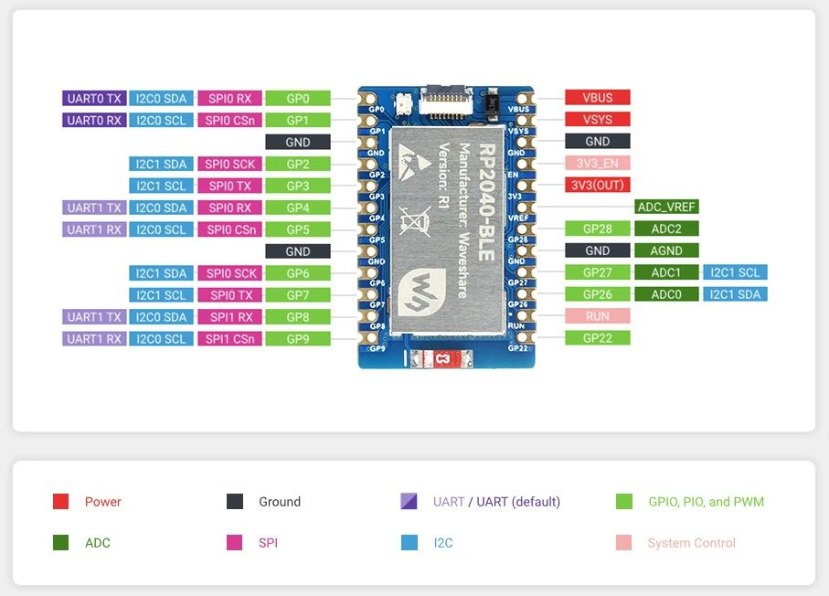

* Raspberry Pi RP2040
* Bluetooth 5.1 dual-mode function (BLE and classic)
* Controlled by serial AT commands
* Has [a wiki page with some examples](https://www.waveshare.com/wiki/RP2040-BLE)
* Very inexpensive, like most Waveshare parts, US$6.50 [from their online shop](https://www.waveshare.com/rp2040-ble.htm)

### Waveshare ESP32-H2-DEV-KIT-N4

RISC-V 32-bit single-core processor with a clock speed of up to 96MHz

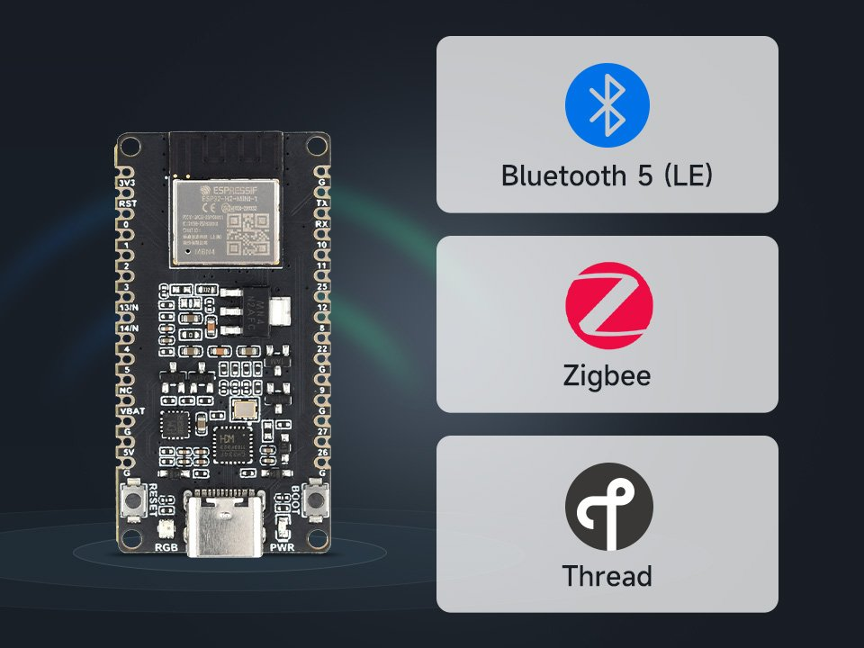

* ESP32-H2-MINI-1 module
* 320 KB SRAM, 128 KB ROM, 4 KB LP memory, 4MB Flash memory
* Radios for Bluetooth, Zigbee, Thread
* Lots of information [on the wiki page](https://www.waveshare.com/wiki/ESP32-H2-DEV-KIT-N4)
* Only US$5.99 [from their online shop](https://www.waveshare.com/esp32-h2-dev-kit-n4.htm)

### Closing Thought

  From [@markb139](https://twitter.com/markb139) [on X](https://twitter.com/markb139/status/1753061279797788681):

  > At one point I was debugging a C extension to micropython in one vscode and debugging python code in another. It was at that point I realised what an amazing set of low cost tools we have access to
