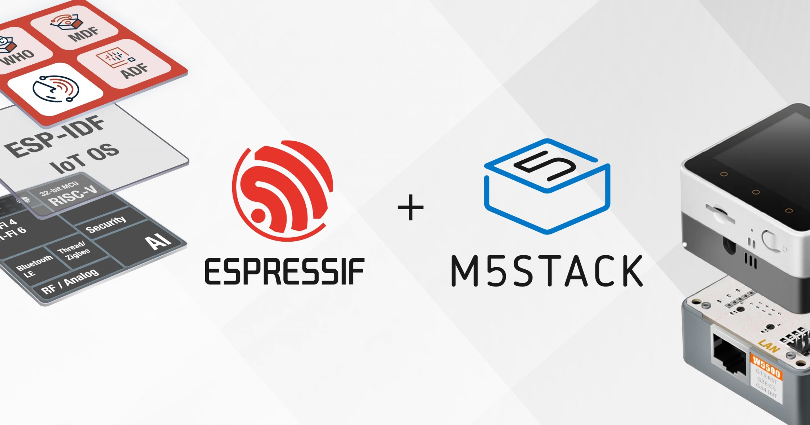
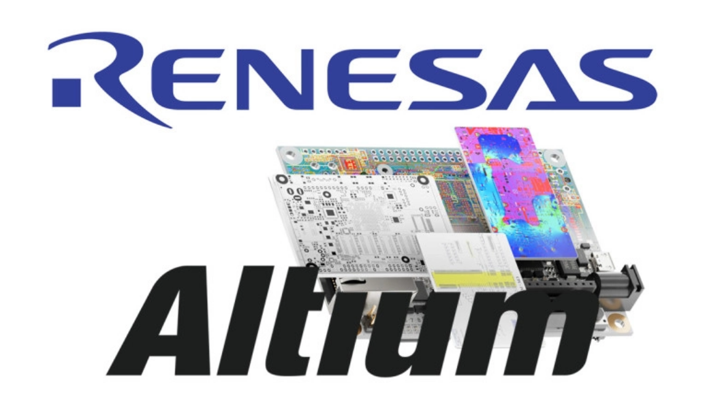
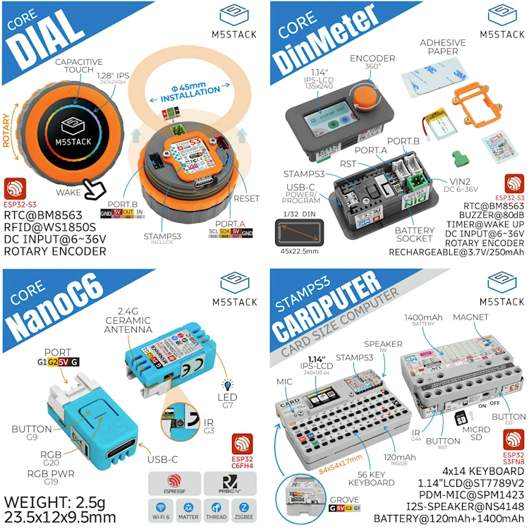
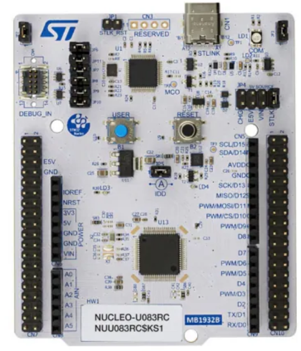
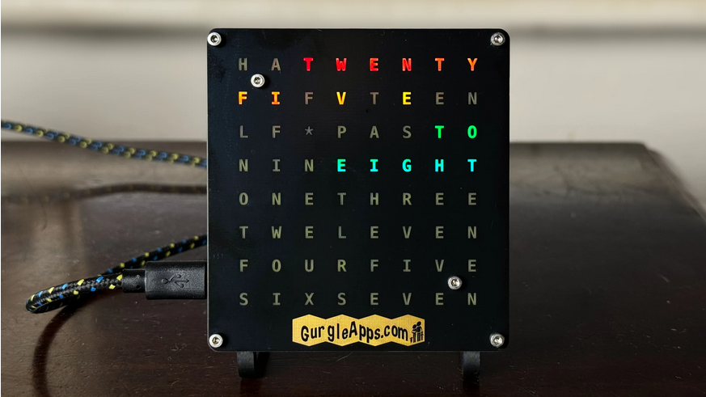
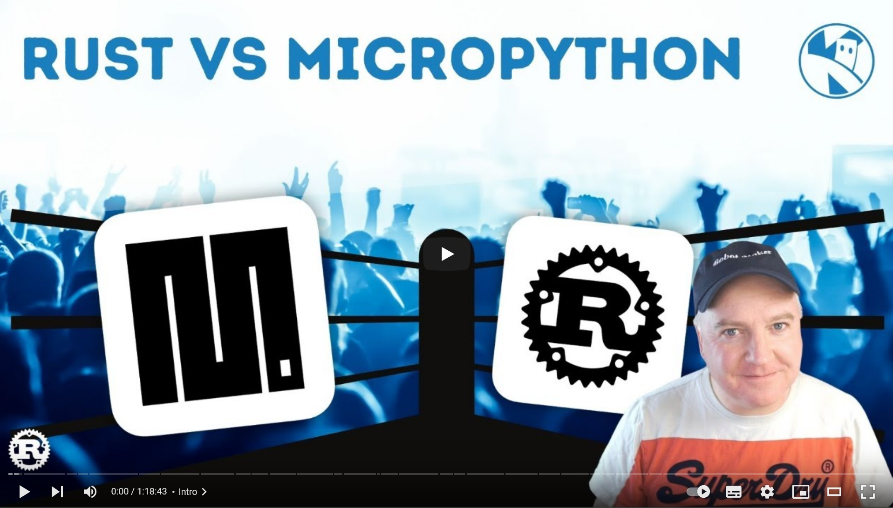
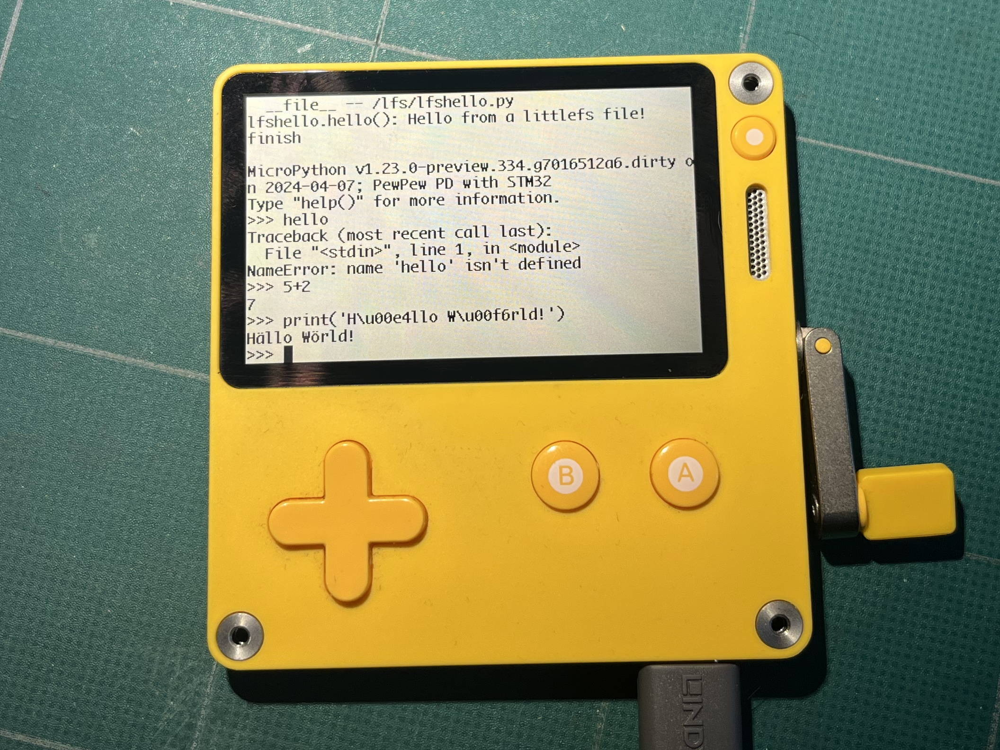
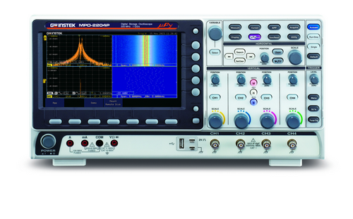
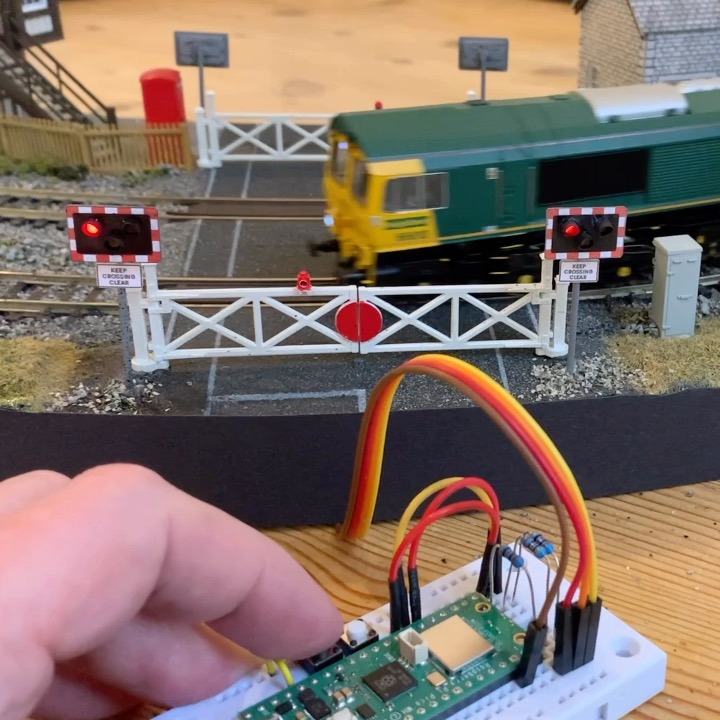
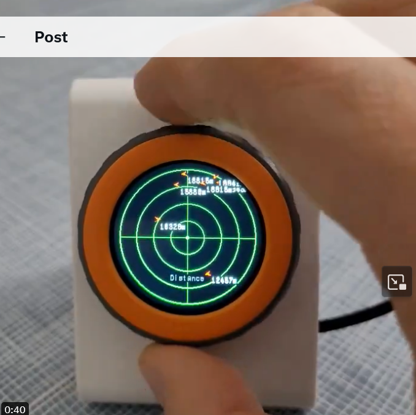

*Matt* has a bumper News Round-up!

## News Round-up

---

### Headlines

#### MicroPython v1.23 Release

It's taking a little longer than expected, but the v1.23 release is shaping up
to be a big one! Check out the [release-1.23.0
milestone](https://github.com/micropython/micropython/milestone/6) for the
current status.

Still to resolve: IPv6, PyScript issues and USB Device support.

#### CircuitPython 9.0

Congrats to our CircuitPython 'cousins' who have ust released version 9.0! Some
very cool additions, including USB Host, synthio updates, as well as merging in
MicroPython 1.21. (Ed: 9.0.4 is the latest bugfix release at the time of
writing)

#### Espressif acquires majority stake in M5Stack

In a [press
release](https://www.espressif.com/en/news/Espressif_Acquires_M5Stack),
Espressif announced they were investing in a majority share of M5Stack. And
M5Stack maintain that '[nothing
changes](https://twitter.com/M5Stack/status/1782337405242294337)' in how they
operate.

#### Renesas buys Altium

Japanese chip manufacturer Renesas plans to acquire PCB deisgn software Altium
for A$9.1 billion (!).

[eeNews: Renesas to buy PCB design software firm Altium for US$5.9
billion](https://www.eenewseurope.com/en/renesas-to-buy-pcb-design-software-firm-altium-for-us5-9-billion)

#### Arduino Days

[Arduino Days](https://days.arduino.cc/) was a three-day event talking about all
things Arduino - which, these days, includes a lot of MicroPython stuff.

Everything was live streamed and is available on YouTube.

---

### Matt's New hardware

#### M5Stack care package

- [M5Stack Dial](https://shop.m5stack.com/products/m5stack-dial-esp32-s3-smart-rotary-knob-w-1-28-round-touch-screen)
- [M5Stack Din Meter](https://shop.m5stack.com/products/m5stack-din-meter-w-m5stamps3)
- [M5Stack Cardputer Kit](https://shop.m5stack.com/products/m5stack-cardputer-kit-w-m5stamps3)
- [M5Stack NanoC6](https://shop.m5stack.com/products/m5stack-nanoc6-dev-kit)
- +Other peripherals!

#### STM32U083RC Nucleo

Super low power but with a Cortex-M0 @56MHz, 256KB flash and 40KB RAM it should
be a decent device for MicroPython!

#### Gurgle Word Clock

The Gurgle Word Clock is the [first kit by the Gurgle
folks](https://twitter.com/GurgleApps/status/1775204450849673563) and provides
all the parts you need to create a beautiful *Word Clock*, where words are lit
by a NeoPixel panel to display the time.

The [kit can be
purchased](https://gurgleapps.com/reviews/electronics/wifi-controlled-color-word-clock-kit-micropython)
complete or in parts, and the 3D models and MicroPython software are [open
source](https://github.com/gurgleapps/Gurgle-Apps-Word-Clock/).

It's such a fantastic little project! I think it will be of particular interest
to parents looking to build a relatively simple STEM project with their teen
child...or if you just want an attractive Word Clock!

---

### Hardware News

#### STM32 Summit

Lots of news!

- Beefier STM32**C0**'s. *Cheap*.
  - Up to 256KB flash, 36KB RAM
- A new series: **U0**. Super low power, affordable.
  - Up to 256KB flash, 40KB RAM
- Beefier **U5**'s. Low power and power*ful*.
  - Graphics acceleration (incl vector), 3-4MB RAM
- Beefier **H7**'s. Super powerful.
  - Also graphics acceleration, 600MHz
- New **WBA55**. H5 core + radio
  - 100MHz, radio good for BLE, Matter, Zigbee
- **MP2**. Two worlds, combined
  - 64bit Linux core + Cortex M33
  - Good match for OpenAMP?

Other big topics:

- AI at the edge
  - Including STM32N6
- Security

---

#### Embedded Open Source Summit

[Build Wireless Products Faster with Zephyr and
MicroPython](https://eoss24.sched.com/event/1aBFA) - Ryan Erickson

Video: See the [recorded livestream from
~7:34](https://www.youtube.com/live/nq1dvz3skUc?si=cgz7nq09yQArVz_d&t=27272).

Really interesting; runs MicroPython as a module in Zephyr, provides Zephyr
filesystem to MicroPython and allows access to C drivers. Slightly different
perspective to the MicroPython Zephyr port, though there is a lot that could be
reused.

#### Rust vs MicroPython

Kevin McAleer dons the fire-proof vest [Code Wars: Rust vs
MicroPython](https://www.youtube.com/watch?v=M9LekkoQyf0)

#### MicroPython Flipper Zero

Run MicroPython as an application on the Flipper Zero with
[mp-flipper](https://github.com/ofabel/mp-flipper). (Unless you're in Canada!)

#### Raspberry Pi Pico W Lessons for Absolute Beginners

Paul McWhorter continues to [release lessons on the RPi Pico
W](https://www.youtube.com/playlist?list=PLGs0VKk2DiYz8js1SJog21cDhkBqyAhC5).
His first was over a year ago and he's just published #66 - with another 13
already scheduled. Many use MicroPython.

#### MicroPython on the Playdate

[Christian Walther](https://fosstodon.org/@isziaui@mstdn.social) demonstrates
[MicroPython running on the
Playdate](https://fosstodon.org/@isziaui@mstdn.social/112230897686298712)!

He recently published his repository
[pew-playdate](https://github.com/cwalther/pew-playdate). I'm itching to try it
out! Christian's goal is to be able to get "[Pew
Pew](https://fosstodon.org/@isziaui@mstdn.social)" games running on the
Playdate.

#### Antirez

Salvatore Sanfilippo, aka *Antirez*, has been digging into MicroPython.

- [BME680 driver](https://github.com/antirez/bme680-pure-mp)
- [microfont](https://github.com/antirez/microfont)
- [vl53l0x-nb](https://github.com/antirez/vl53l0x-nb)
- [uc8151_micropython](https://github.com/antirez/uc8151_micropython)
  - Badget 2040 eink driver - but fast, anti-flickering and 32 levels of grey
    (monochrome device!)
  - [Clever e-ink driver does 32 levels of grey, avoids update flicker, and
    more](https://hackaday.com/2024/03/23/clever-e-ink-driver-does-32-levels-of-grey-avoids-update-flicker-and-more/)
- [Viper](https://twitter.com/antirez/status/1766588917245968643)
  - "Using MicroPython Viper...a 20x speed-up. C-level performance"
  - "Viper is a beast"
  - "...with Viper I found little or zero uses for C..."
- [Small random ideas thread about embedded
  programming...](https://twitter.com/antirez/status/1762774948240625723)
  - "In the embedded world MicroPython may be regarded as something just for
    hobbists, not suitable for real work. I beg to differ"
  - The whole thread is worth a read

This is just in the last month...

### Walter

The [Walter Crowd Supply](https://www.crowdsupply.com/dptechnics/walter) is now
live!

<iframe width="560" height="315" src="https://www.youtube.com/embed/WzoUBjXrJ2k?si=3B9Mzim6StfUGr-7" title="YouTube video player" frameborder="0" allow="accelerometer; autoplay; clipboard-write; encrypted-media; gyroscope; picture-in-picture; web-share" referrerpolicy="strict-origin-when-cross-origin" allowfullscreen></iframe>

### Your oscilloscope may run MicroPython...

Use MicroPython to script your DSO!

This is a [Gwinstek MPO-2000
Oscilloscope](https://www.gwinstek.com/en-global/products/detail)

---

### Projects

Peter Practicus [Level
  Crossing](https://twitter.com/PaterPracticus/status/1762862195283484696)

Sebastien's: [Use your M5Dial to display nearby
flights](https://twitter.com/Seb____________/status/1759680487793029220).

---

### Quick Bytes

* Edge Impulse: [Announcing Support for the OpenMV Cam
  RT1062](https://www.edgeimpulse.com/blog/announcing-support-for-the-openmv-cam-rt1062)
* Random Nerd Tutorials: [Raspberry Pi Pico W: Asynchronous Web Server
  (MicroPython)](https://randomnerdtutorials.com/raspberry-pi-pico-w-asynchronous-web-server-micropython/)
* Also by RNT: eBook - [Learn Raspberry Pi Pico/Pico W with
  MicroPython](https://rntlab.com/product/learn-raspberry-pi-pico-w-with-micropython-ebook/)
  * US$29 (I bought a copy, feel free to take a look)
* Hackaday: [Hacking An Actual WiFi Toothbrush With An
  ESP32-C3](https://hackaday.com/2024/03/05/hacking-an-actual-wifi-toothbrush-with-an-esp32-c3/)
  * (Rickroll #1!)
* Hackster.io: [How to Build a REST API on Raspberry Pi Pico W & Control
  LED](https://www.hackster.io/rajivcodelab/how-to-build-a-rest-api-on-raspberry-pi-pico-w-control-led-91b25b)
* [Installing MicroPython Modbus Library on Raspberry Pi Pico
  W](https://www.hackster.io/fusion_automate/installing-micropython-modbus-library-on-raspberry-pi-pico-w-9a0696)
* [Place Calls from A9G Board using Raspberry Pi Pico
  W](https://www.hackster.io/fusion_automate/place-calls-from-a9g-board-using-raspberry-pi-pico-w-0edaa6)
* [Flash Micropython Firmware in Seed Studio XIAO
  ESP32C3](https://www.hackster.io/fusion_automate/flash-micropython-firmware-in-seed-studio-xiao-esp32c3-80ed84)
* LED Animation library porting

---

### Closing Thoughts

[Bitluni](https://www.youtube.com/channel/UCp_5PO66faM4dBFbFFBdPSQ/join) built
the worlds most complex (spoiler) Rickroll:

<iframe width="560" height="315" src="https://www.youtube.com/embed/DdF_nzMW_i8?si=-D-4Pd9-LRJkN9J0" title="YouTube video player" frameborder="0" allow="accelerometer; autoplay; clipboard-write; encrypted-media; gyroscope; picture-in-picture; web-share" referrerpolicy="strict-origin-when-cross-origin" allowfullscreen></iframe>

Uri Shaked designed a *SkullFET*; a transistor in the shape of a skull and
crossbone! [Github](https://github.com/wokwi/skullfet)

<iframe width="560" height="315" src="https://www.youtube.com/embed/k9uyirps0J8?si=GBjFymTPK8eYzVPc" title="YouTube video player" frameborder="0" allow="accelerometer; autoplay; clipboard-write; encrypted-media; gyroscope; picture-in-picture; web-share" referrerpolicy="strict-origin-when-cross-origin" allowfullscreen></iframe>

---

### Midjourney fun

