*Matt* delivers the News Roundup and *Lachlan* gives a brief Propeller 2 update.

## News Round-up

---

### Headlines

#### Happy 11th Birthday MicroPython!

See the [tweet](https://x.com/micropython/status/1784874073329180975).

---

#### MicroPython v1.23 Release

Stay tuned, it's close!

---

#### Arduino Alvik

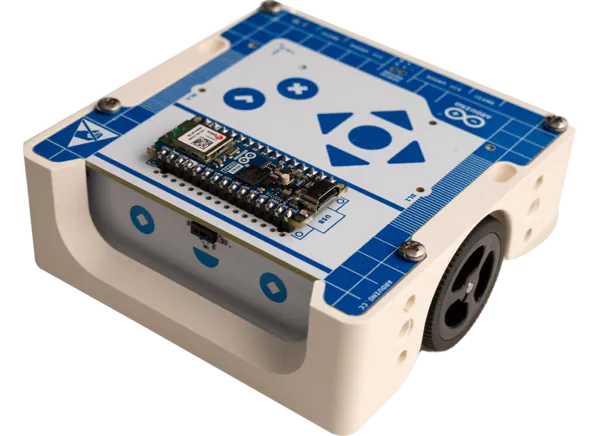

The [Arduino Alvik](https://www.arduino.cc/education/arduino-alvik/) has started
shipping. At US$140 it isn't cheap, but the initial reports seem *really*
positive. Seems *perfect* for STEM education!

The [arduino-alvik-mpy](https://github.com/arduino/arduino-alvik-mpy)
MicroPython was also released. A `mip`-installable library from Arduino!

Alex Glow's unboxing videos at hackster.io are always good and the [Alvik
unboxing](https://www.hackster.io/videos/1591) is no exception. 

---

#### PyCon

[PyCon US](https://us.pycon.org) is wrapping up, May 15-23 in Pittsburgh,
Pennsylvania. It's a fantastic source to learn more about Python - check out the
[schedule](https://us.pycon.org/2024/schedule/) for sessions you might be
interested in and keep an eye on the [PyCon US 2024 YouTube
Playlist](https://www.youtube.com/playlist?list=PL2Uw4_HvXqvYhjub9bw4uDAmNtprgAvlJ)
as all the presentations are recorded and will eventually be freely available.

Two sessions of interest for us are:

- [Introduction to MicroPython: getting started with BBC
  micro:bit](https://us.pycon.org/2024/schedule/presentation/4/) by [Juliana
  Karoline de Sousa](https://us.pycon.org/2024/speaker/profile/5/)
- [Connecting Old to New with CircuitPython: Retrocomputer input devices on
  modern PCs](https://us.pycon.org/2024/schedule/presentation/15/) by [Jeff
  Epler](https://us.pycon.org/2024/speaker/profile/18/)

There are also 3x sessions (!) involving PyScript:
- [Making Your Documentation Interactive with
  PyScript](https://us.pycon.org/2024/schedule/presentation/92/) by [Jeff
  Glass](https://us.pycon.org/2024/speaker/profile/105/)
- [Interactive Software Documentation, with
  PyScript](https://us.pycon.org/2024/schedule/presentation/115/) by [Valerio
  Maggio](https://us.pycon.org/2024/speaker/profile/133/)
- [Build in-browser 3D experiences with WebGL and
  PyScript](https://us.pycon.org/2024/schedule/presentation/139/) by [Łukasz
  Langa](https://us.pycon.org/2024/speaker/profile/159/)

---

#### PyScript

PyScript is moving *rapidly*!

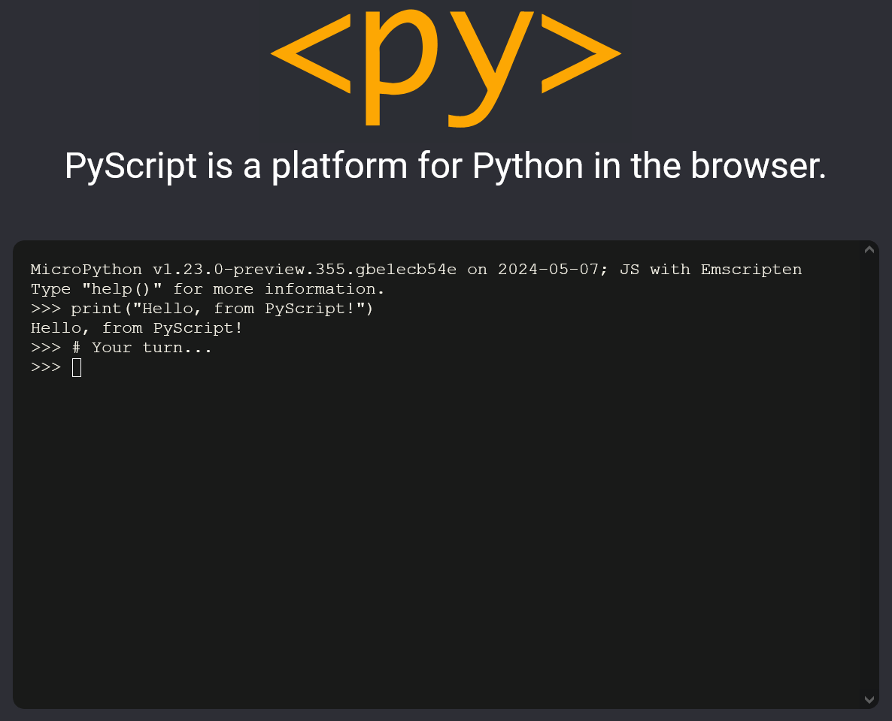

[PyScript.net](https://pyscript.net/) contains PyScript documentation...and now
provides an interactive MicroPython REPL in your browser! And there is now
increasing support to interact with the DOM from MicroPython. It's becoming
*very* usable *very* quickly.

<iframe width="560" height="315" src="https://www.youtube.com/embed/ZeQQxniOFbQ?si=ZyMn_PbUC_Ojy0YY" title="YouTube video player" frameborder="0" allow="accelerometer; autoplay; clipboard-write; encrypted-media; gyroscope; picture-in-picture; web-share" referrerpolicy="strict-origin-when-cross-origin" allowfullscreen></iframe>

Andreas Giammarchi ([Twitter](https://x.com/WebReflection)) provided a short but
*awesome* demo blinking an LED - no big deal except that this is MicroPython *in
the browser*...controlling MicroPython *on a device*!

Andreas has also released
[micro-repl](https://github.com/WebReflection/micro-repl), a SerialPort based
MicroPython REPL for the browser.

---

#### PySheets

[PySheets](https://pysheets.app/) is "The Spreadsheet UI for Python". Runs in
the browser and is commercial, built on PyScript. Interestingly, it appears to
use both CPython and MicroPython back-ends - the former for calculation and providing data science capabilities, the latter for managing the UI.

One of the developers added to the [Hacker News
announcement](https://news.ycombinator.com/item?id=40179566) (look for
'laffra').

MicroPython in the browser is - apparently - already here!

---

### Matt's New Hardware

#### Espressif ESP32-H2 (DevKitM-1)

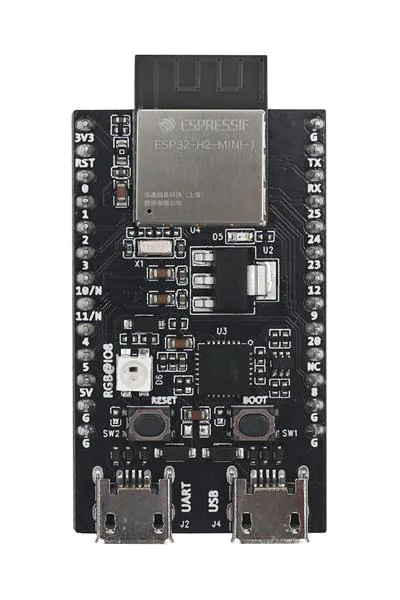

96MHz RISC-V, 4MB flash, 320KB RAM, 19 GPIO, BLE/Thread/Zigbee (no wifi).

---

#### Unexpected Maker: Bling! and TinyC6

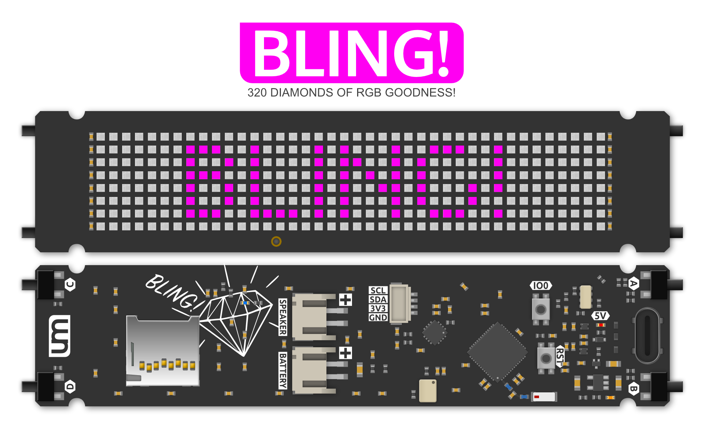

[Bling! at UM Shop](https://unexpectedmaker.com/shop.html#!/BLING/p/596946493/category=0)

- Stunning! 320x (40x8) RGB LED Matrix.
- ESP32-S3 (dual-core 240MHz), Wifi/BLE
- 8MB Flash, 2MB PSRAM
- Buttons, Battery charger
- I2S Mic & amp, RTC, uSD, STEMMA QT

(Three versions are available, this is the 'full' Hello BLING.)

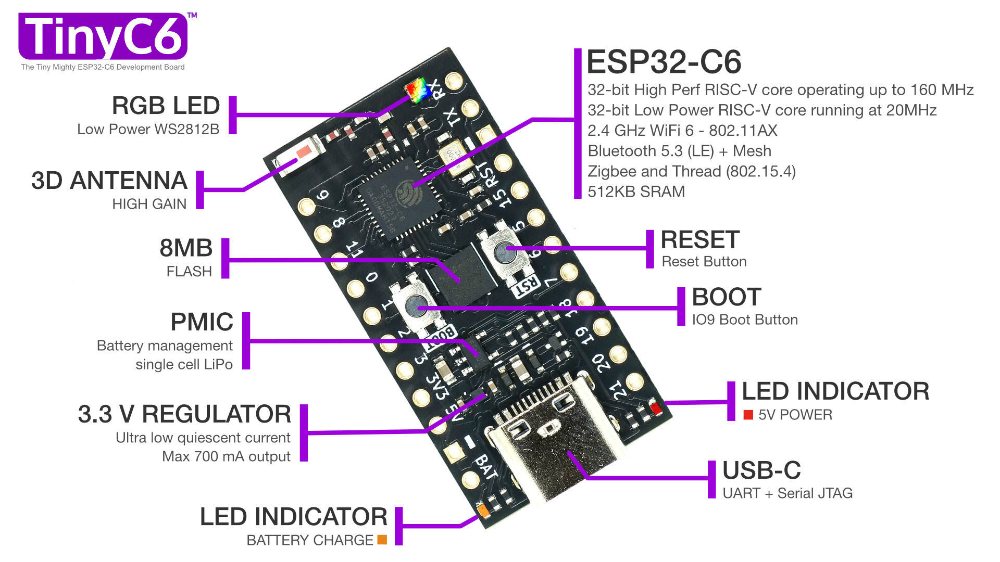

[TinyC6 at UM Shop](https://unexpectedmaker.com/shop.html#!/TinyC6/p/602208790/category=0)

- ESP32-C6, 160MHz RISC-V, Wifi/BLE
- 8MB Flash, 512KB SRAM
- Battery charging, RGB LED

---

#### NXP FRDM-MCXN947 dev board

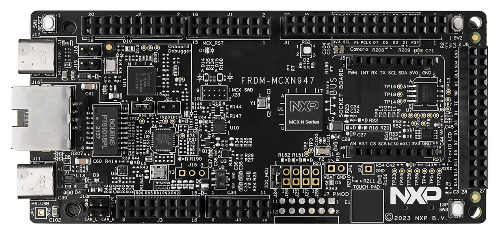

[FRDM-MCXNXP947 home page](https://www.nxp.com/design/design-center/development-boards-and-designs/general-purpose-mcus/frdm-development-board-for-mcx-n94-n54-mcus:FRDM-MCXN947)

Bought to help test PR #[13429](https://github.com/micropython/micropython/pull/13429)

- 150MHz Dual-core Cortex M33
- 2MB dual-bank flash, 512KB RAM
- 124 GPIO, DSP accel, Neural accel, CAN, Eth, touch...

---

### Hardware News

#### RT-Thread/Renesas Vision Board

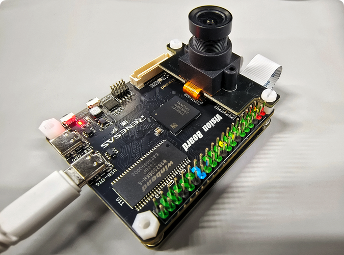

[AliExpress shop](https://www.aliexpress.com/item/1005006676753692.html)

A collaboration between RT-Thread and Renesas (?).

- Renesas R7FA8D1BH 480MHz Cortex M85 - first board to use this processor?
- Internal: 2MB flash, 1MB SRAM
- External: 8MB flash, 32MB SRAM
- Wifi (Renesas RW007)
- Display support: MIPI and RGB666
- OpenMV Port already available! 

[sdk-bsp-ra8d1-vision-board](https://github.com/RT-Thread-Studio/sdk-bsp-ra8d1-vision-board)

**AUD$53/64 (with cam and LCD)**

---

#### Cytron Maker Uno RP2040

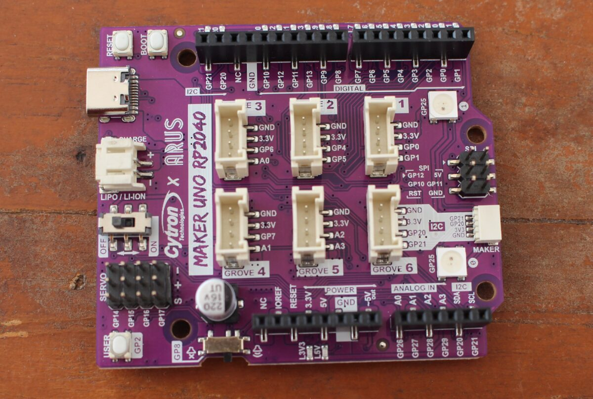

[Cytron Maker Uno RP2040](https://www.cytron.io/p-maker-uno-rp2040)

- RP2040: Dual-core Cortex M0 @133MHz
- 264KB RAM, 2MB flash
- Expansion galore: 6x grove, Arduino UNO headers, STEMMA QT, 12 pin header for servos
- LEDs on 16 GPIO

**US$15**

[Maker Uno RP2040 review at
CNX](https://www.cnx-software.com/2024/05/12/maker-uno-rp2040-review-arduino-ide-micro-servo-soil-moisture-sensor-ultrasonic-sensor-i2c-oled/)

---

#### Seeed Studio XIAO ESP32-C6

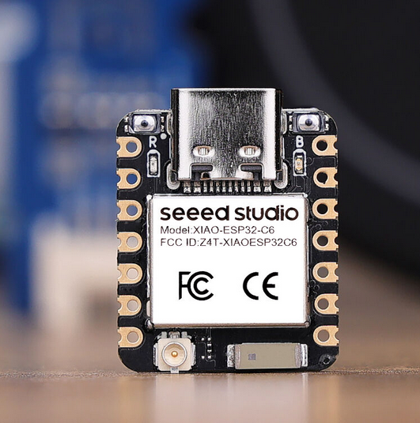

Seeed Studio announced their [XIAO ESP32-C6](https://us.seeedstudio.com/Seeed-Studio-XIAO-ESP32C6-p-5884.html).

ESP32-C6 (160MHz RISC-V, WiFi/BLE/Matter, 512KB RAM), XIAO form-factor, 4MB Flash, on-board & external antenna.

**US$5.20**

---

#### Waveshare

More to report next month, but Waveshare continue to announce interesting
products...

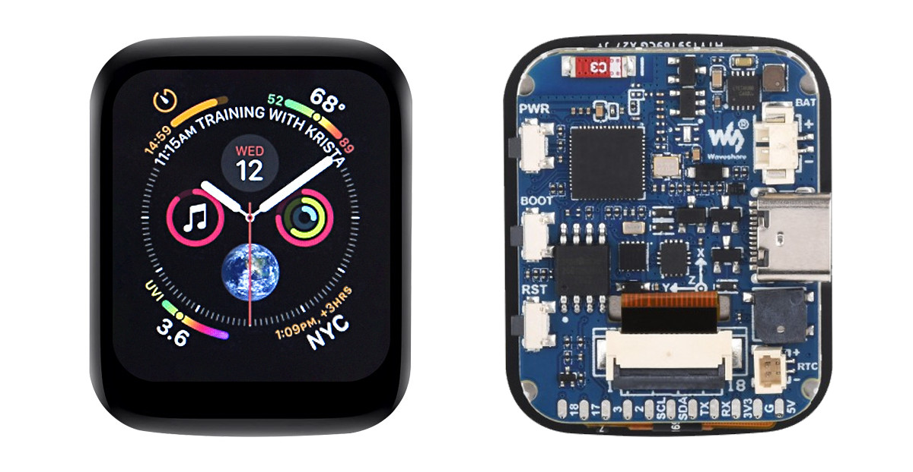

[ESP32-S3 1.69" Touch Development Board, 240×280 With Accelerometer And Gyroscope](https://www.waveshare.com/esp32-s3-touch-lcd-1.69.htm)

**US$22**

[CNX review their ESP32-S3 1.69" touch
device](https://www.cnx-software.com/2024/05/17/esp32-s3-1-69-inch-touch-display-features-6-axis-imu-rtc-uart/)

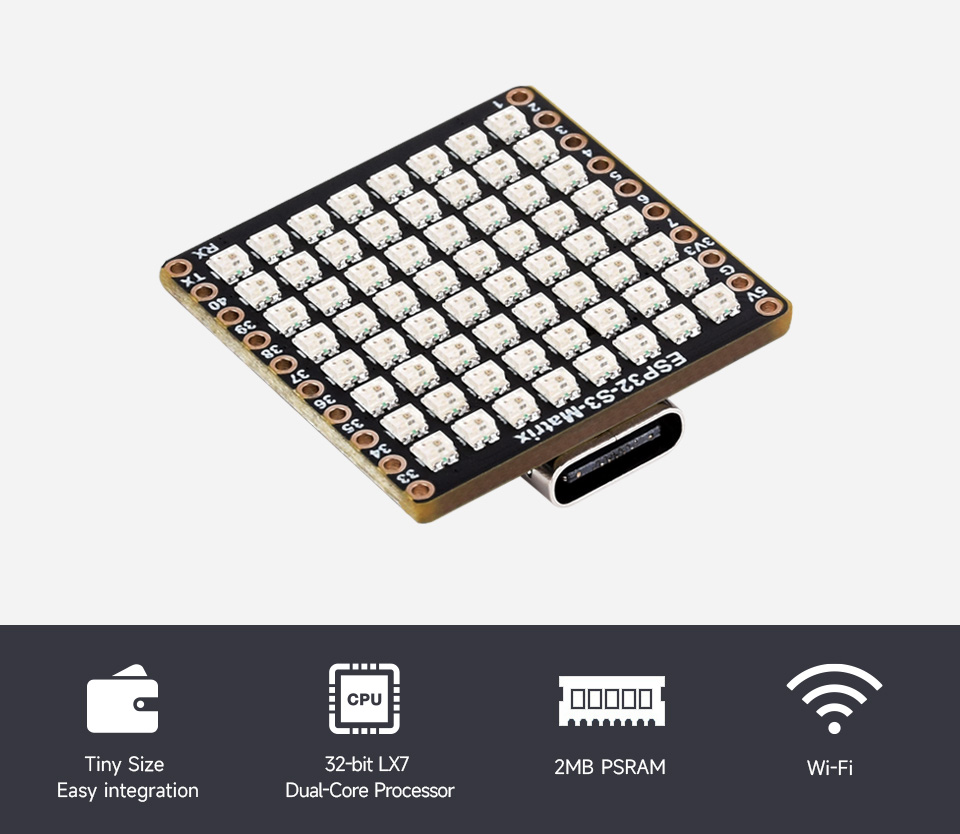

[ESP32-S3 RGB LED Matrix Boar](https://www.waveshare.com/esp32-s3-matrix.htm)

**US$9**

---

#### SparkFun Thing Plus - RA6M5

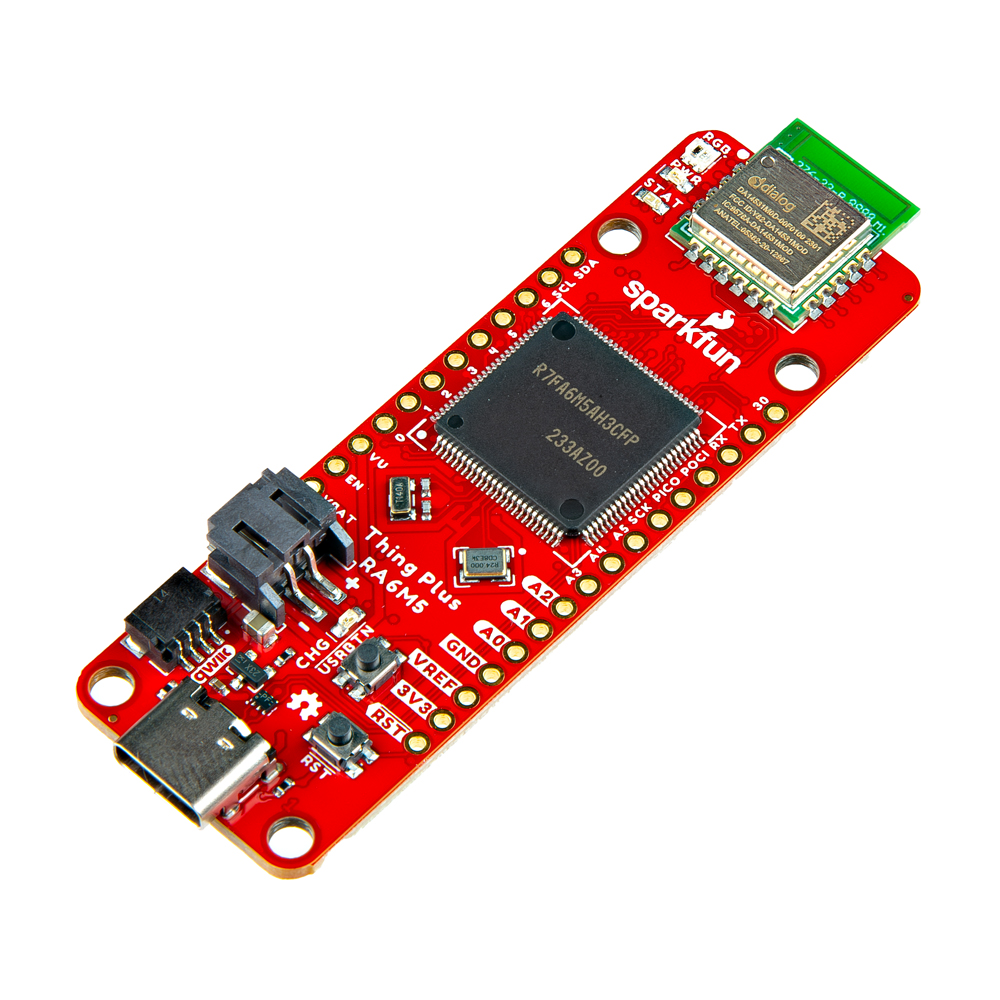

Sparkfun annouced the latest addition to their Thing+ range, [Introducing the
RA6M5 Thing+](https://www.sparkfun.com/news/10404).

Specs:

- Renesas 200MHz RA6M5
- 2MB+16MB flash, 512KB RAM, microSD
- BLE (via Renesas DA14531MOD module)
- Feather feetprint, Qeiic connector

**US$50**

---

#### Olimex ESP32-POE2

An update to their venerable POE board, the [Olimex
ESP32-POE2](https://olimex.wordpress.com/2024/04/25/esp32-poe2-open-source-hardware-poe-iot-board-provides-up-to-25w-power-supply-to-external-circuits/)
has an ESP32 (4MB flash/8MB RAM) at it's heart but the unique feature is on the
power side. This board can supply 24V/0.75A or 12V/1.5A - as well as an
additional 5V/1.5A - to an external circuit. 

Olimex have also open-sourced the hardware, software and documentation under permissive licenses, check out their repository [ESP32-POE2](https://github.com/OLIMEX/ESP32-POE2).

**€21** [direct from
Olimex](https://www.olimex.com/Products/IoT/ESP32/ESP32-POE2/open-source-hardware)

---

### Software News

#### MicroPython on the Playdate

Discussed last month, Christian hasn't stopped working on his MicroPython port
to the Playdate. It now [has access to the
filesystem](https://fosstodon.org/@isziaui@mstdn.social/112447442669116641)!

<video controls>
  <source src="../images/2024-05/pewpew_example.mp4" type="video/mp4">
Your browser does not support the video tag.
</video>

I followed his straightforward instructions to build the port and now
MicroPython is running on my Playdate too!

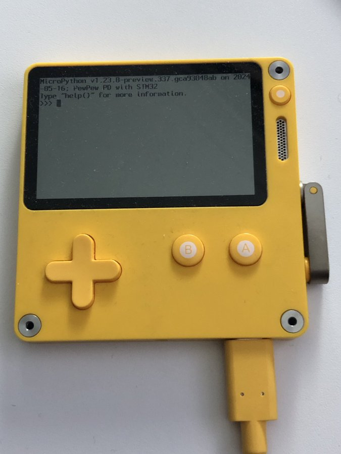

To make this a viable development framework for Playdate (and PewPew), more of
the [Playdate C
API](https://sdk.play.date/2.4.2/Inside%20Playdate%20with%20C.html) needs to be
exposed...for example, there are APIs to play sounds, load sprites and interact
with the crank. All of this can be done and Christian has provided the template
to do so!

---

#### mpflash: Your Ultimate MicroPython Flashing Companion

See [discussion #14395](https://github.com/orgs/micropython/discussions/14395).

Regular MicroPython contributor Jos Verlinde
(@[josverl](https://github.com/Josverl)) released his Python application,
[mpflash](https://github.com/Josverl/micropython-stubber/tree/main/src/mpflash).

It's a command-line utility to assist in deploying MicroPython firmware to
devices. It can list connected boards, detect and download the appropriate image
and flash it to your device.

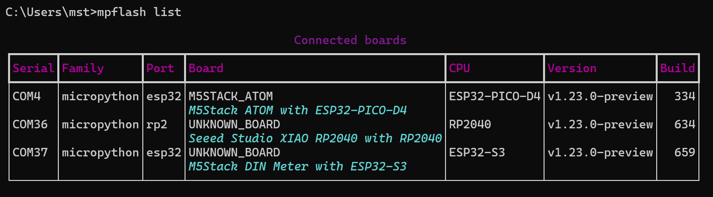

Jos is looking for feedback so please give it a try and let him know how you go.

---

#### microPyEZfonts

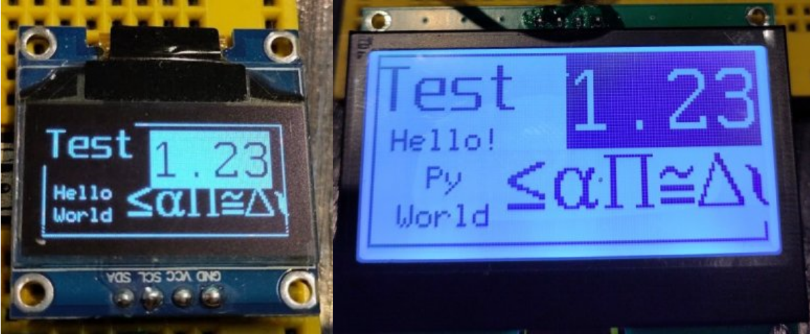

See [discussion #14455](https://github.com/orgs/micropython/discussions/14455).

Owen Carter (@[easytargget](https://github.com/easytarget)) is also looking for
feedback for his recently-released
[microPyEZfonts](https://github.com/easytarget/microPyEZfonts). Building on
Peter Hinch's excellent
[micropython-font-to-py](https://github.com/peterhinch/micropython-font-to-py)
it both complements and adds some improved features including transparency and
many pre-packaged free-to-use fonts.

If you're want to render fonts on a display, particularly if using framebuf, you
*need* to check out microPyEZfonts!

---

#### uPython WiFi Setup

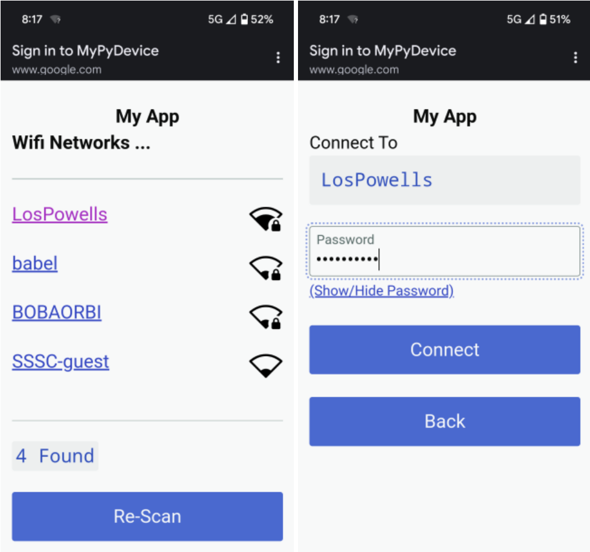

See discussion #[14454](https://github.com/orgs/micropython/discussions/14454).

Shane Powell (@[shaneapowell](https://github.com/shaneapowell)) released
[upython-wifi-setup](https://github.com/shaneapowell/upython-wifi-setup), a
library to help users connect to your device over wifi.

It will create a temporary access point the the first time it's used, acting
like a captive portal - but it will also scan and display wifi SSIDs that it
detects. A user can then select one and provide authentication details; the
device will then use this connection from that point on.

It's easy to integrate to your own projects, is async-compatible and works with
the popular [microdot](https://github.com/miguelgrinberg/microdot/) web
framework.

---

#### ESP32-C6 port

Andrew started PR
#[11869](https://github.com/micropython/micropython/pull/11869) to add support
for the ESP32-C6. I've been helping, there are now board definitions for
GENERIC_C6, M5Stack NanoC6, UM TinyC6.

The ESP32-C6 is an interesting micro, affordable but powerful! Please help test
if you have such a compatible device.

---

#### Other board definitions

I've been trying to backfill MicroPython board definitions for devices I've
purchased...

- [M5Stack Dial](https://github.com/mattytrentini/micropython/tree/add-m5stack-dial-board)
- [M5Stack DIN Meter](https://github.com/mattytrentini/micropython/tree/add-m5stack-din-meter)
- Seeed Studio XIAO RP2040 (PR #[14402](https://github.com/micropython/micropython/pull/14402/))

Again, please test if you can! Reach out if you need help building.

---

### Projects

#### LD06-LIDAR library

[Tim McGuffin](https://x.com/NotMedic) created a library -
[LD06-Lidar-micropython](https://github.com/NotMedic/LD06-Lidar-micropython) -
to interface to the LD06, one of the more affordable (US$10?!) LIDAR devices. 

He then [went on to render the
output](https://x.com/NotMedic/status/1789994305530065272) as a quick demo of
what's possible:

<video controls>
  <source src="../images/2024-05/tim-lidar2.mp4" type="video/mp4">
Your browser does not support the video tag.
</video>

---

#### Car Base Board

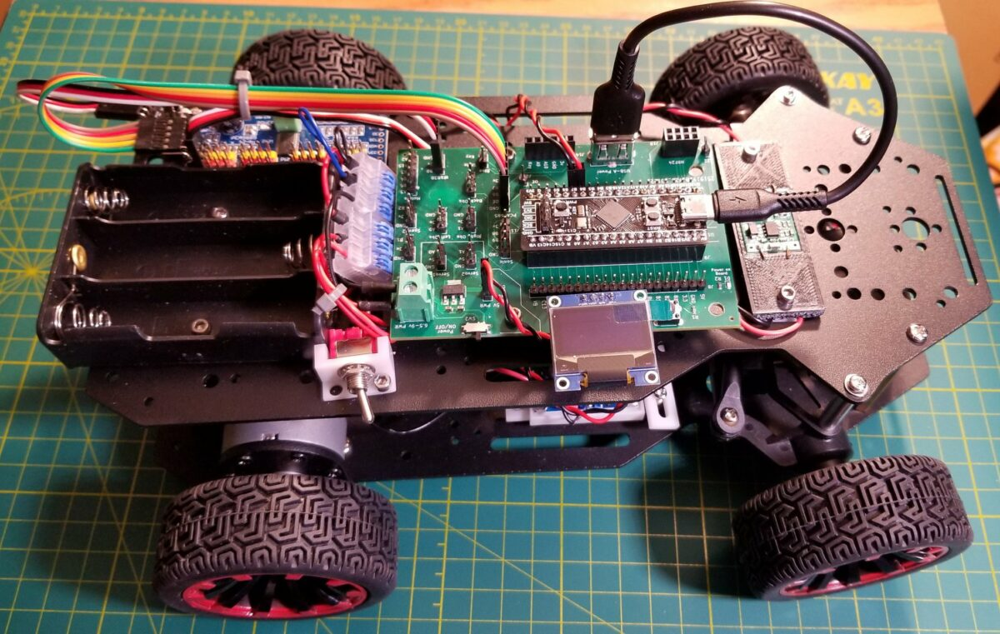

The [Car Base Board](https://www.tindie.com/products/aiy745321/car-base-board/)
is designed to host an STM32 Black Pill and allow easy interfacing to motors and
sensors.

CNX Review: [Easily build a robot car with the Car Base Board for the STM32F411
“Black Pill”
board](https://www.cnx-software.com/2024/05/16/build-robot-car-car-base-board-stm32f411-black-pill-board/)

A whole bunch of demos and MicroPython example code can be found on their
[CarBaseBoard](https://github.com/kwinter745321/CarBaseBoard) repository.

Pick one the bare base board for **US$14**

---

### Quick Bytes

* Kwabena Agyeman (OpenMV) was on [episode
  #477](https://embedded.fm/episodes/477) the Embedded.fm podcast
* Mahmood Shilleh: How to Connect BH1750 with the Raspberry Pi Pico/Pico
  W ([article](https://www.hackster.io/Shilleh/how-to-connect-bh1750-with-the-raspberry-pi-pico-pico-w-7be5e0), [video](https://www.youtube.com/watch?v=l9MAZu7yvN4))
* Lorraine McUnderwood: Moon Phase Display with Raspberry Pi Pico
  ([article](https://community.element14.com/challenges-projects/element14-presents/project-videos/w/documents/28409/moon-phase-display-with-raspberry-pi-pico----episode-641?CMP=SOM-THREADS-PRG-E14PRESENTS-EP641-IMAGEPOST-COMM),
  [video](https://www.youtube.com/watch?v=txeBicJ23eU),
  [code](https://github.com/Lorrainbow/moonphases))
* [Reducing Raspberry Pi Pico W power consumption and a second attempt at using
  solar panels](https://stfn.pl/blog/34-pico-power-consumption-solar-panels/)

---

### Final Thoughts

#### Scroll art from Al
Al Sweigart (author of the popular Python book [Automate the Boring
Stuff](https://automatetheboringstuff.com/)) presented a cool lightning talk at
PyCon US - it's a *scroll art* animation synchronised to Oingo Boingo's
*Forbidden Zone*:

<iframe width="560" height="315" src="https://www.youtube.com/embed/Sjk4UMpJqVs?si=Fg4rkpjj6MygfhR-" title="YouTube video player" frameborder="0" allow="accelerometer; autoplay; clipboard-write; encrypted-media; gyroscope; picture-in-picture; web-share" referrerpolicy="strict-origin-when-cross-origin" allowfullscreen></iframe>

---

#### Lego + Rubik's cube + MicroPython = ?

<iframe width="560" height="315" src="https://www.youtube.com/embed/fhpwnSIfUmM?si=AzJ4xwaf0waNHmQx" title="YouTube video player" frameborder="0" allow="accelerometer; autoplay; clipboard-write; encrypted-media; gyroscope; picture-in-picture; web-share" referrerpolicy="strict-origin-when-cross-origin" allowfullscreen></iframe>

---

### Midjourney fun

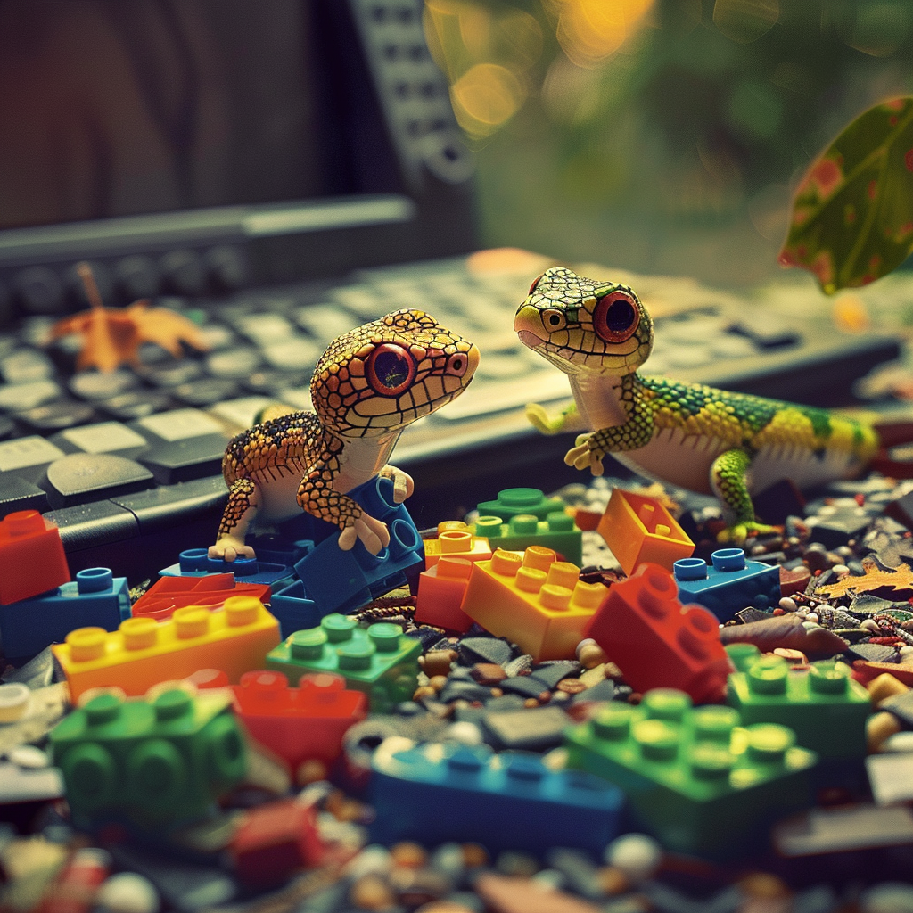
