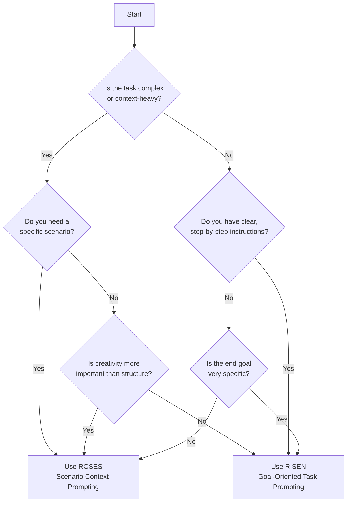

While learning how to use GenAI for coding projects, I've run into a few different prompting frameworks that help to organize my thinking and make my instructions more consistent.  ROSES and RISEN are two strategies that seem similar on the surface, so I wanted to dig into the differences between them.

<!--more-->

## What the acronyms stand for

ROSES:
- Role
- Objective
- Scenario
- Expected Solution
- Steps

RISEN:
- Role
- Instructions
- Steps
- End Goal
- Narrowing

## What they have in common

Any prompting strategy should include defining a 'role' or 'persona', and that's what the 'R' stands for in both of these acronyms.  This part influences the model's output through both contextual framing and behavioral priming.  At first, one point that Claude brought up when explaining this concept was that the role "Activates relevant knowledge domains within the model's training data."  I found this statement misleading since it implies that the model is somehow looking up its answers from the original data, and I know that this isn't the case.

Claude then clarified that "LLMs do not access their original training data in real-time during inference" and that "the model's "knowledge" is encoded in its parameters, not stored as retrievable data."  So the role is more like a way to "steer the model's attention and generation process towards certain types of outputs."  We have to remember that this is a statistical process, not a person with a never-ending library of facts and figures.  I think this is one of the hardest things to remember when conversing with LLMs:  as a friend of mine said recently, "it's not Super Google."

Setting the right context and steering your attention towards the most relevant patterns are two important components for any problem-solving process, whether its being practiced by a human or a machine.  I think this is one of the best things to come out of chatting with bots: if you want to get better results, you yourself have to get better at fundamental decision-making, critical thinking, and communication skills.  It will multiply whatever effort you put into it more and more as the tech gets better.  Technically you could be lazy and just say "do this thing" and that's good enough for very simple scenarios.  For anything beyond that, It's still a matter of garbage in and garbage out.

## How they differ

The main deciding factors when deciding one strategy or the other are:

- Complexity of the task
- Amount of context required for the task
- Specificity of the scenario
- Whether you have (or intend to create) clear, step-by-step instructions
- Importance of creativity vs structure
- Specificity of the end goal

As a table view of different aspects:

| Aspect | ROSES | RISEN |
|--------|-------|-------|
| **Focus** | Scenario and context-oriented | Task and goal-oriented |
| **Components** | Role, Objective, Scenario, Expected Solution, Steps | Role, Instructions, Steps, End Goal, Narrowing |
| **Strength** | Provides rich context and expected outcomes | Offers clear, actionable instructions |
| **Best for** | Complex scenarios, creative tasks | Straightforward, procedural tasks |
| **Flexibility** | More flexible, allows for creative interpretation | More structured, focuses on specific outcomes |
| **Context Depth** | Deep, detailed context through Scenario | Less emphasis on context, more on task execution |
| **User Input** | Requires detailed scenario and expected solution | Requires clear instructions and end goal |
| **AI Guidance** | Guides AI through context and expectations | Guides AI through specific steps and constraints |
| **Output Control** | Controls through expected solution | Controls through narrowing and end goal |
| **Ideal Use Cases** | - Creative writing - Problem-solving - Scenario analysis | - Code generation - Step-by-step tutorials - Technical documentation |
| **Learning Curve** | Steeper; requires skill in scenario crafting | Gentler; more straightforward to construct |
| **Adaptability** | Highly adaptable to various complex situations | More rigid, best for well-defined tasks |

When in doubt, I think that RISEN is a good default strategy since it's well suited towards breaking down a more boilerplate task, which is a more typical scenario for using this type of tool in the first place.  It encourages me to be more structured in my thinking about the task, which can also make it more easily repeatable in the future.  My goal in thinking through these different strategies is to find ways to make this all more built-in to my daily routines, rather than it being such a big switch from my typical approaches.

If you like flowcharts as much as I do, you can also refer to this Mermaid chart that Claude created.  Warning, it might just confuse you more.

On the other hand, the ROSES methodology is more like what I've been doing when thinking through system architecture and design decisions.  In that case, there are bigger objectives at play and much more background context required.  There isn't just a single codebase involved in these types of scenarios - there's people, incentives, and existing systems and company objectives to consider when making a bigger investment than a unit test.  You also want to make sure you are not over-constraining your view of the potential solutions to a set of interlinking problems, which means that you want your prompting to encourage answers to be more creative and open-ended, while still aligning with a set of guiding principles.

## Objectives vs Goals

This all made me think harder about the difference between "objectives" vs "goals."  I feel like I use these words interchangeably. The difference comes down to specificity.  Claude let me know that "objectives guide overall strategy and long-term vision, while end goals provide specific, actionable targets that contribute to achieving the broader objective."  Your mobile app objective might be "enhancing the user experience" (objective) and one end goal or concrete target tied to that might be "to decrease app load time to under 2 seconds."

In the future I'll try to be more accurate about when I use one word over the other.  Personally I enjoy going off on tangents about what words actually mean.  It can be an annoying indulgence if you're trying to have a conversation with a human.  But even if people usually know what I mean, machines aren't always as forgiving.  At least they are a lot more patient.

****

Tools used to help research this post:

* Local Flask app I built to allow me to converse with Claude 3.5 Sonnet using boto3 + AWS Bedrock (which is basically a wrapper for Anthropic APIs)
* Local instance of [ChatCraft](https://chatcraft.org/) pointing to the local Flask endpoint
* My full exported chat session related to this post can be found in the `sauce` folder in my [blog GitHub repo](https://github.com/olaservo/olaservo.github.io/blob/master/sauce/roses_vs_risen_10_05_24.md).
