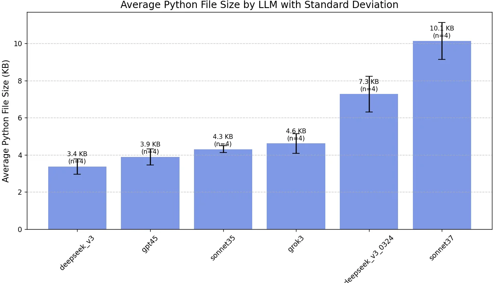

### Recent Advances in LLMs and Diffusion Models

In recent developments, reinforcement learning post-training is emerging as an effective and cost-efficient approach to enhancing Large Language Model (LLM) capabilities. Concurrently, significant discussions have arisen around diffusion models, which reportedly accelerate inference speeds by an order of magnitude.

<iframe width="100%" height="350" src="https://packaged-media.redd.it/1fjjrjf8ip8e1/pb/m2-res_640p.mp4?m=DASHPlaylist.mpd&v=1&e=1743015600&s=1cdd9b402bb27aae2dc6a541effc955661865f81"></iframe>

> [**A diffusion-based 'small' coding LLM 10x faster in token generation than transformer-based LLMs (1000 tok/s on H100)**](https://www.reddit.com/r/LocalLLaMA/comments/1izoyxk/a_diffusion_based_small_coding_llm_that_is_10x/) by [u/Comfortable-Rock-498](https://www.reddit.com/user/Comfortable-Rock-498/) on [LocalLLaMA](https://www.reddit.com/r/LocalLLaMA/).

---

## March 2025: AI Project Highlights

### Ollama: Efficient AI Backend

Since July 2024, **Ollama** has rapidly developed into a compelling backend solution for AI model deployment. While **vllm** remains popular in batch inference scenarios, Ollama distinguishes itself by natively supporting GGUF model formats, enabling versatile single-inference capabilities across various AI modalities (LLMs, Vision Models, VLMs, VLAs).

---

### Chat3D: Next-Gen 3D Model Generation

[**Chat3D**](https://chat3d.ai/), based in Lyon, France, delivers cutting-edge text-to-3D and image-to-3D model generation capabilities. Definitely worth exploring for anyone interested in state-of-the-art 3D content creation.

---

### Enhancing AI-Driven Coding

[**Fasten your AI coding workflow**](https://www.reddit.com/r/ClaudeAI/comments/1jj2ucr/i_completed_a_project_with_100_aigenerated_code/): An insightful experience shared on Reddit highlights a project executed entirely using AI-generated code, demonstrating the transformative impact of AI coding assistants.

However, it's crucial to acknowledge that model choice profoundly affects coding quality. Attention to user intent, response style, and accuracy directly correlates with code quality—positively or negatively.

---

### Vibe Coding by Andrej Karpathy

Andrej Karpathy recently introduced an engaging concept called **"vibe coding"**:

> There's a new kind of coding I call "vibe coding," where you fully give in to the vibes, embrace exponentials, and forget that the code even exists. It's possible because the LLMs (e.g., Cursor Composer with Sonnet) are getting too good. Also, I just talk to Composer with SuperWhisper...

— [Andrej Karpathy](https://twitter.com/karpathy/status/1886192184808149383)

---

### ComfyUI Integration with Unreal Engine

An innovative integration between **ComfyUI** and **Unreal Engine** demonstrates an exciting workflow for creators in the gaming and real-time visualization domains.

> [**Unreal Engine & ComfyUI Workflow**](https://www.reddit.com/r/comfyui/comments/1jfiakn/unreal_engine_comfyui_workflow/) by [u/Plenty_Big4560](https://www.reddit.com/user/Plenty_Big4560/) on [ComfyUI](https://www.reddit.com/r/comfyui/).

---

## Additional Resources and Discussions

- [**DeepSeek R1 Ollama Hardware Benchmark**](https://www.reddit.com/r/LocalLLaMA/comments/1i69dhz/deepseek_r1_ollama_hardware_benchmark_for_localllm/)
- [**New Research: LLMs Could Think in Human-like Ways**](https://www.reddit.com/r/LocalLLaMA/comments/1inch7r/a_new_paper_demonstrates_that_llms_could_think_in/)
- [**Diffusion-Based Small Coding LLMs (Detailed Discussion)**](https://www.reddit.com/r/LocalLLaMA/comments/1izoyxk/a_diffusion_based_small_coding_llm_that_is_10x/)
- [**SmolDocLing 256M VLM for Document Understanding**](https://www.reddit.com/r/LocalLLaMA/comments/1je4eka/smoldocling_256m_vlm_for_document_understanding/)
- [**ComfyUI Unreal Engine Workflow (Discussion)**](https://www.reddit.com/r/comfyui/comments/1jfiakn/unreal_engine_comfyui_workflow/)
- [**Project Completed with 100% AI-Generated Code**](https://www.reddit.com/r/ClaudeAI/comments/1jj2ucr/i_completed_a_project_with_100_aigenerated_code/)

https://www.reddit.com/r/LocalLLaMA/comments/1i69dhz/deepseek_r1_ollama_hardware_benchmark_for_localllm/
https://www.reddit.com/r/LocalLLaMA/comments/1inch7r/a_new_paper_demonstrates_that_llms_could_think_in/
https://www.reddit.com/r/LocalLLaMA/comments/1izoyxk/a_diffusion_based_small_coding_llm_that_is_10x/
https://www.reddit.com/r/LocalLLaMA/comments/1je4eka/smoldocling_256m_vlm_for_document_understanding/
https://www.reddit.com/r/comfyui/comments/1jfiakn/unreal_engine_comfyui_workflow/
https://www.reddit.com/r/ClaudeAI/comments/1jj2ucr/i_completed_a_project_with_100_aigenerated_code/

