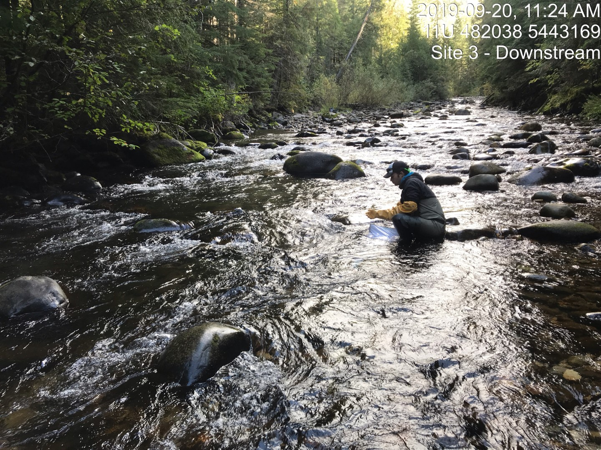
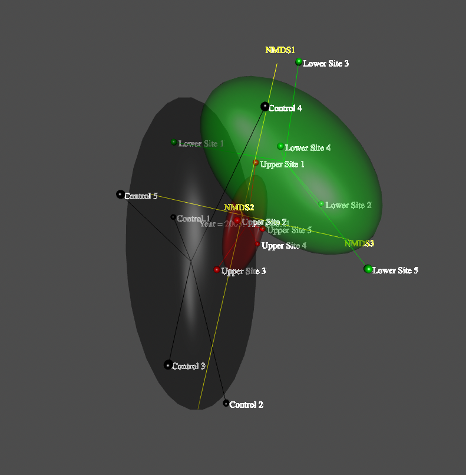

## Sheep Creek Biological Impact Assessment
Environmental impact assessment of landfill leachate on aquatic values in major tributary to the Salmo River. Water quality impacts quantified using analysis of benthic macro-invertebrate and periphyton communities.  Fieldwork, analysis and reporting completed. Reproducible workflows conducted in R including standardization of 2003 – 2019 project data and amalgamation within a sqlite database. Formulated recommendations for future program components including water and aquatic organism sample site locations/timing. 

 

 

 

### Non-metric Multidimensional Scaling (NMDS) 
NMDS is an ordination procedure that represents benthic invertebrate species assemblages as points within coordinate frames based on the rank order of among sample dissimilarities. In community ecology, NMDS is often regarded as the most robust ordination method as it does not rely on assumptions about distribution of sample data and because it’s distance-preserving properties can provide clarity in communicating results of impact studies to environmental managers. As part of our work with the Regional District we incorporated NMDS ordination models in both report 2D plots as well as interactive 3D deliverables.

 

