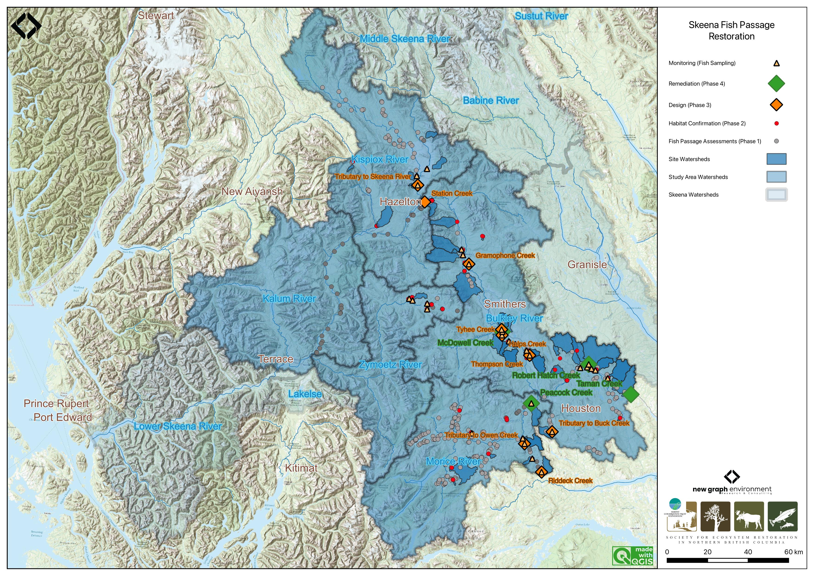
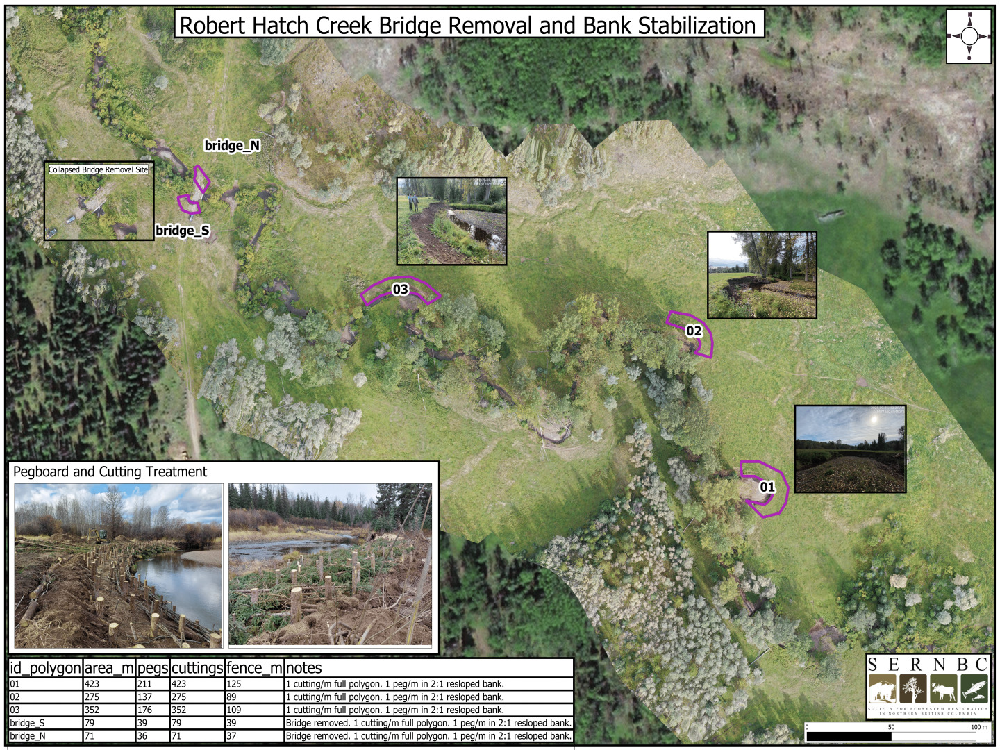
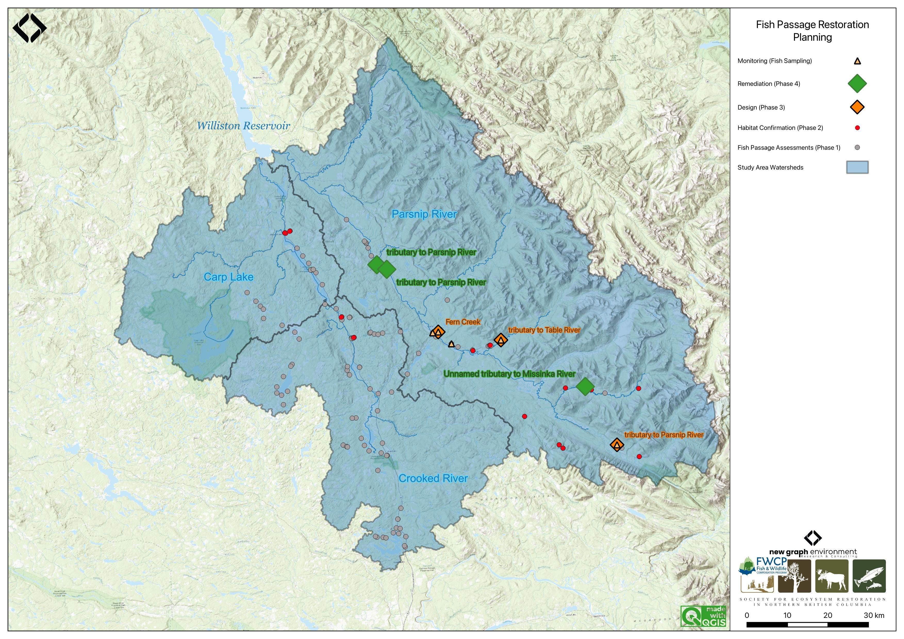
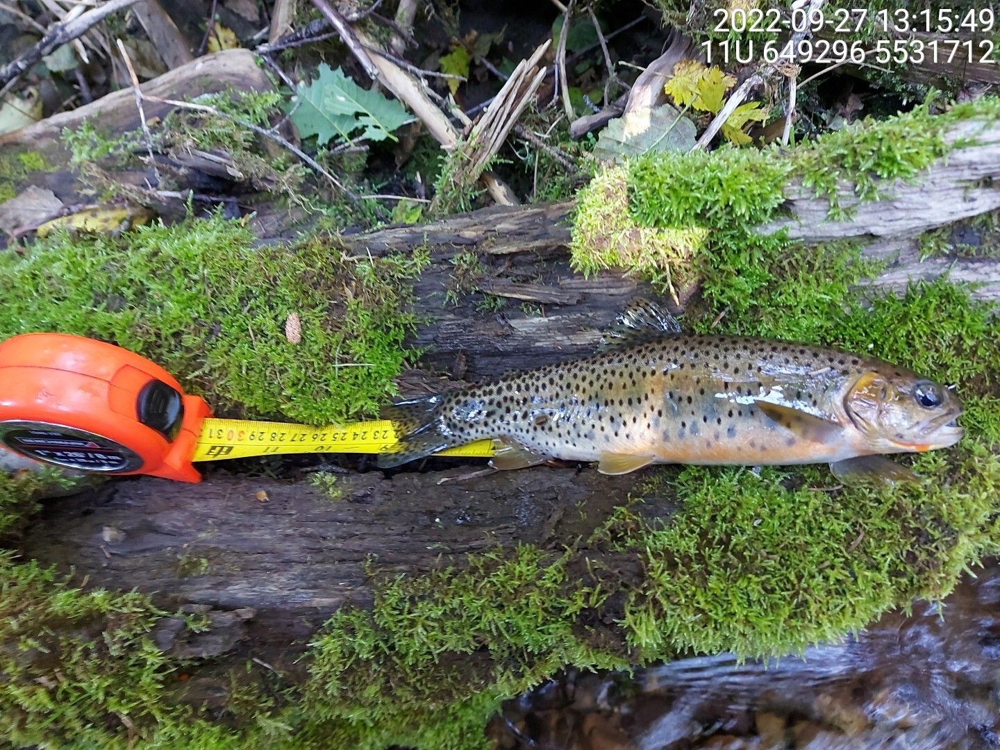

Past and current initiatives include fish passage restoration planning for over 20 other watershed groups in British Columbia with clients including Society for Ecosystem Restoration Northern BC, First Nation development corporations, Ministry of Water and Land Stewardship,  Fish and Wildlife Compensation Program, Habitat Conservation Trust Foundation, Ministry of Transporrtation and Infrastructure and others. Multi-year efforts are underway within the Skeena River, Elk River and Parsnip River regions. Initiatives have led to substantial funding to support not only fish passage restoration but also successful cattle exclusion fencing, streambank stabilization and riparian planting programs. Online interactive reporting is ongoing with a selection of live websites detailed below:

  
  
### Skeena Fish Passage Restoration Planning

  - [Skeena Watershed Fish Passage Restoration Planning 2023](https://www.newgraphenvironment.com/fish_passage_skeena_2023_reporting/)
  - [Skeena Watershed Fish Passage Restoration Planning 2022](https://www.newgraphenvironment.com/fish_passage_skeena_2022_reporting/)
  - [Bulkley Watershed Fish Passage Restoration Planning 2022](https://www.newgraphenvironment.com/fish_passage_bulkley_2022_reporting/)
  - [Bulkley River and Morice River Watershed Groups Fish Passage Restoration Planning 2021](https://www.newgraphenvironment.com/fish_passage_skeena_2021_reporting/)
  - [Bulkley River and Morice River Watershed Groups Fish Passage Restoration Planning 2020](https://www.newgraphenvironment.com/fish_passage_bulkley_2020_reporting/)

 

   
  

 
  


 

### Restoring Fish Passage in the Peace Region
  
  - [Restoring Fish Passage in the Peace Region 2023](https://www.newgraphenvironment.com/fish_passage_peace_2023_reporting/)
  - [Restoring Fish Passage in the Peace Region 2022](https://www.newgraphenvironment.com/fish_passage_peace_2022_reporting/)
  - [Restoring Fish Passage in the Peace Region 2021](https://www.newgraphenvironment.com/fish_passage_parsnip_2021_reporting/)
  - [Parsnip River Watershed – Fish Habitat Confirmations 2019](https://www.newgraphenvironment.com/Parsnip_Fish_Passage/)
  
  

  

  
   

### Elk River Watershed Group Fish Passage Restoration Planning
  
  - [Elk River Watershed Group Fish Passage Restoration Planning 2022](https://www.newgraphenvironment.com/fish_passage_elk_2022_reporting/)
  - [Elk River Watershed Group Fish Passage Restoration Planning 2021](https://www.newgraphenvironment.com/fish_passage_elk_2021_reporting/)
  - [Upper Elk River and Flathead River Fish Passage Restoration Planning 2020](https://www.newgraphenvironment.com/fish_passage_elk_2020_reporting/)
  
   

 

### Effectiveness Monitoring for Fish Passage Restoration
  - [Effectiveness Monitoring for Cross Creek, Bittner Creek and Five Mile Creek - 2022](https://www.newgraphenvironment.com/fish_passage_moti_2022_reporting/)
  
   
  
  <iframe src="https://www.mapsmadeeasy.com/maps/public_3D/bc05b8efed3f42f28fced92614b08edd" scrolling="no" title="Maps Made Easy" width="100%" height="600" frameBorder ="0"></iframe>

