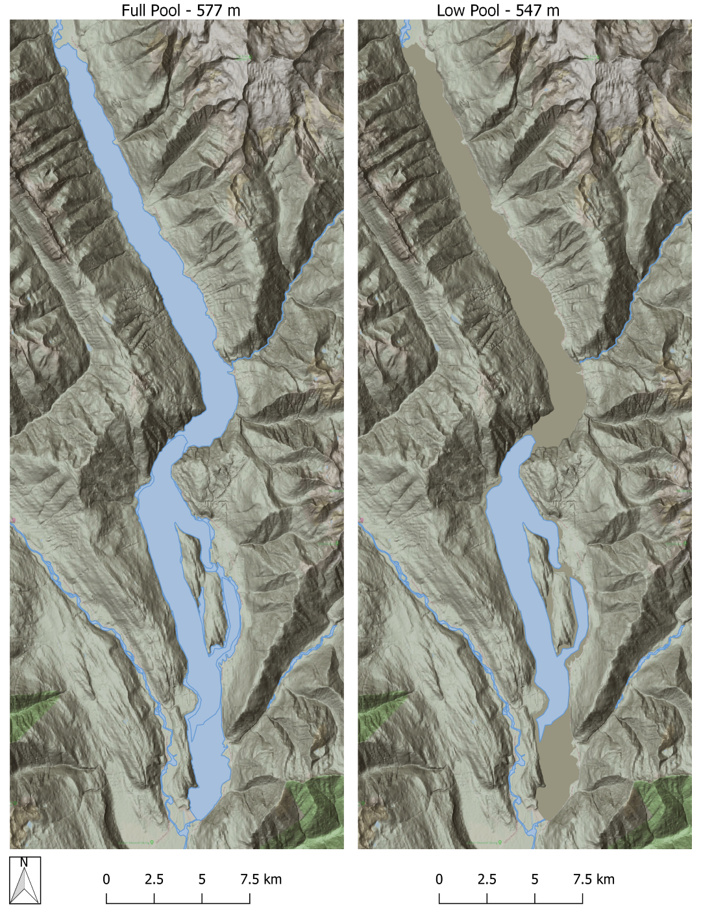
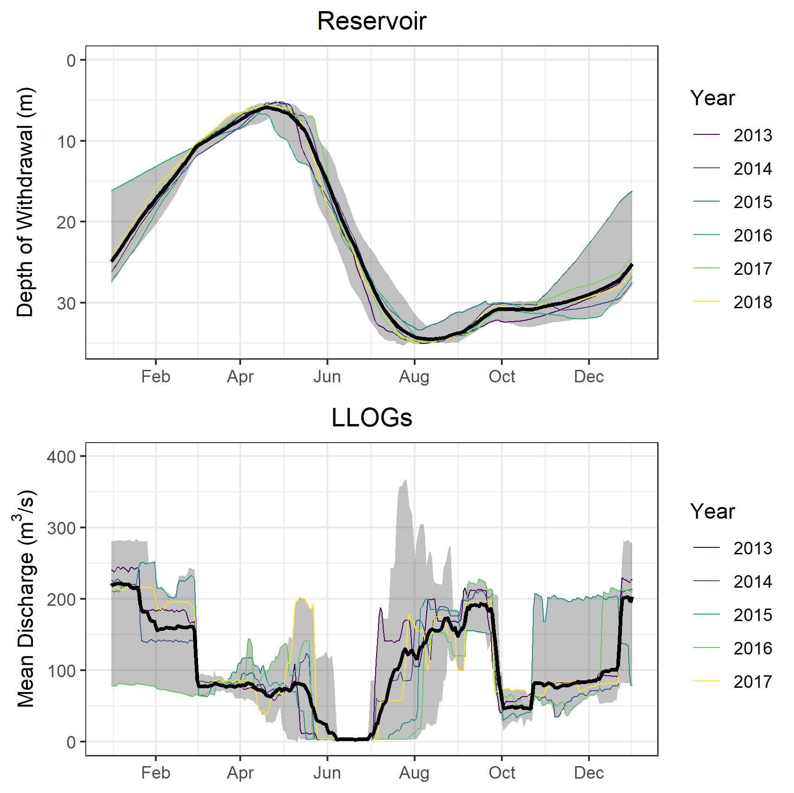

## Duncan Reservoir Kokanee Stock Assessment - DDMMON-17

We provided data analysis, mapping and reporting services to support large lake specialists on a 3-year synthesis report for a water use planning study.  Reporting incorporated results and data from multiple 10-year water use planning projects in the Columbia Basin to explore impacts and mitigation strategies related to flow regulation and water impoundment in the Duncan River watershed. We built tools in R to automate the processing of hydroacoustic fish density outputs as well as associated water quality (i.e. temperature, conductivity, fluorescence), zooplankton and hydrometric data.

 

 

 

