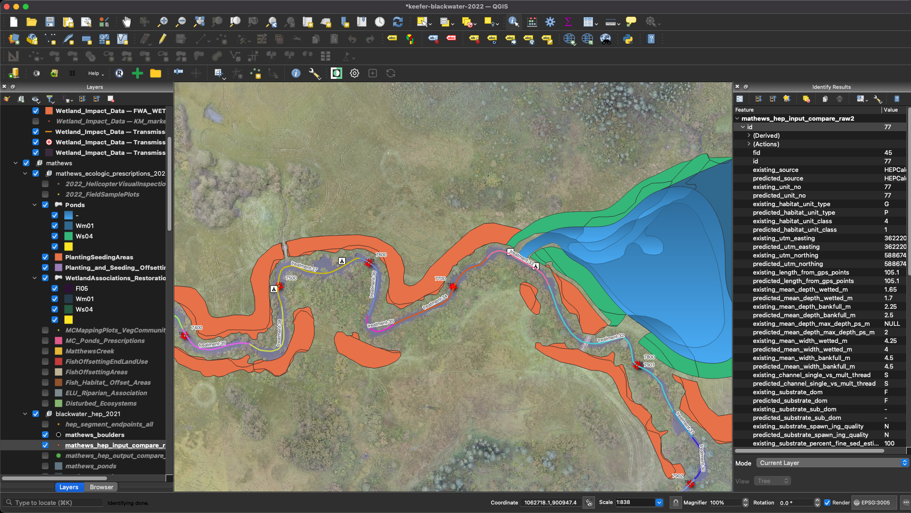

As part of a team under sub-contract to Keefer Ecological Consultants working on behalf of Lhoosk’uz Dene and Ulkatcho First Nations over a two year period, we helped lead the technical review of aquatic permitting applications for the Blackwater Mine near Vanderhoof BC which included the proposed gold mine site as well as the 120km long Electrical Transmission Line. The review included the development of collaborative GIS projects and interactive online tools to build capacity, communicate technical data in plain language and advocate for First Nation interests related to the Environmental Impact assessment, Fisheries and Riparian Offsetting Works, Environmental Effects Monitoring and Mitigation Programs.

 

