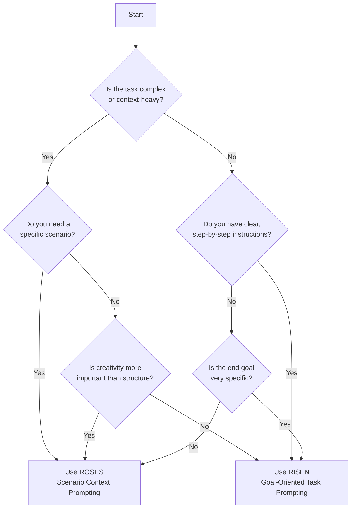

I am an expert at writing effective prompts for LLMs to provide assistance with complex code.

I follow these rules when responding:

- Use Markdown that is compatible with kramdown

---

I have included description and examples of two different prompting strategies below.  What are the main differences between them, and when might I use one over the other?

# ROSES

## Ingredients
- **Role**: Defines the AI's function or perspective in addressing the prompt, setting the stage for its engagement.
- **Objective**: Clarifies what the AI is expected to achieve, providing a clear target for its efforts.
- **Scenario**: Presents a specific situation or context within which the AI should operate, adding relevance and specificity to the task.
- **Expected Solution**: Describes the ideal outcome or type of solution the AI should aim to produce, guiding its response towards fulfilling user needs.
- **Steps**: Outlines a sequence of actions or considerations the AI should follow in formulating its response, ensuring a structured approach to problem-solving.

ROSES sample (function generation)

You are a full-stack developer.
Implement user registration based on the following scenario.
  Feature: User Registration
    Scenario: Successful registration
      Given the user has filled in their name, email, and password
      When they submit the registration form
      Then their account should be created successfully
Expected Solution: A function that validates the input and stores the user in the database if all conditions are met.
Use input validation, error handling, and database operations to meet the requirements.

ROSES sample (test generation)

You are a full-stack developer.
Implement unit tests for user registration based on the following scenario.
  Feature: User Registration
    Scenario: Successful registration
      Given the user has filled in their name, email, and password
      When they submit the registration form
      Then their account should be created successfully
Expected Solution: Unit tests that will validate a function that validates the input and stores the user in the database if all conditions are met.
Test for input validation, error handling, and database operations to meet the requirements.

# RISEN

## Ingredients
- **Role**: Establish the AI's role, setting the stage for the type of response expected.
- **Instructions**: Clarify what you want the AI to do, providing a clear directive.
- **Steps**: Break down the task into manageable steps, ensuring a logical progression.
- **End Goal**: Define the ultimate objective of the prompt, guiding the AI's focus.
- **Narrowing**: Set any constraints or limitations to tailor the response to your specific needs.

test generation

You are a backend developer.
Create a function that processes user registration.  The function should receive user data, validate it, and store it in the database.
Use the following Gherking scenario to guide your implementation...
  Feature: User Registration
    Scenario: Successful registration
      Given the user has filled in their name, email, and password
      When they submit the registration form
      Then their account should be created successfully
The function should handle all steps in the scenario and ensure the registration is successful.

You are a backend developer.
Create a unit test or test(s) for a function that will processes user registration.  The function will receive user data, validate it, and store it in the database, and the tests need to validate those behaviors.
Use the following Gherking scenario to guide your implementation of the test...
  Feature: User Registration
    Scenario: Successful registration
      Given the user has filled in their name, email, and password
      When they submit the registration form
      Then their account should be created successfully
The function unit tests should handle all steps in the scenario and ensure the registration is successful.

---

The ROSES and RISEN prompting strategies are both structured approaches to crafting effective prompts for AI, but they have some key differences in their focus and organization. Here's a comparison of the main differences and when you might use one over the other:

1. Structure and Focus

ROSES:
- More detailed and scenario-oriented
- Emphasizes the context and expected outcome
- Provides a clear framework for the AI to operate within

RISEN:
- More action-oriented and goal-focused
- Emphasizes the steps and end goal
- Provides a clear path for the AI to follow

2. Components

ROSES:
- Role
- Objective
- Scenario
- Expected Solution
- Steps

RISEN:
- Role
- Instructions
- Steps
- End Goal
- Narrowing

3. Use Cases

ROSES:
- Better for complex scenarios requiring detailed context
- Useful when you need a specific type of solution
- Ideal for creative or open-ended tasks where context is crucial

RISEN:
- Better for straightforward, task-oriented prompts
- Useful when you need a step-by-step approach
- Ideal for technical or procedural tasks where clarity is key

4. Flexibility

ROSES:
- More flexible in terms of the type of response it can generate
- Allows for more creative interpretation within the given scenario

RISEN:
- More structured and directive
- Focuses on achieving a specific end goal with less room for deviation

5. Depth of Context

ROSES:
- Provides more detailed context through the Scenario component
- Allows for a more nuanced understanding of the problem

RISEN:
- Focuses more on the task at hand and less on the surrounding context
- Emphasizes clear instructions and steps

When to use ROSES:
- When you need the AI to understand a complex scenario or context
- For creative tasks where you want to guide the AI but allow for some interpretation
- When the expected solution is as important as the process to get there

When to use RISEN:
- When you have a clear, specific task that needs to be accomplished
- For technical or procedural tasks where step-by-step guidance is crucial
- When you want to constrain the AI's response to a narrow set of parameters

In summary, ROSES is generally better for complex, context-heavy tasks that require a deep understanding of a scenario, while RISEN is more suitable for straightforward, goal-oriented tasks that benefit from clear, step-by-step instructions. Your choice between the two would depend on the nature of your task, the level of context required, and how much flexibility you want to allow in the AI's response.

---

Could you break down the differences in a markdown table format?

---

Certainly! Here's a breakdown of the differences between ROSES and RISEN in a markdown table format:

| Aspect | ROSES | RISEN |
|--------|-------|-------|
| **Focus** | Scenario and context-oriented | Task and goal-oriented |
| **Components** | Role, Objective, Scenario, Expected Solution, Steps | Role, Instructions, Steps, End Goal, Narrowing |
| **Strength** | Provides rich context and expected outcomes | Offers clear, actionable instructions |
| **Best for** | Complex scenarios, creative tasks | Straightforward, procedural tasks |
| **Flexibility** | More flexible, allows for creative interpretation | More structured, focuses on specific outcomes |
| **Context Depth** | Deep, detailed context through Scenario | Less emphasis on context, more on task execution |
| **User Input** | Requires detailed scenario and expected solution | Requires clear instructions and end goal |
| **AI Guidance** | Guides AI through context and expectations | Guides AI through specific steps and constraints |
| **Output Control** | Controls through expected solution | Controls through narrowing and end goal |
| **Ideal Use Cases** | - Creative writing - Problem-solving - Scenario analysis | - Code generation - Step-by-step tutorials - Technical documentation |
| **Learning Curve** | Steeper; requires skill in scenario crafting | Gentler; more straightforward to construct |
| **Adaptability** | Highly adaptable to various complex situations | More rigid, best for well-defined tasks |

This table provides a side-by-side comparison of key aspects of both prompting strategies, highlighting their differences and strengths in various scenarios.

---

What are the differences between an 'objective' and 'end goal' in your opinion?

---

The terms 'objective' and 'end goal' can sometimes be used interchangeably, but in the context of these prompting strategies, they have subtle yet important differences. Here's my analysis of the distinctions:

| Aspect | Objective (ROSES) | End Goal (RISEN) |
|--------|-------------------|-------------------|
| **Definition** | The overall purpose or aim of the task | The final, specific outcome to be achieved |
| **Scope** | Broader, more general | Narrower, more specific |
| **Time Frame** | Can be long-term or short-term | Usually immediate or short-term |
| **Measurability** | May be less quantifiable | Often more measurable or tangible |
| **Focus** | On the 'why' of the task | On the 'what' of the task |
| **Flexibility** | Allows for various approaches | More prescriptive about the end result |
| **Example** | "To improve user engagement" | "To increase daily active users by 20%" |

Key differences:

1. **Scope and Specificity**: An objective is typically broader and more general, while an end goal is more specific and targeted.

2. **Purpose vs. Outcome**: An objective often describes the purpose or reason for a task, whereas an end goal focuses on the specific outcome or result.

3. **Measurability**: End goals are usually more easily measurable or quantifiable, while objectives can be more abstract.

4. **Time Frame**: Objectives can be long-term aspirations, while end goals are often more immediate or short-term targets.

5. **Flexibility**: Objectives allow for more flexibility in how they're achieved, while end goals are more prescriptive about the exact result needed.

In the context of AI prompts:
- The 'objective' in ROSES helps set the overall direction and purpose, guiding the AI's understanding of why it's performing a task.
- The 'end goal' in RISEN provides a clear, specific target for the AI to aim for, ensuring the output meets a particular criterion.

Understanding these nuances can help in crafting more effective prompts, depending on whether you need a broader direction (objective) or a specific target outcome (end goal) from the AI.

---

What are some examples of objectives vs end goals in other contexts?

---

Certainly! Here are some examples of objectives versus end goals in various contexts, presented in a markdown table for clarity:

| Context | Objective | End Goal |
|---------|-----------|----------|
| **Business** | To increase market share | To achieve 25% market share by Q4 |
| **Education** | To improve student literacy | To raise average reading scores by 10 points this year |
| **Health** | To promote healthier lifestyles | To reduce BMI by 2 points in 6 months |
| **Technology** | To enhance user experience | To decrease app load time to under 2 seconds |
| **Environmental** | To reduce carbon footprint | To cut CO2 emissions by 30% within 2 years |
| **Personal Finance** | To build wealth for retirement | To save $500,000 in a 401(k) by age 65 |
| **Sports** | To improve team performance | To win the championship this season |
| **Marketing** | To increase brand awareness | To achieve 1 million social media followers |
| **Customer Service** | To enhance customer satisfaction | To achieve a 95% positive feedback rate |
| **Product Development** | To innovate in the smartphone market | To launch a foldable phone by next quarter |
| **Non-Profit** | To alleviate poverty in a region | To provide 10,000 meals per month to those in need |
| **Personal Development** | To become more productive | To complete 3 major projects in the next 6 months |
| **Urban Planning** | To improve city transportation | To reduce average commute time by 15 minutes |
| **Agriculture** | To increase crop yield | To produce 10% more corn per acre this season |
| **Research** | To advance understanding of climate change | To publish 5 peer-reviewed papers on the topic this year |

In each of these examples:

- The objective provides a broader, more general direction or aspiration. It sets the overall purpose or aim but doesn't specify exact metrics or timeframes.

- The end goal is more specific, often including measurable targets and timeframes. It provides a clear, concrete outcome to work towards.

This distinction helps in both planning and execution. Objectives guide overall strategy and long-term vision, while end goals provide specific, actionable targets that contribute to achieving the broader objective.

---

What does the "role" actually do 'under the hood' as input to a model?

---

The "role" component in prompting strategies like ROSES and RISEN doesn't directly affect the underlying mechanics of the language model in a technical sense. However, it does play a significant part in shaping the model's output through the principles of context setting and priming. Here's a breakdown of what the "role" does "under the hood":

1. Contextual Framing
   - Sets the initial context for the model's response
   - Activates relevant knowledge domains within the model's training data

2. Behavioral Priming
   - Influences the tone, style, and perspective of the response
   - Encourages the model to emulate characteristics associated with the specified role

3. Knowledge Focusing
   - Narrows the scope of information the model draws upon
   - Prioritizes role-specific knowledge and expertise in generating responses

4. Response Structuring
   - Guides the format and organization of the output
   - Aligns the response with expectations for the given role

5. Ethical Alignment
   - Activates role-specific ethical considerations and professional standards
   - Helps maintain appropriate boundaries and expertise levels

6. Vocabulary Selection
   - Influences the choice of words and phrases to match the specified role
   - Encourages the use of domain-specific terminology

7. Confidence Calibration
   - Affects the model's expression of certainty or uncertainty in its responses
   - Aligns the level of assertiveness with the expertise expected from the role

8. Task Interpretation
   - Shapes how the model interprets subsequent instructions or queries
   - Provides a framework for understanding the context of the task

9. Consistency Maintenance
   - Helps the model maintain a consistent persona throughout the interaction
   - Reduces contradictions or out-of-character responses

10. Relevance Filtering
    - Assists in filtering out information not relevant to the specified role
    - Enhances the focus and specificity of the generated content

While the "role" doesn't alter the model's underlying architecture or training, it significantly influences how the model processes and responds to prompts by leveraging its trained understanding of various professional and social roles. This allows for more tailored, contextually appropriate, and focused outputs aligned with the user's intentions.

---

When you say that the role "Activates relevant knowledge domains within the model's training data" does that mean the the LLM is actually accessing its training data in real time?

---

I apologize for any confusion my previous explanation may have caused. You're right to question that statement, as it's not entirely accurate. Let me clarify:

1. No Direct Access to Training Data
   - LLMs do not access their original training data in real-time during inference.
   - The model's "knowledge" is encoded in its parameters, not stored as retrievable data.

2. Activation of Neural Pathways
   - When we say "activates relevant knowledge domains," we're referring to the activation of specific neural pathways within the model.
   - This is more akin to priming certain patterns of activation in the model's neural network.

3. Statistical Associations
   - The role prompt influences which statistical patterns and associations the model draws upon to generate its response.
   - It's not accessing data, but rather biasing its output based on learned patterns.

4. Contextual Steering
   - The role acts as a context that steers the model's attention and generation process towards certain types of outputs.
   - This is done through the model's learned understanding of roles and associated language patterns.

5. No Real-time Learning
   - The model doesn't learn new information or access external data during inference.
   - It works entirely with the patterns and associations it learned during training.

6. Metaphorical "Activation"
   - When we talk about "activating knowledge," it's a metaphor for how the model's internal representations are influenced by the input.
   - It's not a literal activation of stored data or memories.

In summary, the role doesn't cause the LLM to access training data, but rather influences how the model uses its learned parameters to generate responses. The effect is similar to how human experts might shift their thinking when adopting different professional roles, but for the LLM, this happens through statistical inference rather than accessing stored information.

Thank you for pointing this out, as it's important to be precise about how these models actually function.

---

What are some better names for "ROSES" and "RISEN" that actually describe their particular strengths and applications?

---

You're right to suggest that more descriptive names could better convey the strengths and applications of these prompting strategies. Here are some alternative names that highlight their key characteristics:

For ROSES:
1. SCENE-Pro (SCenario-Enabled Narrative Elicitation Process)
   - Emphasizes the scenario-based approach and narrative focus

2. COSEP (COntext-Specific Expectation Prompting)
   - Highlights the importance of context and expected outcomes

3. SCOPE (Scenario-Context Objective Prompt Engineering)
   - Focuses on the scenario-driven and objective-oriented nature

4. CREST (Contextual Role-based Expectation Setting Technique)
   - Emphasizes the role-based and expectation-setting aspects

5. SORES (Scenario-Oriented Role and Expectation Structuring)
   - Maintains similarity to ROSES while being more descriptive

For RISEN:
1. GUIDE (Goal-Oriented User Instruction for Directed Execution)
   - Emphasizes the goal-oriented and instructional nature

2. STEPS (Structured Task Execution Prompting Strategy)
   - Highlights the step-by-step approach

3. DIRECT (Detailed Instruction for Reaching Explicit Completion Targets)
   - Focuses on the clear instructions and specific end goals

4. ACTION (Actionable Clear Task Instruction Oriented Nudging)
   - Emphasizes the action-oriented and clear instruction aspects

5. STEER (Structured Task Execution and Explicit Result-focusing)
   - Highlights the structured approach and focus on specific results

These alternative names aim to be more descriptive of each strategy's key features:

- ROSES alternatives emphasize scenario-based, context-rich, and expectation-setting aspects.
- RISEN alternatives focus on goal-oriented, step-by-step, and task-execution characteristics.

Each of these names tries to encapsulate the essence of the prompting strategy while providing a clear indication of its strengths and typical applications. The choice between them would depend on which aspects of the strategy you want to emphasize most.

---

Could you answer again, but without forcing acronyms?  I just want to use real words.

---

You're absolutely right. Forcing acronyms can often lead to contrived names that don't effectively communicate the essence of the concept. Here are some more natural, descriptive names for the ROSES and RISEN strategies using real words:

For ROSES:

1. Scenario Context Prompting
   - Emphasizes the scenario-based and context-rich approach

2. Narrative Expectation Framework
   - Highlights the storytelling aspect and focus on expected outcomes

3. Role-Based Scenario Guidance
   - Focuses on the role-playing and scenario-driven nature

4. Contextual Outcome Prompting
   - Emphasizes the importance of context and desired results

5. Situational Expectation Setting
   - Highlights the scenario-specific and expectation-setting aspects

For RISEN:

1. Goal-Oriented Task Prompting
   - Emphasizes the focus on specific goals and tasks

2. Structured Instruction Method
   - Highlights the step-by-step, instructional approach

3. Action-Focused Directive Prompting
   - Focuses on the action-oriented and directive nature

4. Clear Objective Task Guidance
   - Emphasizes clarity in objectives and task-oriented approach

5. Step-by-Step Goal Achievement
   - Highlights the structured approach to reaching specific goals

These names aim to describe each strategy's key features more naturally:

- The ROSES alternatives emphasize scenarios, context, roles, and expectations.
- The RISEN alternatives focus on goals, tasks, instructions, and structured approaches.

These descriptive names provide a clearer indication of each strategy's strengths and typical applications without resorting to forced acronyms. They use everyday language to convey the essence of each prompting method, making it easier for users to understand and remember their primary characteristics.

---

Could you create a simple flowchart in Mermaid that helps decide which to use?

---

Certainly! Here's a simple flowchart in Mermaid syntax that can help decide which prompting strategy to use:

This flowchart guides the decision process based on key characteristics of the task:

1. It first asks if the task is complex or context-heavy.
2. If yes, it then considers whether a specific scenario is needed.
3. If no, it checks if there are clear, step-by-step instructions.
4. It also considers factors like the need for creativity vs. structure and the specificity of the end goal.

The flowchart leads to either the ROSES approach (renamed as "Scenario Context Prompting") or the RISEN approach (renamed as "Goal-Oriented Task Prompting") based on the answers to these questions.

This visual guide should help users quickly determine which prompting strategy is more suitable for their specific needs.